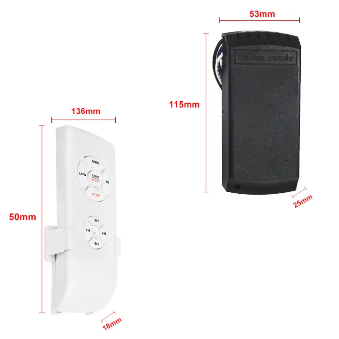
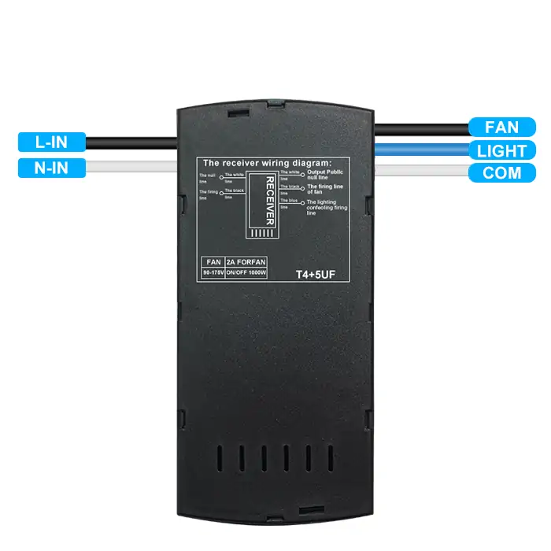
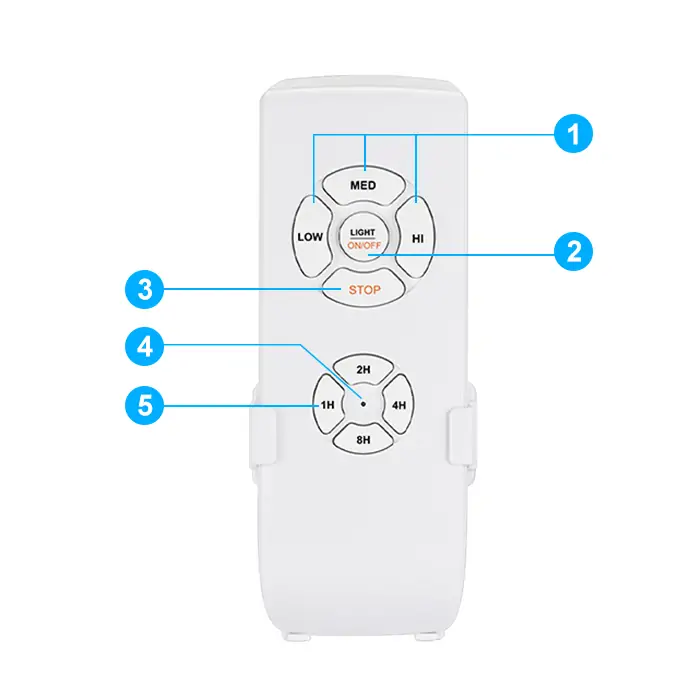
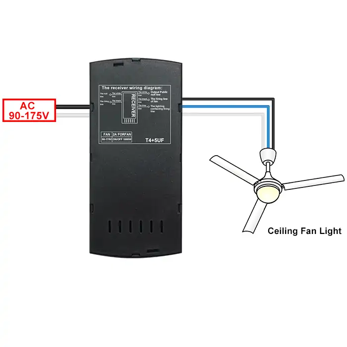

# QIACHIP FLC05-E110V Instruction Manual AC 90V-175V 433MHz RF Ceiling Fan Light Remote Control Switch

{ width="50%" .center loading="lazy" }

> Version: V1.0
> 

> Last Updated: 2025-09-15
> 

> Model: FLC05-E110V
> 

## Product Size

{ width="68%" .center loading="lazy" }

- Receiver Length (L) x Width (W) x Height (H): 115mm x 53mm x 25mm
- Remote Control Length (L) x Width (W) x Height (H): 136mm x 50mm x 18mm

## Component Description

### Receiver

{ width="50%" .center loading="lazy" }

  <ul style="flex: 1 1 45%; margin-right: 1%;">
    <li>L-IN: Input live wire terminal</li>
    <li>N-IN: Input neutral wire terminal</li>
  </ul>
  <ul style="flex: 1 1 45%; margin-left: 1%;">
    <li>FAN: Output fan live wire</li>
    <li>LIGHT: Output light live wire</li>
    <li>COM: Common neutral terminal</li>
  </ul>

---

### Remote control

{ width="50%" .center loading="lazy" }

  <ul style="flex: 1 1 45%; margin-right: 1%;">
    <li>1: Fan speed Low/Med/High</li>
    <li>2: Switch light on/off</li>
  </ul>
  <ul style="flex: 1 1 45%; margin-left: 1%;">
    <li>3: Stop fan</li>
    <li>4: Indicator light</li>
    <li>5: Fan Timer (1H-2H-4H-8H)</li>
  </ul>

---

## Wiring Diagram

Disconnect power before wiring.

### Figure 1

{ width="68%" .center loading="lazy" }

Figure 1: Wiring diagram for AC ceiling fan light

- Load:  AC ceiling fan light
- Input Power: AC 90V-175V

## Function description and setting method

**(1) Pairing; (2) Unpairing; (3) Disable Buzzer; (4) Enable Buzzer.**

**NOTE**

- This product is intended for use only with AC motor ceiling fans and fan-lights; it is not compatible with DC motor fans or fan-lights.
- After successful pairing, the receiver stays linked to the transmitter even if power is lost and then restored.
- The following operations must be performed using QIACHIP-brand remote controls (transmitters) and controllers (receivers); compatibility with products of other brands cannot be guaranteed.
- Capacitors for our product: T4+5 µF (starting 4 µF/running 5 µF).

If the user's existing running capacitor is also 5 µF, it is the most compatible.

If the deviation is 1 µF: Nearly perfect. 

If the deviation is 2 µF: A speed difference of 1-2 steps will occur. 

If the deviation is 3 µF or more: Significant speed variation occurs

### (1) Pairing

After completing this operation:

- Can use the remote control to turn the fan or fan-with-light on or off, and switch freely between any of the three fan speed levels.
- Can set a timed shutdown for 1H/2H/4H/8H. (This timer function applies only to the fan, not the light.)

#### How to Pair

**Step 1**

Power off the receiver, then power it back on (restart).

**Step 2**
Within 5 seconds of powering on the receiver, simultaneously press and hold the remote control "LIGHT ON/OFF" and "HI" buttons until the controller beeps three times, which indicates successful pairing.

### (2) Unpairing

After completing this operation:

- FLC05-E110V receiver is unpaired, all previously paired transmitters lose control of it.

#### How to Unpair

**Step 1**

Power off the receiver, then power it back on (restart).

**Step 2**

Within 5 seconds of powering on the receiver, simultaneously press and hold the remote control "STOP" and "2H" buttons until the controller beeps once times, which indicates the completion of the unpairing.

### (3) Disable Buzzer

After completing this operation:

- The buzzer is turned off, and when the remote control button is pressed, the receiver will no longer emit a beep.

#### How to Disable Buzzer

**Step 1**

Power off the receiver, then power it back on (restart).

**Step 2**

Within 5 seconds of powering on the receiver, press and hold the remote control "STOP" button until the controller beeps three times, at which point the buzzer will be turned off.

### (4) Enable Buzzer

After completing this operation:

- The buzzer is turned on, and when the remote control button is pressed, the receiver will emit a beep.

#### How to Enable Buzzer

**Step 1**

Power off the receiver, then power it back on (restart).

**Step 2**

Within 5 seconds of powering on the receiver, Press and hold the remote control "STOP" button until the controller beeps twice, at which point the buzzer will be turned on.

## Electrical characteristics

| Parameter | Value |
| --- | --- |
| Input voltage | AC 90-175V |
| RF frequency | 433.92MHz |
| Rated Load  | <300W Ceiling Fan / <200W LED Light  |
| Capacitors | T4+5μF |
| Standby Power Consumption | <0.5W |
| Applicable Devices | AC motor ceiling fans and fan-lights |
| Working temperature  | -20℃~80℃  |
| Receiver Size | 115x53x25mm |
| Remote Control Size | 136x50x25mm |

## Warning

- L and N wires must not be reversed.
- When using wireless electronic devices, avoid proximity to metal objects, large electronic equipment, electromagnetic fields, and other sources of strong interference