# QIACHIP KR0548-2CH ( KR0548 Series ) Instruction Manual DC 7-48V WIFI Ewelink Smart Remote Control Switch 2-CH Relay Receiver

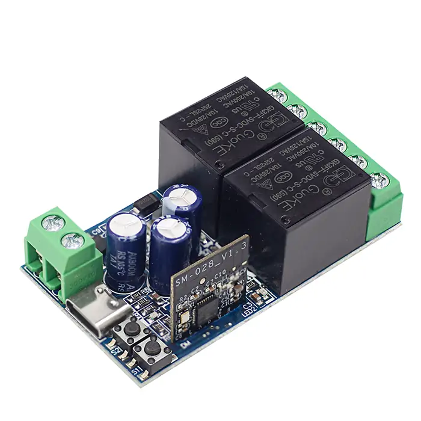{ width="50%" .center loading="lazy" }

> Version: V1.0

> Last Updated: 2026-02-11

> Model: KR0548-2CH ( KR0548 Series )

## Product Size

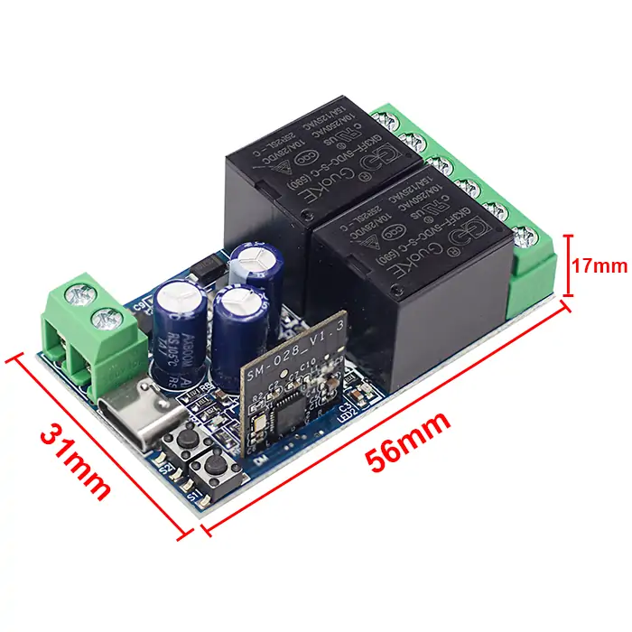{ width="68%" .center loading="lazy" }

- Receiver Length (L) x Width (W) x Height (H): 56mm x 31mm x 17mm

## Component Description

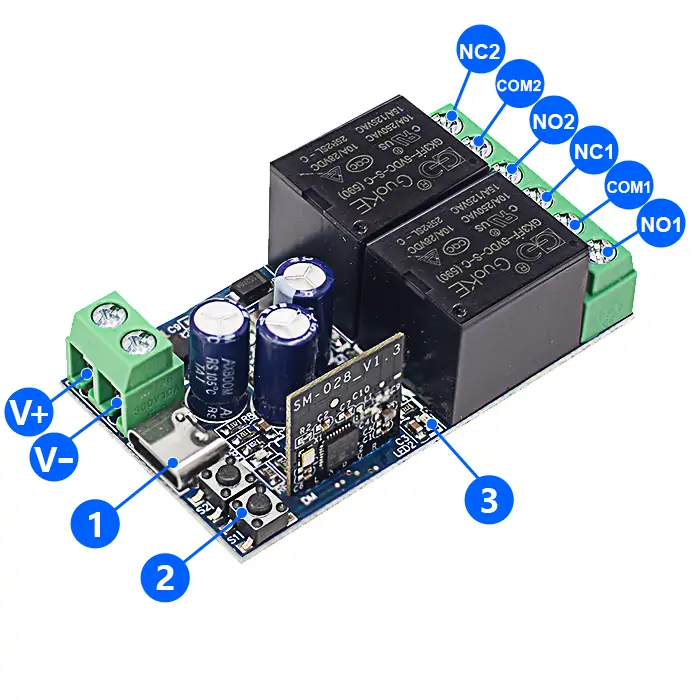{ width="50%" .center loading="lazy" }

  <ul style="flex: 1 1 45%; margin-right: 1%;">
    <li>1: Type‑C 5V input</li>
    <li>2: Learning button</li>
    <li>3: Indicator light</li>
    <li>V+: Positive input terminal</li>
    <li>V-: Negative input terminal</li>
  </ul>
  <ul style="flex: 1 1 45%; margin-left: 1%;">
    <li>NO1: Normally open terminal of relay1</li>
    <li>COM1: Common terminal of relay1</li>
    <li>NC1: Normally closed terminal of relay1</li>
    <li>NO2: Normally open terminal of relay2</li>
    <li>COM2: Common terminal of relay2</li>
    <li>NC2: Normally closed terminal of relay2</li>
  </ul>

## Wiring Diagram

Disconnect power before wiring.

### Figure 1

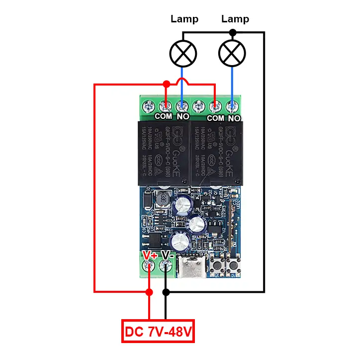{ width="68%" .center loading="lazy" }

Figure 1: Wiring diagram for Lamp

- Load: Lamp
- Input Power: DC 7V-48V

---

### Figure 2

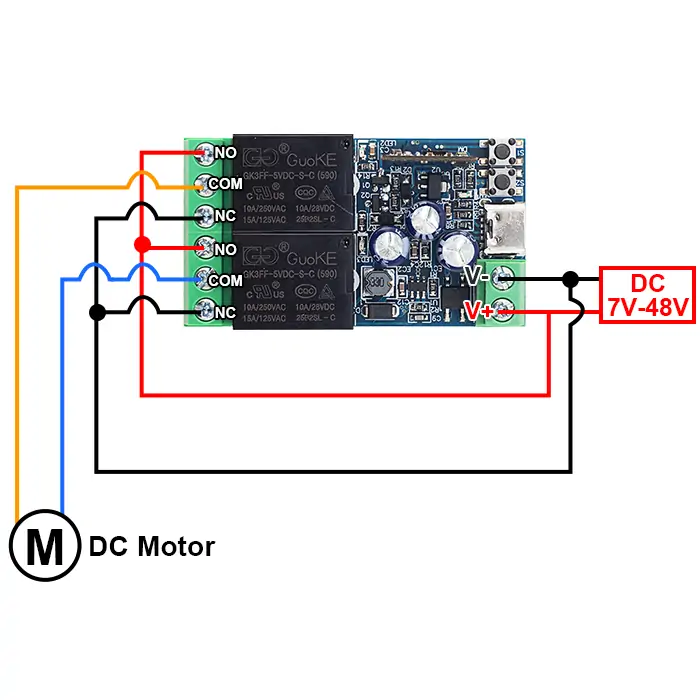{ width="68%" .center loading="lazy" }

Figure 2: Wiring diagram for DC motors

- Load: DC motors
- Input Power: DC 7V-48V

---

### Figure 3

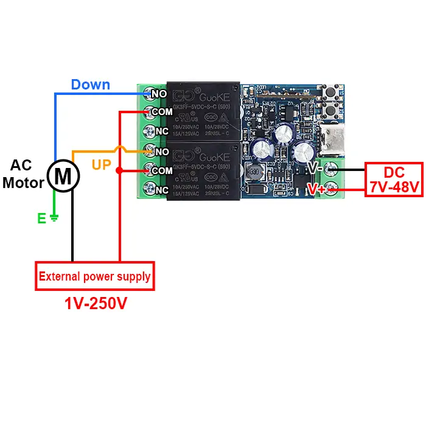{ width="68%" .center loading="lazy" }

Figure 3: Wiring diagram for AC motors

- Load: AC motors
- Input Power: DC 7V-48V
- External power supply: 1V-250V

---

### Figure 4

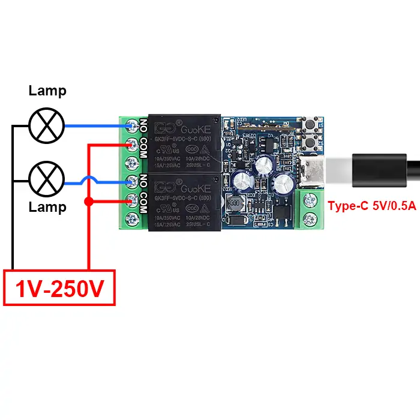{ width="68%" .center loading="lazy" }

Figure 4: Wiring diagram for Lamp (Type-C 5V Power Input)

- Load: Lamp
- Input Power for Receiver: Type-C 5V/0.5A

---

## Pairing with Ewelink APP

**Step 1**

Connect your phone to 2.4GHz WIFI and turn on Bluetooth.

**Step 2**

Long press learning button on receiver for more than 6 seconds until indicator light flashes twice quickly and then stays on once, and WIFI pairing mode will be successfully activated.

**Step 3**

Open Ewelink APP. Tap "+" to add a device in top right corner of screen, and enter password of connected 2.4G WIFI.

{ width="50%" .center loading="lazy" }

**Step 4**

Tap icon of device that appears to start pairing process, and then wait until pairing is completed.

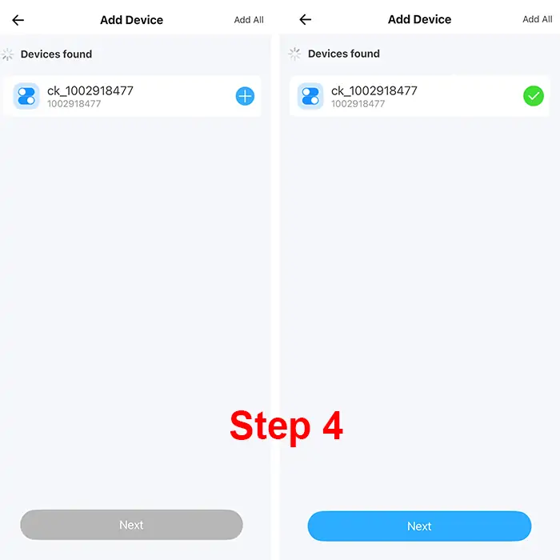{ width="50%" .center loading="lazy" }

---

## Compatible Pairing Mode

If you fail to enter Quick Pairing Mode (Touch), please try "Compatible Pairing Mode" to pair.

**Step 1**

Long press learning button on receiver for more than 5 seconds until LED indicator flashes twice rapidly and then remains on steadily. Then release button. Long press pairing button for 5 seconds again until indicator flashes rapidly. Subsequently, device enters compatible pairing mode.

**Step 2**

Tap "+" and select "Compatible Pairing Mode" on APP. Select Wi-Fi SSID with ITEAD-****** and enter password 12345678, and then go back to eWeLink APP and tap "Next". Be patient until pairing completes.

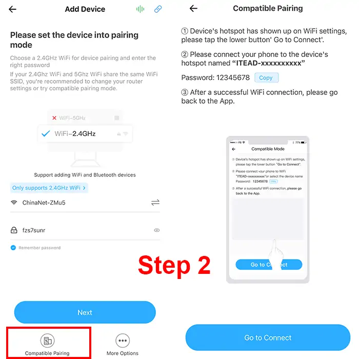{ width="50%" .center loading="lazy" }

---

## Pairing with RM2.4G remote control

### Offline Pairing

**Step 1**

Press learning button on receiver twice in quick succession.

**Step 2**

The pairing can be completed by pressing button of remote control to be paired again.

To delete paired remote control buttons, you need to go to "eWelink Remote" page in App settings for deletion.

### Pairing within APP

**Step 1**

Click on added device, then click settings icon in upper - right corner, and then select "eWelink Remote".

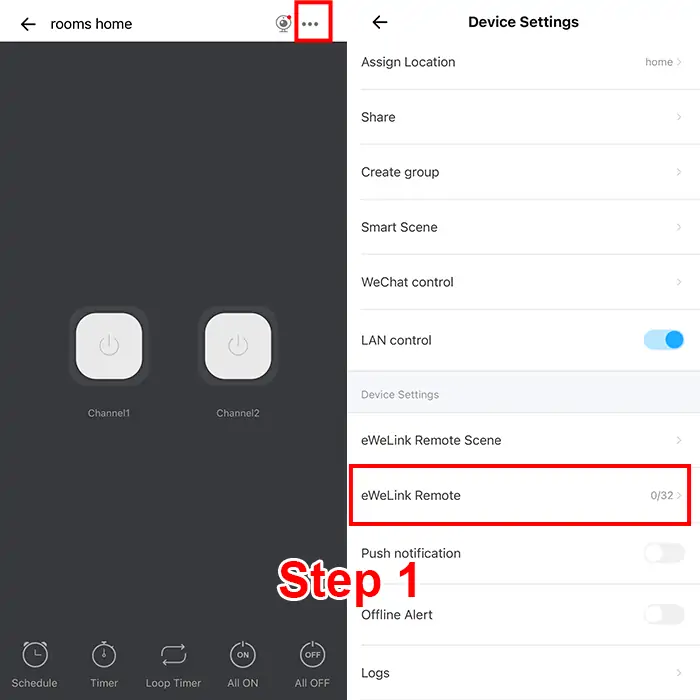{ width="50%" .center loading="lazy" }

**Step 2**

Simply operate according to prompts.

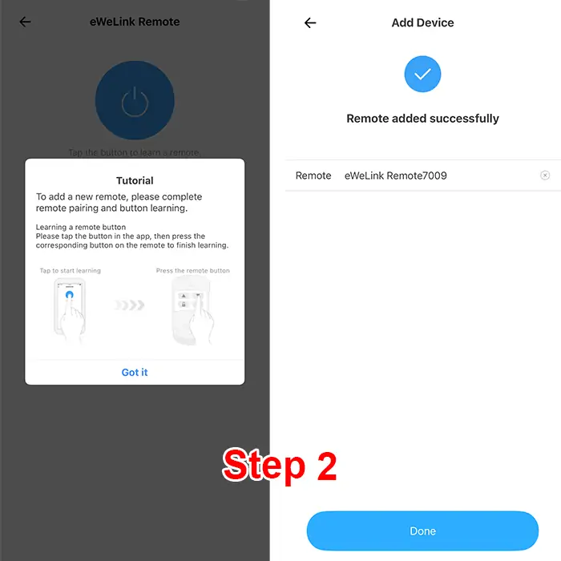{ width="50%" .center loading="lazy" }

## Electrical characteristics

| Parameter | Value |
| --- | --- |
| Input voltage | DC 7V-48V |
| Type-C Input | DC 5V/0.5A |
| WIFI frequency | IEEE 802.11 b/g/n 2.4GHz |
| Maximum Load Current | 10A |
| Rated Load | Max 480W |
| Receiver sensitivity | -108dBm |
| Working temperature | -10℃~70℃ |
| Size | 56x31x17mm |

## Warning

- The positive and negative terminal wires must not be reversed.
- When using wireless electronic devices, avoid proximity to metal objects, large electronic equipment, electromagnetic fields, and other sources of strong interference.
