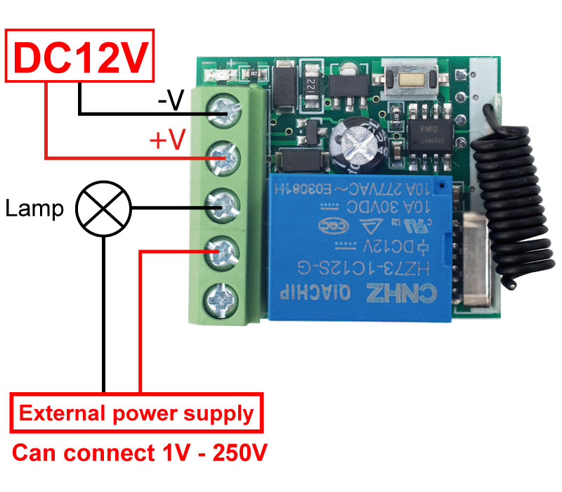

# DC 12V RF Relay User Manual -KR1201

## 1. Introduction

> Version number: V1.0
> 

> Compilation Date: 2025/4/22
> 

> **(Model: KR1201A/KR1201B/KR1201A)**
> 

{ width="50%" .center loading="lazy" }

## 2. Product diagram (key part markings)

{ width="50%" .center loading="lazy" }

- NC：Normally Closed
- COM：Common
- NO：Normally Open
- +V：Power positive
- -V：GND ：Power negative
- 1：Learning Button
- 2 : Antenna
- 3 : Indicator Light

## 3. WIRING DIAGRAM

{ width="50%" .center loading="lazy" }

- Load：Lamp
- Input Power ：DC 12V

{ width="50%" .center loading="lazy" }

- Load：Lamp
- Input Power：DC 12V
- External Power Supply：1V-250V

{ width="50%" .center loading="lazy" }

- Load：Door Lock
- Input Power：DC 12V

## 4. Function description and setting method

- Note: All the following working modes need to be implemented with QIACHIP remote control (transmitter) and controller (receiver/wireless remote control switch).There is no guarantee that remote controls from other brands will work properly with our product.

### Reset function:
Clear all matched remotes. When the data is cleared, all remote control can't make receiver work.

### Settings reset:
After pressing the receiver's learning button 8 times, the receiver clears all remote control data in its memory. When the receiver's LED light flashes, the reset function is complete.

### Description of the working modes:

Working modes: 1) Momentary; 2) Toggle; 3) Latching; 4) Delay.

### Power-off Memory Preservation

After the receiver has been set to the working mode and paired with the remote control, it will maintain this state until it is reset. The memory will not be lost due to the receiver being powered off. 

### Working modes details:

Working modes: 1) Momentary; 2) Toggle; 3) Latching; 4) Delay.

#### 1) Momentary mode:

After successful pairing in this mode,press and hold the remote control button (such as A),the corresponding relay on the receiver is turn ed on; release the remote control button (such as A), and the corresponding relay on the receiver will turn off;

Set Momentary mode :

Step 1) Press the receiver's learning button once. Wait for the LED on the receiver to light on and enter the setting state.

Step 2) Press the button on the remote control (such as A)once. The LED on the receiver will flash and then turn off. The Toggle Mode is set successfully.

#### 2) Toggle mode:

After successful paring in this mode,press and hold the remote control button (such as A),the corresponding relay on the receiver is turned on; release the remote control button (such as A), and the corresponding relay on the receiver will turn off;

Set Toggle Mode:

Step 1) Press the receiver's learning button twice. Wait for the LED on the receiver to lighton and enter the setting state.

Step 2) Press the button on the remote control (such as A) once. The LED on the receiver will flash and then turn off. The Toggle Mode is set successfully.

#### 3) Latching mode:

After successful pairing in this mode,press the remote control button (such as A),the receiver relay corresponding is turned on；press the remote control button (such as B),the relay on the receiver corresponding is turned off.

Set Latching Mode:

Step 1) Press the receiver's learning button 3 times. Wait for the LED on the receiver to light off and enter the setting state.

Step 2) Press the button on the remote control (such as A) once. The LED on the receiver will flash and then turn off.

Step 3) At this time, press another button (such as B) of the same remote control, the indicator flashes and then lights up.The jog mode is set successfully.

#### 4) Delay mode (timed):

After successfully pairing in this mode,press the button (such as A) on the remote control to turn on the corresponding relay on the receiver.Press the remote control button (such as A)again,the corresponding relay on the receiver will be delayed; ( press the receiver button 4 times to pair,delay 5s to close the corresponding relay; press the receiver button 5 times to pair,delay 10S to close Corresponding relay; press the receiver button 6 times to pair, delay 15S to colose the corresponding relay; press the receiver button 7 times to pair,delay 20S to close the corresponding relay;)

## 5. PRODUCT PARAMETERS

| Input Voltage | DC 12V |
| --- | --- |
| RF Frequency | 433.92MHz |
| Receiver Sensitivity | >97dbm |
| Working temperature | -10℃~80℃ |
| Load Power | 800W |
| Operation Mode | Momentary Mode / Toggle Mode / Latching Mode / Delay |
| Size | 30*30*18mm |