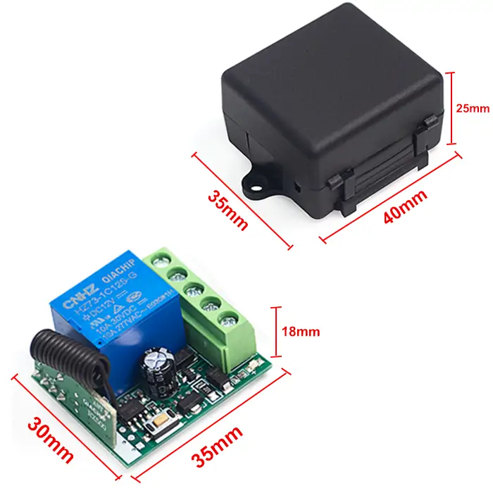
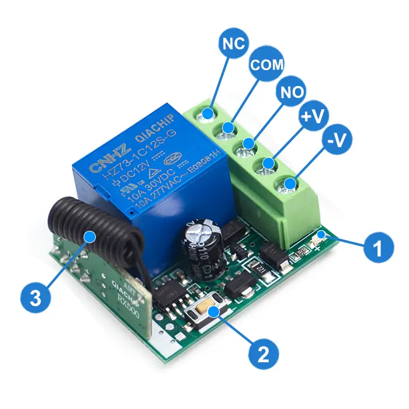
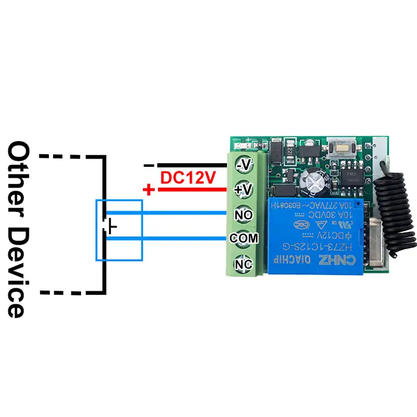
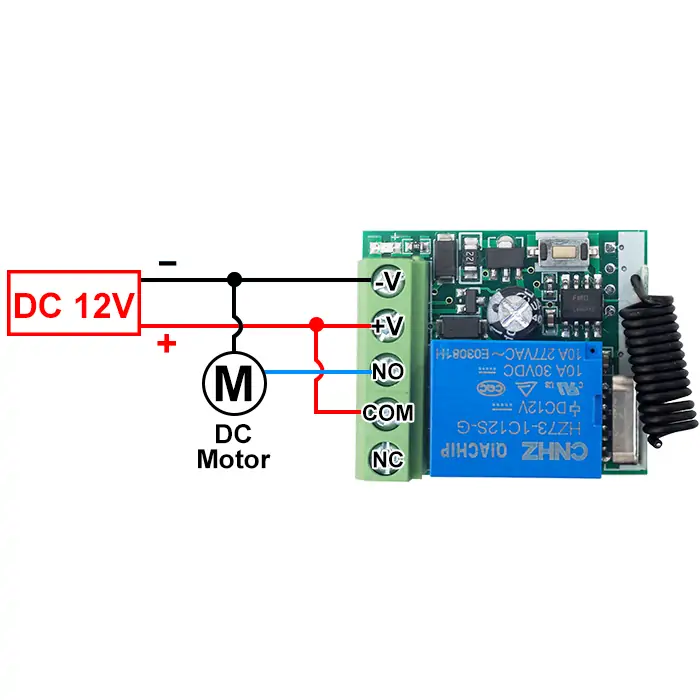
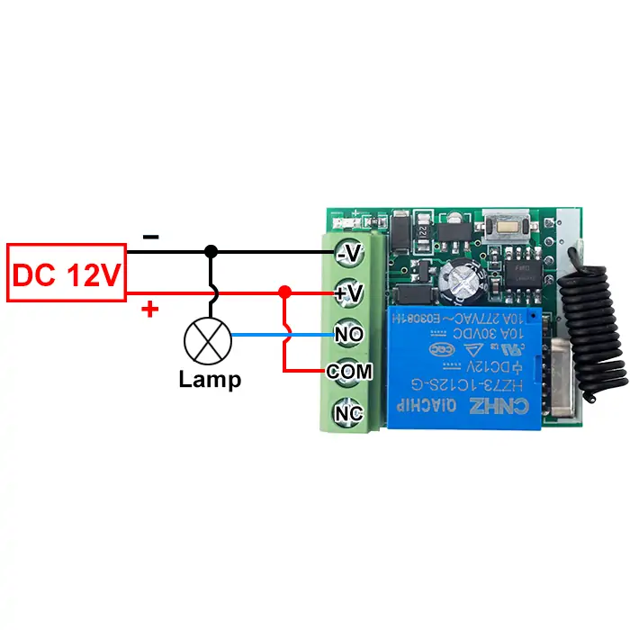

# QIACHIP KR1201A ( KR1201 Series ) Instruction Manual DC 12V 433MHz RF Remote Control Switch 1-CH Relay Receiver

{ width="50%" .center loading="lazy" }

> Version: V1.0
> 

> Last Updated: 2025-6-14
> 

> Model: KR1201A ( KR1201 Series ) 
> 

## Product Size

{ width="68%" .center loading="lazy" }

- Receiver Length (L) × Width (W) × Height (H): 35mm × 30mm × 18mm
- Housing Length (L) × Width (W) × Height (H): 40mm × 35mm × 25mm

## Component description

{ width="50%" .center loading="lazy" }

  <ul style="flex: 1 1 45%; margin-right: 1%;">
    <li>1: Indicator light</li>
    <li>2: Learning button</li>
    <li>3: Antenna</li>
    <li>+V: Positive input terminal</li>
  </ul>
  <ul style="flex: 1 1 45%; margin-left: 1%;">
    <li>NO: Normally open terminal</li>
    <li>COM: Common terminal</li>
    <li>NC: Normally closed terminal</li>
    <li>-V: Negative input terminal</li>
  </ul>

## Wiring diagram

Disconnect power before wiring.

### Figure 1

{ width="50%" .center loading="lazy" }

Figure 1: For door access switches or switches of other devices

- Input Power: DC 12V
- Output switching signal, which can replace switches to control other devices.
- Dry contacts: Potential-free contacts that act only as a switch to connect or disconnect external circuits.

---

### Figure 2

{ width="50%" .center loading="lazy" }

Figure 2: Wiring diagram for DC motors

- Load: DC motor
- Input power: DC 12V

---

### Figure 3

{ width="50%" .center loading="lazy" }

Figure 3: Wiring diagram for lamps

- Load: lamp
- Input power: DC 12V

---

## Function description and setting method

**(1) Momentary mode; (2) Toggle mode; (3) Latching mode; (4) Delay mode; (5) Reset function.**

- When you use the first and second working modes, a remote control with at least two buttons is required.
- When you use the third working mode, a remote control with at least three buttons is required.
- When pairing a second remote, you don't need to press the button on the receiver 8 times again to reset it.
- Once the receiver and transmitter are paired and a working mode is selected, the receiver will retain this mode even if powered off and on again.
- The following working modes require the use of QIACHIP brand remote controls (transmitters) and controllers (receivers/wireless remote control switches). Compatibility with other brands is not guaranteed

### **(1) Momentary mode**

 In this mode: 

- Press and hold the remote control button (such as A), and the corresponding relay on the receiver is turned on.
- Release the remote control button (such as A), and the corresponding relay on the receiver will turn off.

### **How to set momentary mode**

**Step 1**

Click the learning button of the receiver once. The indicator light on the receiver turns on and the receiver enters the setting state.

**Step 2**

Press the button on the remote control (such as A) once. The indicator light on the receiver will flash and then turns off.The momentary mode is set successfully. 

### **(2) Toggle mode**

In this mode: 

- Press the remote control button (such as A), and the corresponding relay on the receiver will turn on.
- Press the remote control button (such as A) again, and the corresponding relay on the receiver will turn off.

### **How to set toggle mode**

**Step 1**

Click the learning button of the receiver twice. The indicator light on the receiver turns on, and the receiver enters the setting state.

**Step 2**

Press the button on the remote control (such as A) once. The indicator light on the receiver will flash and then turns off.The toggle mode is set successfully. 

### **(3) Latching mode**

In this mode:

- Press the remote control button (such as A), and the receiver's relay turns on.
- Press the remote control button (such as B), and the receiver's relay turns off.

### **How to set latching mode**

**Step 1** 

Click the learning button of the receiver three times. The indicator light on the receiver turns on, and the receiver enters the setting state.

**Step 2**

Press the button on the remote control (such as A) once. The indicator light on the receiver will flash and then turns on.

**Step 3**

Within this period, press another button (such as B) on the same remote control. The indicator light on the receiver flashes and then turns off. The latching mode is set successfully. 

### **(4) Delay mode**

In this mode:

- Press the remote control button (such as A), and the corresponding relay of the receiver will enter delay mode.

### How to set delay mode

**Step 1** 

Click the learning button of the receiver 4 times. The indicator light on the receiver turns on, and the receiver enters the setting state. 

(Press the receiver button **4 times**: The corresponding relay will close after a 5-second delay);

(Press the receiver button **5 times**: The corresponding relay will close after a 10-second delay);

(Press the receiver button **6 times**: The corresponding relay will close after a 15-second delay);

(Press the receiver button **7 times**: The corresponding relay will close after a 20-second delay).

**Step 2**

Press the button on the remote control (such as A) once. The indicator light on the receiver will flash and then turns off. The delay mode is set successfully,

### **(5) Reset function**

- When the KR1201A receiver is reset, all paired transmitters will be unpaired and can no longer control the receiver.

### How to Reset

Click the learning button on the receiver 8 times. The reset is complete when the indicator light flashes and then turns off.

## Electrical characteristics

| Parameter | Value |
| --- | --- |
| Input voltage | DC 12V |
| RF frequency | 433.92MHz |
| Standby current | 5 mA |
| Rated Load | Max 120W |
| Receiver sensitivity | -97dBm |
| Operation mode | Momentary mode/Toggle mode/Latching mode/Delay mode |
| Working temperature | -10℃~+80℃ |
| Size | 35x30x18mm |

## Warning

- The positive and negative terminal wires must not be reversed
- When using wireless electronic devices, avoid proximity to metal objects, large electronic equipment, electromagnetic fields, and other sources of strong interference

## Frequently Asked Questions（Q&A）

**Q1: Does KR1201A support momentary mode?**

**A:** Yes. KR1201A supports momentary mode. In momentary mode, the relay is activated only while the remote button is pressed. When the button is released, the relay turns off.

KR1201A also supports other working modes, such as self-locking mode and interlocking mode. Select the mode according to your application.

**Q2: What happens in momentary mode if the remote moves out of signal range while the button is being held?**

**A:** In momentary mode, moving the remote out of signal range is equivalent to releasing the remote button. The relay will turn off when the receiver no longer receives the signal.

**Q3: Which mode should I use if I want to reduce battery consumption?**

**A:** The receiver consumes a small amount of power while in standby as long as it is connected to power. Momentary mode can reduce the active working time, which may help extend battery life in some applications.

For longer operating time, use a suitable large-capacity battery or a stable 12V DC power supply.

**Q4: Will KR1201A lose the paired remote controls or working mode after power loss?**

**A:** No. KR1201A has memory function. After the remote controls and working mode are correctly paired and set, they will not be lost when the power is disconnected.

After power is restored, the receiver can continue working with the previously saved remote controls and mode, unless the receiver has been reset.

**Q5: Does toggle mode need to be set again after power loss?**

**A:** No. If KR1201A has been set to toggle mode, the receiver will remember this mode after power loss. It does not need to be paired or programmed again after power is restored.

**Q6: Can one KR1201A receiver be paired with more than one remote control?**

**A:** Yes. One KR1201A receiver can be paired with multiple remote controls. Pair the first remote control, then repeat the pairing operation for the additional remote controls.

The paired remote controls can operate the same receiver independently.

**Q7: Can two remote controls use the same working mode, such as delay mode or toggle mode?**

**A:** Yes. Multiple remote controls can be paired with the same receiver and used with the same working mode, such as delay mode or toggle mode.

**Q8: Can KR1201A reverse a DC motor?**

**A:** No. KR1201A is a single-channel relay receiver. It supports simple on/off control and cannot reverse a DC motor directly.

Reversing a DC motor requires switching the positive and negative terminals of the motor, which normally requires at least a two-channel relay controller or a dedicated motor controller.

**Q9: Can button B be used to reverse a motor?**

**A:** Not with KR1201A alone. KR1201A is a single-channel controller and cannot provide forward and reverse motor control.

For motor forward and reverse control, use a suitable two-channel controller, such as a controller designed for DC motor or linear actuator control.

**Q10: Can KR1201A control a servo motor?**

**A:** KR1201A is not designed for precise servo motor control. Servo motors usually require signal-based control from a suitable servo controller or programmable controller.

If you only need simple motor forward and reverse operation, use a suitable motor controller instead of KR1201A.

**Q11: Can two KR1201A receivers be used to control a DC motor left and right?**

**A:** KR1201A is not the recommended solution for DC motor direction control. For left and right, forward and reverse, or polarity-changing motor control, use a two-channel receiver or a dedicated motor controller.

**Q12: Can KR1201A be powered by AC power?**

**A:** No. KR1201A is a DC relay receiver and must not be connected directly to AC power.

Use a suitable DC power supply for KR1201A. If your application requires AC 110V or AC 220V control, choose a relay receiver designed for that AC voltage.

**Q13: Can KR1201A control AC 220V home appliances?**

**A:** KR1201A itself is a 12V DC receiver module. Do not power the module directly with AC 220V.

If you need to control AC 220V appliances, use a relay module designed for AC 220V applications, or use KR1201A only in a properly isolated control circuit designed by a qualified person.

**Q14: Can KR1201A and the load use the same power supply?**

**A:** They can use the same power supply only if the voltage and current ratings match the requirements of both the receiver and the load.

Check that:

- the receiver input voltage matches the power supply;
- the load voltage matches the same power supply;
- the power supply output current is sufficient for the receiver and load together.

If the voltage is incorrect or the current is insufficient, the device may not work properly or may be damaged.

**Q15: Can a 5V version work with a 3.7V Li-ion / 18650 battery?**

**A:** A 5V-rated receiver is designed to operate at 5V. A 3.7V Li-ion battery, such as an 18650 cell, is lower than the rated voltage.

It may cause unstable operation, reduced remote-control distance, or failure to work. For stable performance, use a proper 5V power source for a 5V receiver.

**Q16: What battery should be used for KR1201A?**

**A:** Use a suitable 12V power source for KR1201A. A 12V lithium battery can provide better power capacity than ordinary AA batteries.

Ordinary AA batteries may work if they provide the required voltage, but they usually have lower capacity and may run out quickly. If the device stops working, check whether the battery is drained or whether the receiver has been damaged.

**Q17: Can a 9V battery power KR1201A?**

**A:** No. KR1201A is designed for 12V DC power. A 9V battery may light the indicator but may not provide enough voltage for the relay to work correctly.

Use a proper 12V power source within the specified operating range.

**Q18: Can two devices be connected using NO and NC?**

**A:** Yes, the NO and NC terminals can be used according to the relay logic. NO is normally open, and NC is normally closed.

For example, one load can be connected through NO and another load through NC, so one load is on while the other is off. Make sure the wiring matches the load type and power supply, and avoid short circuits.

**Q19: Can the negative line be connected to COM for triggering?**

**A:** In many wiring diagrams, the positive line is connected to COM. However, if you understand the relay principle, the negative line can also be connected to COM in some DC circuits.

The key rule is that the circuit must not create a short circuit before or after relay triggering.

**Q20: Can KR1201A control two LED lights so that one is on while the other is off?**

**A:** Yes, this can be done by using the NO and NC contacts of the relay.

One LED can be connected through the NO terminal, and the other LED can be connected through the NC terminal. When the relay changes state, one LED turns on and the other turns off.

For more complex multi-load control, a multi-channel relay receiver is recommended.

**Q21: What is the maximum remote-control distance?**

**A:** The actual remote-control distance depends on the remote model, antenna, installation environment, obstacles, and interference.

Some remotes may claim very long ranges, such as 2 miles or 3 km, but real-world performance can be much lower. In practical road-like testing, the distance may be around 1 km or less depending on conditions.

**Q22: Can an external antenna be connected?**

**A:** KR1201A has an antenna on the module. The antenna can be replaced for testing, but the replacement antenna must match the required specifications.

If the antenna impedance or design is not suitable, the distance may not improve and the module may perform poorly.

**Q23: How do I reset KR1201A?**

**A:** For QIACHIP KR1201A, reset is usually performed by pressing the learning button on the receiver 8 times.

After reset, previously paired remote controls and mode settings may be cleared. Pair the remote controls and set the working mode again after reset.

**Q24: Does KR1201A have memory storage, such as EEPROM?**

**A:** Yes. KR1201A has storage memory for paired remote controls and mode settings.

The module can store up to 20 remote controls.

**Q25: Can KR1201A be used for access control or automatic residential gates?**

**A:** KR1201A can provide dry contact control and may be used in some access-control applications.

Whether it can be used for an automatic residential gate depends on the gate controller's working principle, input requirements, and voltage. For AC 220V systems or higher-power applications, choose a suitable relay receiver designed for that system.