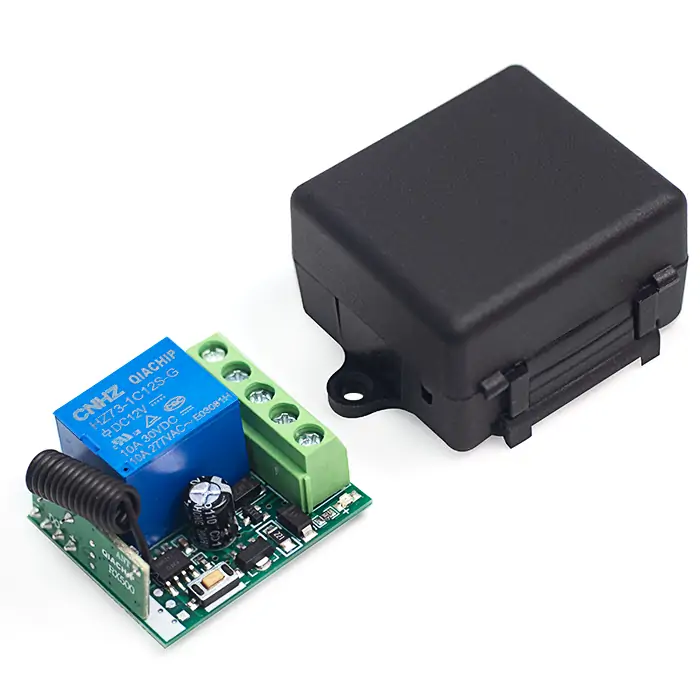
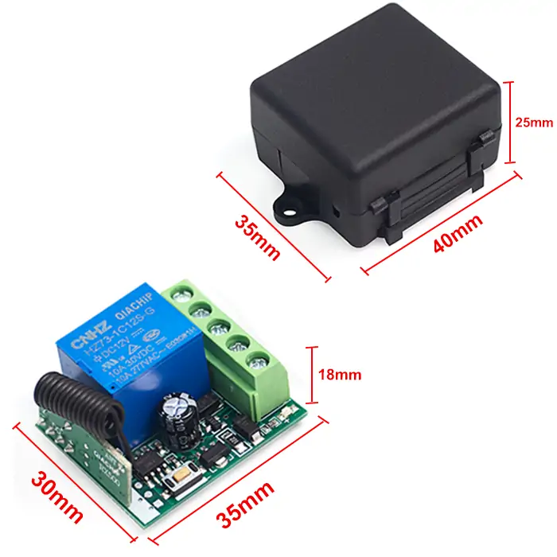
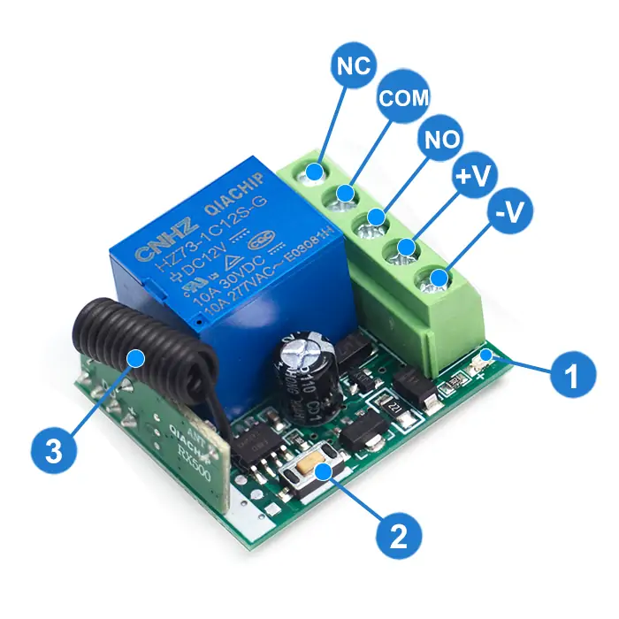
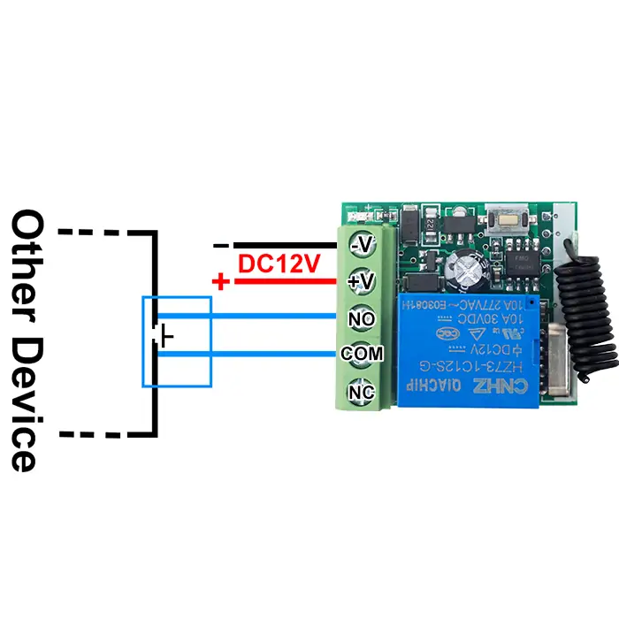
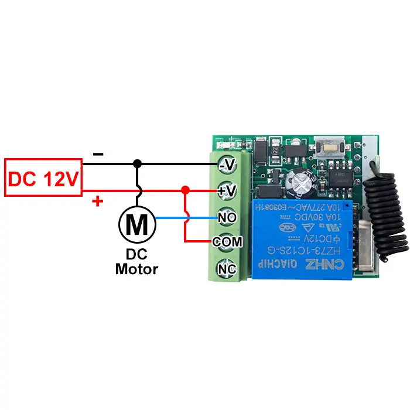
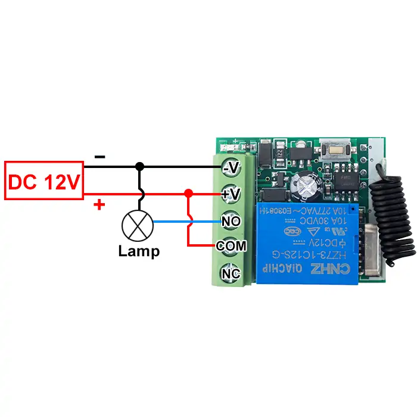

# QIACHIP KR1201A ( KR1201 Series ) Instruction Manual DC 12V 433MHz RF Remote Control Switch 1-CH Relay Receiver

{ width="50%" .center loading="lazy" }

> Version: V1.0
> 

> Last Updated: 2025-6-14
> 

> Model: KR1201A ( KR1201 Series ) 
> 

## Product Size

{ width="68%" .center loading="lazy" }

- Receiver Length (L) × Width (W) × Height (H): 35mm × 30mm × 18mm
- Housing Length (L) × Width (W) × Height (H): 40mm × 35mm × 25mm

## Component description

{ width="50%" .center loading="lazy" }

  <ul style="flex: 1 1 45%; margin-right: 1%;">
    <li>1: Indicator light</li>
    <li>2: Learning button</li>
    <li>3: Antenna</li>
    <li>+V: Positive input terminal</li>
  </ul>
  <ul style="flex: 1 1 45%; margin-left: 1%;">
    <li>NO: Normally open terminal</li>
    <li>COM: Common terminal</li>
    <li>NC: Normally closed terminal</li>
    <li>-V: Negative input terminal</li>
  </ul>

## Wiring diagram

Disconnect power before wiring.

### Figure 1

{ width="50%" .center loading="lazy" }

Figure 1: For door access switches or switches of other devices

- Input Power: DC 12V
- Output switching signal, which can replace switches to control other devices.
- Dry contacts: Potential-free contacts that act only as a switch to connect or disconnect external circuits.

---

### Figure 2

{ width="50%" .center loading="lazy" }

Figure 2: Wiring diagram for DC motors

- Load: DC motor
- Input power: DC 12V

---

### Figure 3

{ width="50%" .center loading="lazy" }

Figure 3: Wiring diagram for lamps

- Load: lamp
- Input power: DC 12V

---

## Function description and setting method

**(1) Momentary mode; (2) Toggle mode; (3) Latching mode; (4) Delay mode; (5) Reset function.**

- When you use the third working mode, a remote control with at least two buttons is required.
- When pairing a second remote, you don't need to press the button on the receiver 8 times again to reset it.
- Once the receiver and transmitter are paired and a working mode is selected, the receiver will retain this mode even if powered off and on again.
- The following working modes require the use of QIACHIP brand remote controls (transmitters) and controllers (receivers/wireless remote control switches). Compatibility with other brands is not guaranteed

### **(1) Momentary mode**

 In this mode: 

- Press and hold the remote control button (such as A), and the corresponding relay on the receiver is turned on.
- Release the remote control button (such as A), and the corresponding relay on the receiver will turn off.

### **How to set momentary mode**

**Step 1**

Click the learning button of the receiver once. The indicator light on the receiver turns on and the receiver enters the setting state.

**Step 2**

Press the button on the remote control (such as A) once. The indicator light on the receiver will flash and then turns off.The momentary mode is set successfully. 

### **(2) Toggle mode**

In this mode: 

- Press the remote control button (such as A), and the corresponding relay on the receiver will turn on.
- Press the remote control button (such as A) again, and the corresponding relay on the receiver will turn off.

### **How to set toggle mode**

**Step 1**

Click the learning button of the receiver twice. The indicator light on the receiver turns on, and the receiver enters the setting state.

**Step 2**

Press the button on the remote control (such as A) once. The indicator light on the receiver will flash and then turns off.The toggle mode is set successfully. 

### **(3) Latching mode**

In this mode:

- Press the remote control button (such as A), and the receiver's relay turns on.
- Press the remote control button (such as B), and the receiver's relay turns off.

### **How to set latching mode**

**Step 1** 

Click the learning button of the receiver three times. The indicator light on the receiver turns on, and the receiver enters the setting state.

**Step 2**

Press the button on the remote control (such as A) once. The indicator light on the receiver will flash and then turns on.

**Step 3**

Within this period, press another button (such as B) on the same remote control. The indicator light on the receiver flashes and then turns off. The latching mode is set successfully. 

### **(4) Delay mode**

In this mode:

- Press the remote control button (such as A), and the corresponding relay of the receiver will enter delay mode.

### How to set delay mode

**Step 1** 

Click the learning button of the receiver 4 times. The indicator light on the receiver turns on, and the receiver enters the setting state. 

(Press the receiver button **4 times**: The corresponding relay will close after a 5-second delay);

(Press the receiver button **5 times**: The corresponding relay will close after a 10-second delay);

(Press the receiver button **6 times**: The corresponding relay will close after a 15-second delay);

(Press the receiver button **7 times**: The corresponding relay will close after a 20-second delay).

**Step 2**

Press the button on the remote control (such as A) once. The indicator light on the receiver will flash and then turns off. The delay mode is set successfully,

### **(5) Reset function**

- When the KR1201A receiver is reset, all paired transmitters will be unpaired and can no longer control the receiver.

### How to Reset

Click the learning button on the receiver 8 times. The reset is complete when the indicator light flashes and then turns off.

## Electrical characteristics

| Parameter | Value |
| --- | --- |
| Input voltage | DC 12V |
| RF frequency | 433.92MHz |
| Standby current | 5 mA |
| Rated Load | Max 120W |
| Receiver sensitivity | -97dBm |
| Operation mode | Momentary mode/Toggle mode/Latching mode/Delay mode |
| Working temperature | -10℃~+80℃ |
| Size | 35x30x18mm |

## Warning

- The positive and negative terminal wires must not be reversed
- When using wireless electronic devices, avoid proximity to metal objects, large electronic equipment, electromagnetic fields, and other sources of strong interference

## Frequently Asked Questions（Q&A）

**Question 1:** Does KR1201A support Momentary mode?

**Answer:**

Yes, KR1201A supports Momentary mode.

Momentary mode: the relay turns on while you hold the remote button. The relay turns off when you release it.

KR1201A also supports Toggle mode, Latching mode, and Delay mode.

**Question 2:** In Momentary mode, what happens if the remote moves out of range while I hold the button?

**Answer:**

If the remote moves out of range, the relay turns off.

The receiver no longer gets the remote signal. This is the same as releasing the remote button.

**Question 3:** Which mode should I use to reduce battery consumption?

**Answer:**

Momentary mode may help reduce battery use.

The receiver still uses a small amount of power in standby. Momentary mode can reduce the active working time.

For longer operating time, use a large-capacity battery or a stable 12V DC power supply.

**Question 4:** Will KR1201A lose the paired remotes or working mode after power loss?

**Answer:**

No, KR1201A can remember the paired remotes and working mode after power loss.

The relay cannot stay on when the power is off.

After power comes back, the receiver works with the saved remotes and mode. Reset deletes the saved data.

**Question 5:** Does Toggle mode need to be set again after power loss?

**Answer:**

No, KR1201A does not need to be set again after power loss.

The receiver can remember Toggle mode after power loss.

**Question 6:** Can one KR1201A receiver work with more than one remote?

**Answer:**

Yes, one KR1201A receiver can work with multiple remotes.

Pair the first remote. Then pair each new remote the same way.

Each paired remote can control the same receiver.

**Question 7:** Can two remotes use the same working mode, such as Delay mode or Toggle mode?

**Answer:**

Yes, multiple remotes can use the same working mode.

Pair the remotes to the same receiver and set the working mode you need.

**Question 8:** Can KR1201A reverse a DC motor?

**Answer:**

No, KR1201A cannot reverse a DC motor.

KR1201A is a single-channel relay receiver. It can do simple on / off control.

DC motor reverse control needs polarity change. Use a two-channel relay receiver or a motor controller.

**Question 9:** Can button B reverse a motor?

**Answer:**

No, button B cannot reverse a motor with KR1201A.

KR1201A is a single-channel relay receiver. It cannot do forward and reverse motor control.

Use a two-channel controller for motor forward and reverse control.

**Question 10:** Can KR1201A control a servo motor?

**Answer:**

No, KR1201A is not made for servo motor control.

Servo motors need a signal-based servo controller.

**Question 11:** Can two KR1201A receivers control a DC motor left and right?

**Answer:**

No, two KR1201A receivers are not the right choice for DC motor left and right control.

DC motor direction control needs polarity change. Use a two-channel receiver or a motor controller.

**Question 12:** Can KR1201A be powered by AC power?

**Answer:**

No, do not power KR1201A with AC power.

KR1201A needs DC 12V input. If you need AC 110V or AC 220V control, choose a receiver made for that AC voltage.

**Question 13:** Can KR1201A control AC 220V home appliances?

**Answer:**

No, KR1201A is not the right choice for AC 220V home appliances.

KR1201A itself is a 12V DC receiver. Do not power it with AC 220V.

Use an AC 220V receiver instead. For example: KR2201 series.

**Question 14:** Can KR1201A and the load use the same power supply?

**Answer:**

Yes, but only if the voltage and current match both the receiver and the load.

Check that:

- receiver input voltage: DC 12V;
- load voltage;
- power supply output current.

Wrong voltage or not enough current can damage the device.

**Question 15:** Can a 5V version work with a 3.7V Li-ion / 18650 battery?

**Answer:**

No, a 3.7V battery is lower than the 5V receiver input.

Low voltage may make the receiver unstable, reduce range, or stop the receiver from working.

Use a proper 5V power source for a 5V receiver.

**Question 16:** What battery should I use for KR1201A?

**Answer:**

Use a 12V power source for KR1201A.

A 12V lithium battery is usually better than AA batteries.

AA batteries may work, but they have lower capacity and may run out fast. If the device stops working, check the battery first.

**Question 17:** Can a 9V battery power KR1201A?

**Answer:**

No, a 9V battery is not enough for KR1201A.

KR1201A needs 12V DC. A 9V battery may light the indicator, but it may not power the relay.

Use a proper 12V power source.

**Question 18:** Can two devices be connected using NO and NC?

**Answer:**

Yes, you can use NO and NC to connect two loads.

NO: normally open.
NC: normally closed.

Connect one load through NO and another load through NC. When the relay changes, one load turns on and the other turns off.

Avoid short circuits.

**Question 19:** Can the negative line be connected to COM?

**Answer:**

Yes, the negative line can connect to COM in some DC circuits.

Only do this if you understand relay wiring.

The key rule: the circuit must not create a short circuit.

**Question 20:** Can KR1201A control two LED lights so that one is on while the other is off?

**Answer:**

Yes, KR1201A can control two LED lights so that one is on while the other is off.

Connect one LED through NO and the other LED through NC. When the relay changes, one LED turns on and the other turns off.

For more complex control, use a multi-channel relay receiver.

**Question 21:** What is the maximum remote-control distance?

**Answer:**

It depends on the remote model, antenna, environment, and interference.

Some remotes claim 2 miles or 3 km. Real-world distance is much lower, around 1 km or less.

**Question 22:** Can I connect an external antenna to KR1201A?

**Answer:**

Yes, but the external antenna must match the module specs.

KR1201A has an antenna on the module. A wrong antenna may not improve distance and may make the module work poorly.

**Question 23:** How do I reset KR1201A?

**Answer:**

Press the receiver's Learning button 8 times to reset the receiver.

Reset deletes all paired remotes and mode settings. Pair the remotes and set the mode again.

**Question 24:** Does KR1201A have memory storage, such as EEPROM?

**Answer:**

Yes, KR1201A has memory for paired remotes and mode settings.

The module can store up to 20 remotes.

**Question 25:** Can KR1201A be used for access control or automatic residential gates?

**Answer:**

It depends on the gate controller input and voltage.

For access-control systems with a dry contact input, KR1201A can trigger that input.

For automatic residential gates, use a receiver that matches the gate controller voltage and control input.

If the access-control system or the gate controller has a manual switch or button, connect KR1201A relay output COM and NO in parallel with that switch.

This makes the manual switch work by remote control.
