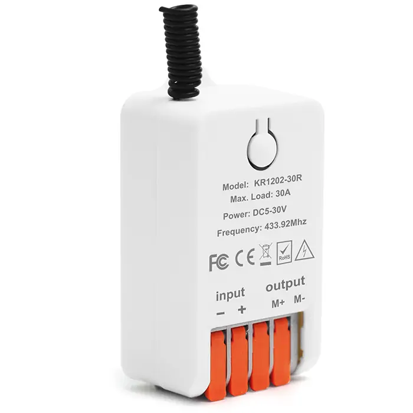
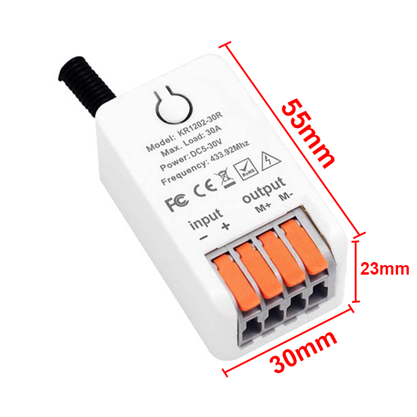
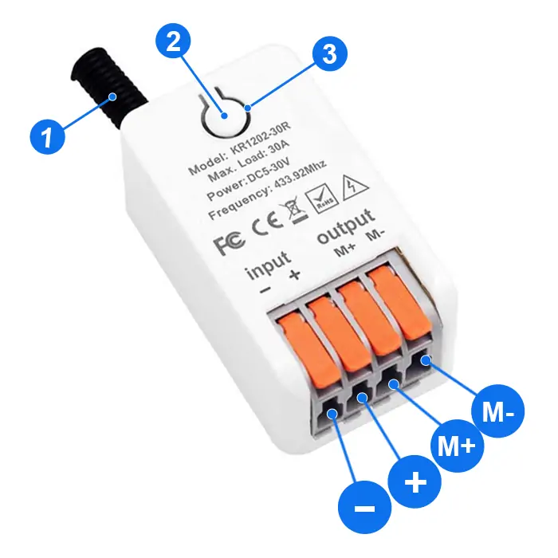
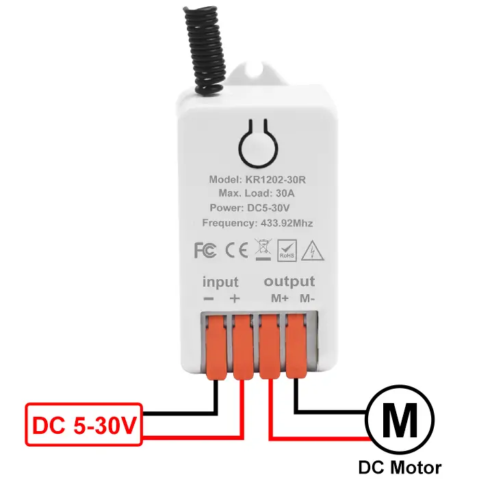

# QIACHIP KR1202-30R Instruction Manual DC 5V-30V 433MHz RF Wireless Motor Control Module Relay Receiver

{ width="50%" .center loading="lazy" }

> Version: V1.0
> 

> Last Updated: 2026-01-19
> 

> Model: KR1202-30R
> 

## Product Size

{ width="68%" .center loading="lazy" }

- Receiver Length (L) x Width (W) x Height (H): 55mm x 30mm x 23mm

## Component Description

{ width="50%" .center loading="lazy" }

  <ul style="flex: 1 1 45%; margin-right: 1%;">
    <li>1: Antenna</li>
    <li>2: Learning button</li>
    <li>3: Indicator light</li>
  </ul>
  <ul style="flex: 1 1 45%; margin-left: 1%;">
    <li>Input-: Negative input terminal</li>
    <li>Input+: Positive input terminal</li>
    <li>Output M+: Forward control terminal</li>
    <li>Output M-: Reverse control terminal</li>
  </ul>

## Wiring Diagram

Disconnect power before wiring.

### Figure 1

{ width="50%" .center loading="lazy" }

Figure 1: Wiring diagram for DC motors

- Load: DC motors

- Input Power: DC 5V-30V

---

## Function description and setting method

**(1) Momentary mode; (2) Toggle mode; (3) Latching mode; (4) Reset function.**

**NOTE**

- **This product requires a remote control with at least two buttons. For the third mode, a remote control with at least three buttons is required.**
- **The receiver will fail to pair with any remote control after 18 buttons have been paired. The function can be restored by resetting the receiver.**
- **When pairing a second remote, you don't need to press the button on the receiver 8 times again to reset it.**
- **Once the receiver and transmitter are paired and a working mode is selected, the receiver will retain this mode even if powered off and on again.**
- **The following working modes require the use of QIACHIP brand remote controls (transmitters) and controllers (receivers). Compatibility with other brands is not guaranteed.**

### (1) Momentary mode

In this mode: 

- Press and hold the remote control button (such as A) to rotate the motor forward; release the remote control button to stop.
- Press and hold the remote control button (such as B) to rotate the motor backward; release the remote control button to stop.

### How to set momentary mode

**Step 1**

Click the learning button of the receiver once. The indicator light on the receiver will turn on, and the receiver will enter the setting state.

**Step 2**

Press the button on the remote control (such as A) once. The indicator light on the receiver will flash and then will turn on.

**Step 3**

After the indicator light turns on, press another button (such as B) on the same remote control. The indicator light on the receiver will flash and then will turn off. The momentary mode will be set successfully.

### (2) Toggle mode

In this mode: 

- Press the remote control button (such as A), and the motor rotates forward. Press button A again, and the motor stops.
- Press the remote control button (such as B), and the motor rotates backward. Press button B again, and the motor stops.

### How to set toggle mode

**Step 1**

Click the learning button of the receiver twice. The indicator light on the receiver will turn on, and the receiver will enter the setting state.

**Step 2**

Press the button on the remote control (such as A) once. The indicator light on the receiver will flash and then will turn on.

**Step 3**

After the indicator light turns on, press another button (such as B) on the same remote control. The indicator light on the receiver will flash and then will turn off. The Toggle mode will be set successfully.

### (3) Latching mode

In this mode:

- Press the remote control button (such as A), and the receiver's relay will turn on.
- Press the remote control button (such as B), and the receiver's relay will turn off.

### How to set latching mode

**Step 1**

Click the learning button of the receiver three times. The indicator light on the receiver will turn on, and the receiver will enter the setting state.

**Step 2**

Press the button on the remote control (such as A) once. The indicator light on the receiver will flash and then will turn on.

**Step 3**

After the indicator light turns on, press another button (such as B) on the same remote control. The indicator light on the receiver will flash and then will turn on.

**Step 4**

After the indicator light turns on, press another button (such as C) on the same remote control. The indicator light on the receiver will flash and then will turn off. The latching mode will be set successfully.

### (4) Reset function

- When the KR1202-30R receiver is reset, all paired transmitters will be unpaired and will no longer be able to control the receiver.

### How to reset

Click the learning button on the receiver 8 times. The indicator light will flash and then will turn off. The reset will be complete.

## Electrical characteristics

| Parameter | Value |
| --- | --- |
| Input voltage | DC 5V-30V |
| RF frequency | 433.92MHz |
| Relay max contact current | 30A |
| Rated Load | Max 900W |
| Receiver sensitivity | -100dBm |
| Operation mode | Momentary mode/Toggle mode/Latching mode |
| Working temperature | -20℃~+80℃ |
| Size | 55x30x23mm |

## Warning

- The positive and negative terminal wires must not be reversed.
- When using wireless electronic devices, avoid proximity to metal objects, large electronic equipment, electromagnetic fields, and other sources of strong interference.
