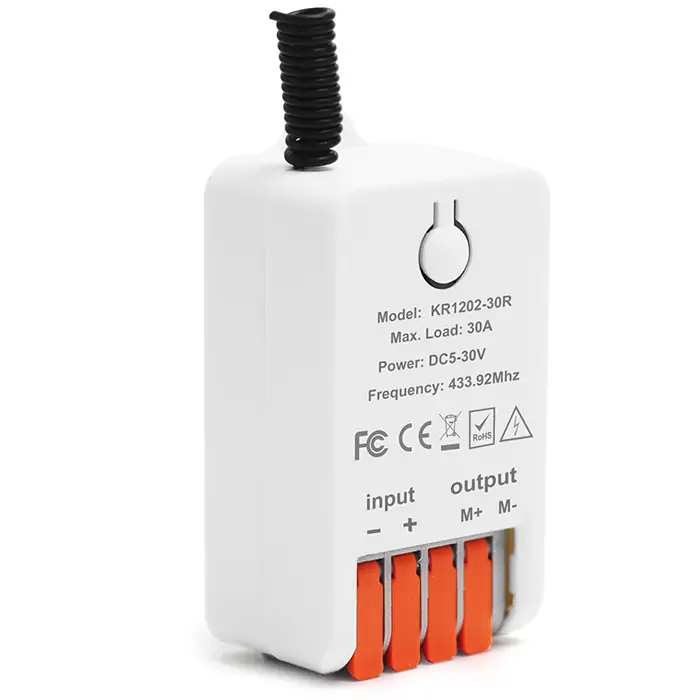
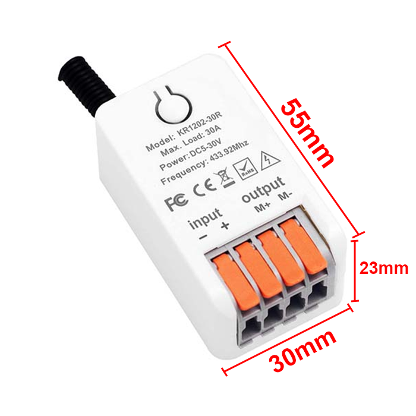
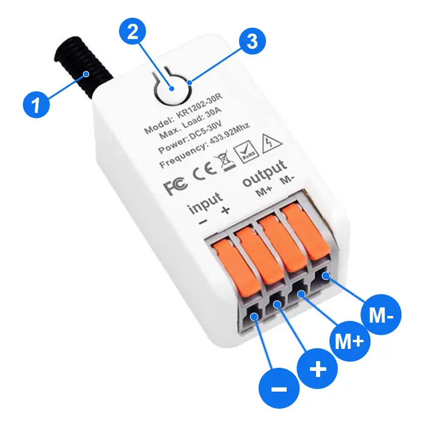
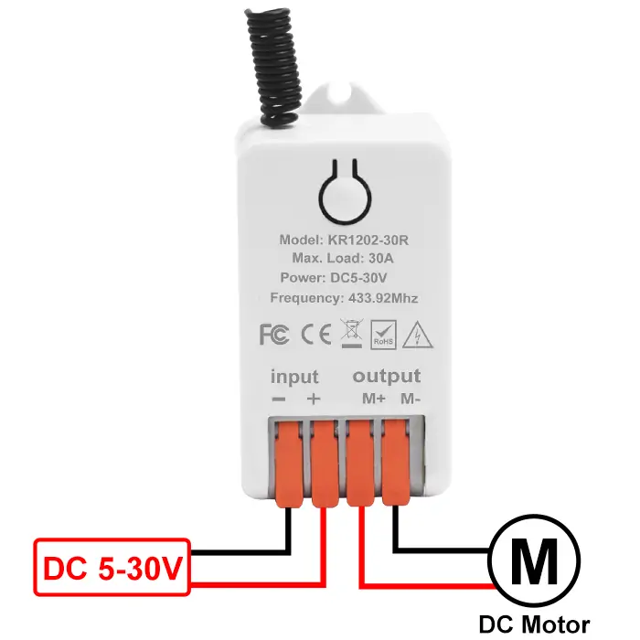

# QIACHIP KR1202-30R ( KR1202 Series ) Instruction Manual DC 5V-30V 433MHz RF Wireless Motor Control Module Relay Receiver

{ width="50%" .center loading="lazy" }

> Version: V1.0
> 

> Last Updated: 2026-06-05
> 

> Model: KR1202-30R ( KR1202 Series )
> 

## Product Size

{ width="68%" .center loading="lazy" }

- Receiver Length (L) x Width (W) x Height (H): 55mm x 30mm x 23mm

## Component Description

{ width="50%" .center loading="lazy" }

  <ul style="flex: 1 1 45%; margin-right: 1%;">
    <li>1: Antenna</li>
    <li>2: Learning button</li>
    <li>3: Indicator light</li>
  </ul>
  <ul style="flex: 1 1 45%; margin-left: 1%;">
    <li>Input-: Negative input terminal</li>
    <li>Input+: Positive input terminal</li>
    <li>Output M+: Forward control terminal</li>
    <li>Output M-: Reverse control terminal</li>
  </ul>

## Wiring Diagram

Disconnect power before wiring.

### Figure 1

{ width="50%" .center loading="lazy" }

Figure 1: Wiring diagram for DC motors

- Load: DC motors

- Input Power: DC 5V-30V

---

## Function description and setting method

**(1) Momentary mode; (2) Toggle mode; (3) Latching mode; (4) Reset function.**

- **This product requires a remote control with at least two buttons. For the third mode, a remote control with at least three buttons is required.**
- **The receiver will fail to pair with any remote control after 18 buttons have been paired. The function can be restored by resetting the receiver.**
- **When pairing a second remote, you don't need to press the button on the receiver 8 times again to reset it.**
- **Once the receiver and transmitter are paired and a working mode is selected, the receiver will retain this mode even if powered off and on again.**
- **The following working modes require the use of QIACHIP brand remote controls (transmitters) and controllers (receivers). Compatibility with other brands is not guaranteed.**

### (1) Momentary mode

 In this mode: 

- Press and hold the remote control button (such as A) to rotate the motor  forward; release the remote control button to stop.
- Press and hold the remote control button (such as B) to rotate the motor backward; release the remote control button to stop.

### How to set momentary mode

**Step 1**

Click the learning button of the receiver once. The indicator light on the receiver will turn on, and the receiver will enter the setting state.

**Step 2**

Press the button on the remote control (such as A) once. The indicator light on the receiver will flash and then will turn on.

**Step 3**

After the indicator light turns on, press another button (such as B) on the same remote control. The indicator light on the receiver will flash and then turn off. The momentary mode will be set successfully

### (2) Toggle mode

In this mode: 

- Press the remote control button (such as A), and the motor rotates forward. Press button A again, and the motor stops.
- Press the remote control button (such as B), and the motor rotates backward. Press button B again, and the motor stops.

### How to set toggle mode

**Step 1**

Click the learning button of the receiver  twice. The indicator light on the receiver will turn on, and the receiver will enter the setting state.

**Step 2**

Press the button on the remote control (such as A) once. The indicator light on the receiver will flash and then will turn on.

**Step 3**

After the indicator light turns on, press another button (such as B) on the same remote control. The indicator light on the receiver will flash and then turn off. The Toggle mode will be set successfully.

### (3) Latching mode

In this mode:

- Press the remote control button (such as A), and the motor rotates forward.
- Press the remote control button (such as B), and the motor rotates backward.
- Press the remote control button (such as C), and the motor stops.

### How to set latching mode

**Step 1**

Click the learning button of the receiver three times. The indicator light on the receiver will turn on, and the receiver will enter the setting state.

**Step 2**

Press the button on the remote control (such as A) once. The indicator light on the receiver will flash and then will turn on.

**Step 3**

After the indicator light turns on, press another button (such as B) on the same remote control. The indicator light on the receiver will flash and then will turn on.

**Step 4**

After the indicator light turns on, press another button (such as C) on the same remote control. The indicator light on the receiver will flash and then turn off. The latching mode will be set successfully.

### (4) Reset function

- When the KR1202-30R receiver is reset, all paired transmitters will be unpaired and will no longer be able to control the receiver.

### How to reset

Click the learning button on the receiver 8 times. The indicator light will flash and then will turn off. The reset will be complete.

## Electrical characteristics

| Parameter | Value |
| --- | --- |
| Input voltage | DC 5-30V |
| RF frequency | 433.92MHz |
| Relay max contact current | 30A |
| Rated Load | Max 900W |
| Receiver sensitivity | -100dBm |
| Operation mode | Momentary mode/Toggle mode/Latching mode/Delay mode |
| Working temperature | -20℃~+80℃ |
| Size | 55x30x23mm |

## Warning

- The positive and negative terminal wires must not be reversed.
- When using wireless electronic devices, avoid proximity to metal objects, large electronic equipment, electromagnetic fields, and other sources of strong interference.

## Frequently Asked Questions (Q&A)

**Question 1:** My 3-button remote opens my gate with every button, but no button closes it. My second remote opens and closes fine. How do I fix the first remote?

**Answer:**

Your buttons may all be set to the same direction, so they all open the gate and none closes it.

Your second remote opens and closes fine. This shows the receiver, wiring, and motor are all working. The problem is only how that first remote is paired.

Your remote has 3 buttons, so use Latching mode. Latching mode gives you one button to open, one button to close, and one button to stop.

Reset deletes all paired remotes, so you pair both remotes again after the reset.

Pair each remote with three buttons in the same Latching setup:

1. Press the receiver's Learning button 8 times to reset the receiver. The indicator light flashes, then turns off.
2. Press the receiver's Learning button 3 times for Latching mode. The indicator light turns on.
3. Press one button on the remote (such as A). Wait until the indicator light flashes, then turns on. This button opens the gate.
4. Press a second button (such as B). Wait until the indicator light flashes, then turns on. This button closes the gate.
5. Press a third button (such as C). Wait until the indicator light flashes, then turns off. This button stops the gate.
6. Repeat steps 2-5 for your second remote.

Use QIACHIP brand remotes for this setup. Other-brand remote compatibility is not guaranteed.

If this remote still cannot close the gate after you pair all three buttons again, the remote itself may be faulty.
