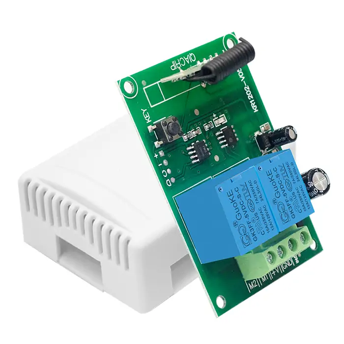
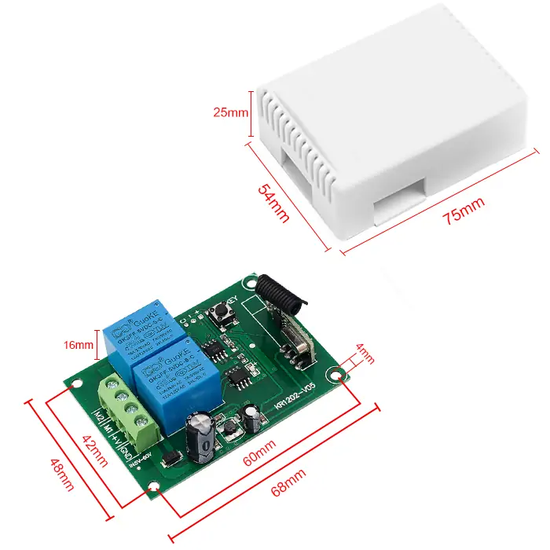
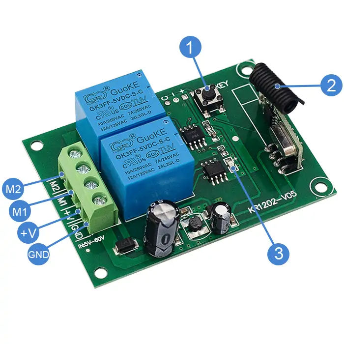
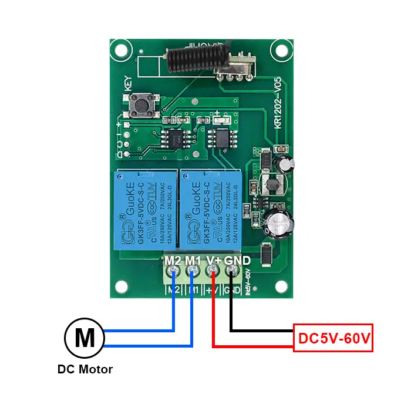

# QIACHIP KR1202-V05 ( KR1202 Series ) Instruction Manual DC 5V-60V 433MHz RF Wireless Motor Control Module Relay Receiver

{ width="50%" .center loading="lazy" }

> Version: V1.0
> 

> Last Updated: 2026-08-06
> 

> Model: KR1202-V05
> 

## Product Size

{ width="68%" .center loading="lazy" }

- Receiver Length (L) x Width (W) x Height (H): 68mm x 48mm x 16mm
- Housing Length (L) x Width (W) x Height (H): 75mm x 54mm x 25mm
- Receiver hole horizontal spacing: 60mm; Vertical spacing: 42mm; Hole Diameter: Ø4mm

## Component Description

{ width="50%" .center loading="lazy" }

  <ul style="flex: 1 1 45%; margin-right: 1%;">
    <li>1: Learning button</li>
    <li>2: Antenna</li>
    <li>3: Indicator light</li>
  </ul>
  <ul style="flex: 1 1 45%; margin-left: 1%;">
    <li>Input GND : Negative input terminal</li>
    <li>Input +V: Positive input terminal</li>
    <li>Output M1: Motor control terminal 1</li>
    <li>Output M2: Motor control terminal 2</li>
  </ul>

## Wiring Diagram

Disconnect power before wiring.

### Figure 1

{ width="50%" .center loading="lazy" }

Figure 1: Wiring diagram for DC motors

- Load: DC motors
- Input Power: DC 5V-60V

---

## Function description and setting method

**(1) Momentary mode; (2) Toggle mode; (3) Latching mode; (4) Reset function.**

**NOTE**

- **This product requires a remote control with at least two buttons. For the third mode, a remote control with at least three buttons is required.**
- **M1 and M2 are independent motor control terminals with no fixed forward/reverse assignment. Their actual function is determined by your external wiring configuration.**
- **When pairing a second remote, you don't need to press the button on the receiver 8 times again to reset it.**
- **Once the receiver and transmitter are paired and a working mode is selected, the receiver will retain this mode even if powered off and on again.**
- **The following working modes require the use of QIACHIP brand remote controls (transmitters) and controllers (receivers). Compatibility with other brands is not guaranteed.**

### (1) Momentary mode

In this mode: 

- Press and hold the remote control button (such as A) to rotate the motor forward; release the remote control button to stop.
- Press and hold the remote control button (such as B) to rotate the motor backward; release the remote control button to stop.

### How to set momentary mode

**Step 1**

Click the learning button of the receiver once. The indicator light on the receiver will turn off, and the receiver will enter the setting state.

**Step 2**

Press the button on the remote control (such as A) once. The indicator light on the receiver will flash and then will turn off.

**Step 3**

Press another button (such as B) on the same remote control. The indicator light on the receiver will flash and then turn on. The momentary mode will be set successfully.

### (2) Toggle mode

In this mode: 

- Press the remote control button (such as A), and the motor rotates forward. Press button A again, and the motor stops.
- Press the remote control button (such as B), and the motor rotates backward. Press button B again, and the motor stops.

### How to set toggle mode

**Step 1**

Click the learning button of the receiver twice. The indicator light on the receiver will turn off, and the receiver will enter the setting state.

**Step 2**

Press the button on the remote control (such as A) once. The indicator light on the receiver will flash and then will turn off.

**Step 3**

Press another button (such as B) on the same remote control. The indicator light on the receiver will flash and then turn on. The Toggle mode will be set successfully.

### (3) Latching mode

In this mode:

- Press the remote control button (such as A), and the motor rotates forward.
- Press the remote control button (such as B), and the motor rotates backward.
- Press the remote control button (such as C), and the motor stops.

### How to set latching mode

**Step 1**

Click the learning button of the receiver three times. The indicator light on the receiver will turn off, and the receiver will enter the setting state.

**Step 2**

Press the button on the remote control (such as A) once. The indicator light on the receiver will flash and then will turn off.

**Step 3**

Press another button (such as B) on the same remote control. The indicator light on the receiver will flash and then turn on. The latching mode will be set successfully.

### (4) Reset function

- When the KR1202-V05 receiver is reset, all paired transmitters will be unpaired and will no longer be able to control the receiver.

### How to reset

Click the learning button on the receiver 8 times. The indicator light will flash and then will turn on. The reset will be complete.

## Electrical characteristics

| Parameter | Value |
| --- | --- |
| Input voltage | DC 5V-60V |
| RF frequency | 433.92MHz |
| Relay max contact current | 10A |
| Rated Load | Max 600W  |
| Receiver sensitivity | -97dBm |
| Operation mode | Momentary mode/Toggle mode/Latching mode |
| Working temperature | -20℃~+80℃ |
| Size | 68x48x16mm |

## Warning

- The positive and negative terminal wires must not be reversed.
- When using wireless electronic devices, avoid proximity to metal objects, large electronic equipment, electromagnetic fields, and other sources of strong interference.

## Frequently Asked Questions (Q&A)

**Question 1:** Why does only one of the two KR1202-V05 channels work?

**Answer:**

Your pairing steps may be wrong, so the receiver may learn only one channel.

Pair both channels again in the same Momentary setup:

1. Press the receiver's Learning button 8 times to reset the receiver.
2. Press the receiver's Learning button 1 time for Momentary mode. Wait until the receiver's indicator light turns off.
3. Press one button on the remote (such as A). Wait until the receiver's indicator light flashes, then turns off.
4. Press another button on the remote (such as B). Wait until the receiver's indicator light flashes, then turns on.

This pairs both channels in Momentary mode.

**Question 2:** Why does button A on one remote work in reverse from the other remotes?

**Answer:**

That transmitter may have been paired with a different button order.

Reset the receiver once. Then pair all transmitters again with the same button order. Example for Momentary mode:

1. Press the receiver's Learning button 8 times to reset the receiver.
2. Press the receiver's Learning button 1 time for Momentary mode. Wait until the receiver's indicator light turns off.
3. Press button A on transmitter 1 first. Wait until the receiver's indicator light flashes, then turns off.
4. Press button B on transmitter 1 second. Wait until the receiver's indicator light flashes, then turns on.
5. Repeat the same A/B button order for each transmitter.

This pairs each transmitter with the same A/B button order.

**Question 3:** Why does my motor go up but not down after KR1202-V05 worked normally for one week?

**Answer:**

If the motor worked normally before but now goes up and not down, the first thing to check is loose wiring.

The likely causes are:

1. One motor output wire may have become loose. Check the wires on M1 and M2, especially the wire for the failed direction.

2. The remote battery may be weak. One button signal may still work, but the other button signal may be too weak. Replace the remote battery. Then pair the remote and receiver again.

If the wiring is tight, the battery is new, and pairing again does not fix it, the receiver may have a fault. In that case, apply for a return or replacement.

**Question 4:** How do I pair all 4 transmitters for my theft alarm if only 1 transmitter works now?

**Answer:**

This is usually because the receiver was reset before each new transmitter was paired.

Do not press the receiver's Learning button 8 times before pairing each new transmitter.

Reset deletes all paired transmitters. If you reset before pairing the next transmitter, only the last transmitter may work.

Pair the 4 transmitters again with the steps below:

1. Press the receiver's Learning button 8 times to reset the receiver once.
2. Press the receiver's Learning button 1 time for Momentary mode. Wait until the receiver's indicator light turns off.
3. Press the first remote button on transmitter 1. Wait until the receiver's indicator light flashes, then turns off.
4. Press the second remote button on transmitter 1. Wait until the receiver's indicator light flashes, then turns on.
5. Repeat the same button order for transmitter 2, transmitter 3, and transmitter 4.

Use QIACHIP brand transmitters for this setup. Other-brand transmitter compatibility is not guaranteed.

**Question 5:** Why does my gate open and close by itself without pressing the remote? Is it interference?

**Answer:**

Yes, it may be interference from a nearby same-frequency signal.

If the receiver learned that interference signal during pairing, that signal may control the receiver. Then the receiver may open or close the gate without pressing your remote.

Pair the remote and receiver again in a place with no signal interference:

1. Move the receiver away from the gate and nearby interference sources.
2. Pair your remote and receiver again.
3. Connect the receiver to the gate equipment again.
4. Test the gate with your remote.

If the gate location always has same-frequency interference, we do not recommend this 433.92MHz wireless controller. Use a different-frequency controller to avoid signal interference.
