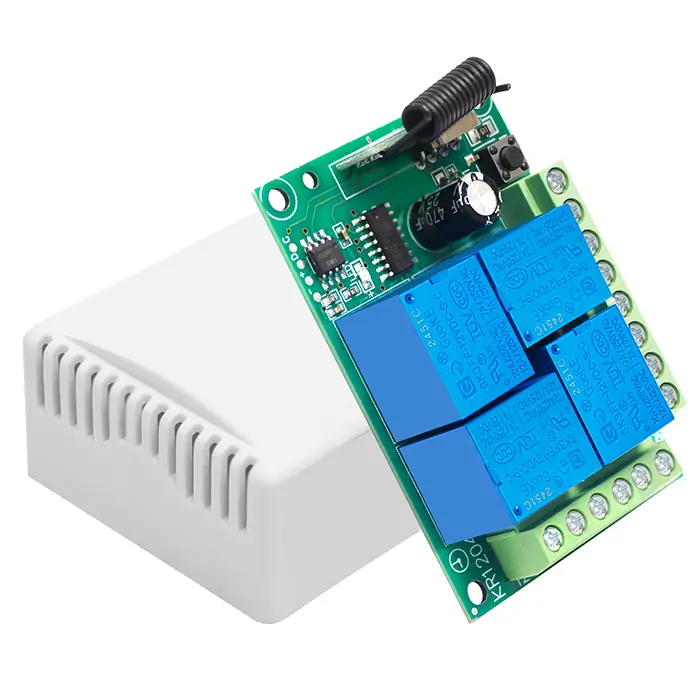
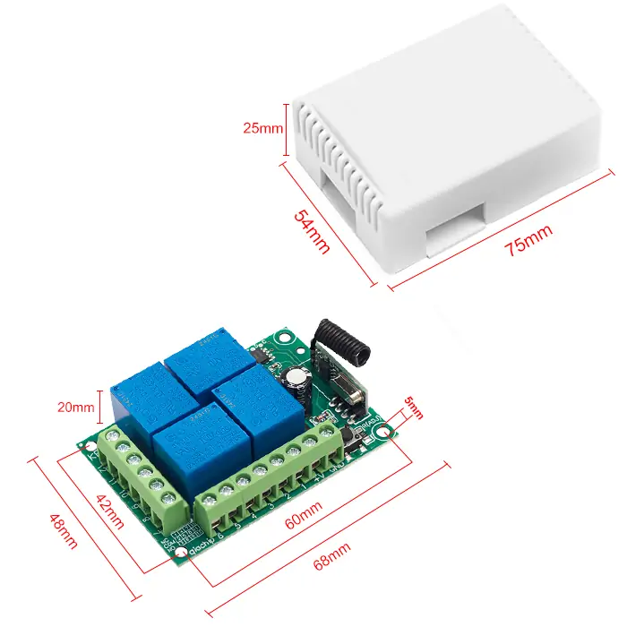
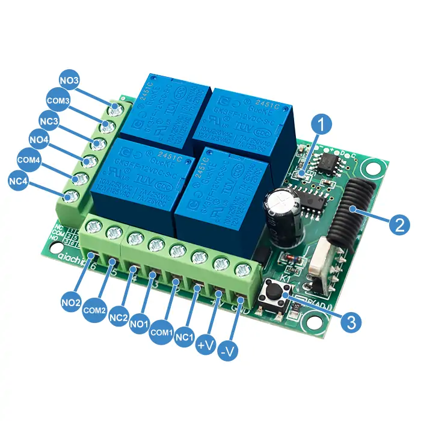
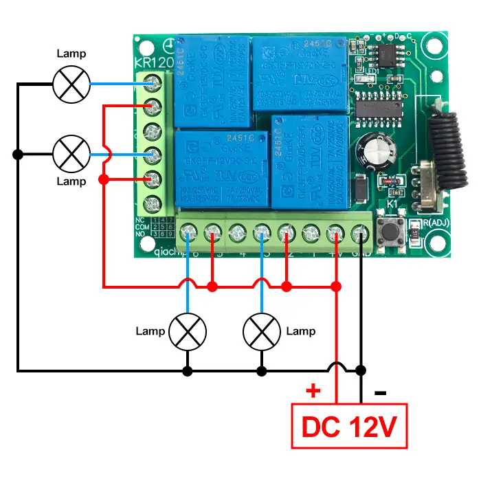
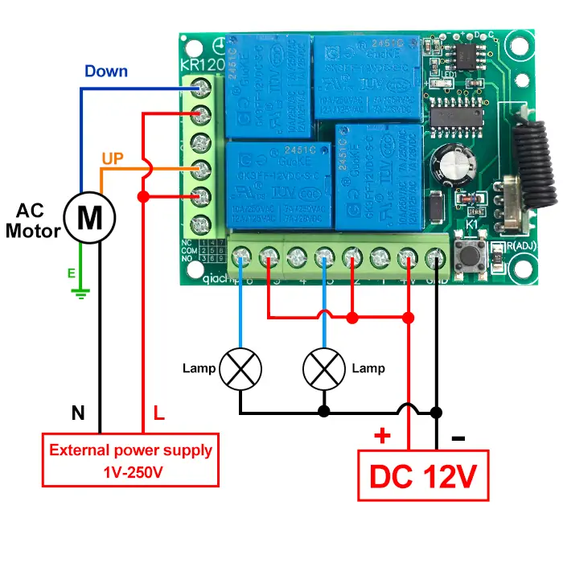
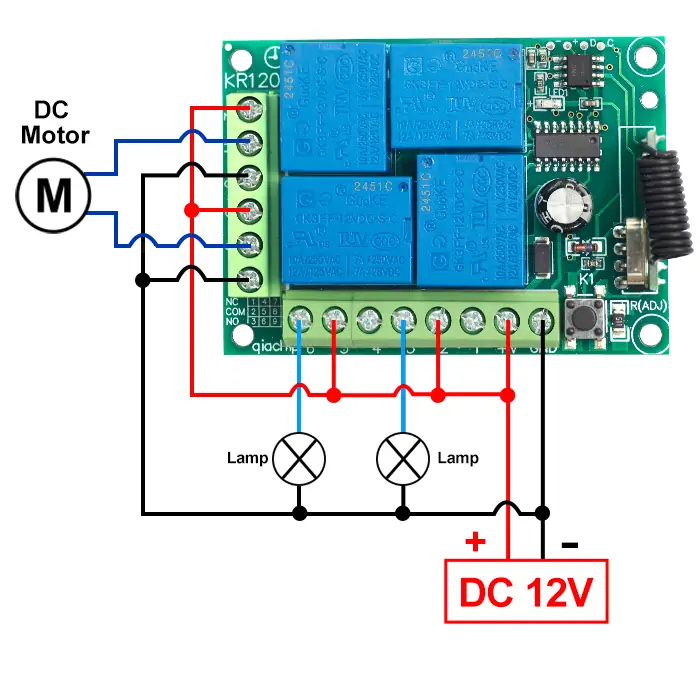

# QIACHIP KR1204 Instruction Manual DC 12V 433MHz RF Remote Control Switch 4-CH Relay Receiver

{ width="50%" .center loading="lazy" }

> Version: V1.0
> 

> Last Updated: 2025-07-27
> 

> Model: KR1204
> 

## Product Size

{ width="68%" .center loading="lazy" }

- Receiver Length (L) × Width (W) × Height (H): 68mm × 48mm × 20mm
- Housing Length (L) × Width (W) × Height (H): 75mm × 54mm × 25mm
- Receiver hole horizontal spacing: 60mm; Vertical spacing: 42mm; Hole Diameter: Ø5mm

## Component description

{ width="50%" .center loading="lazy" }

  <ul style="flex: 1 1 45%; margin-right: 1%;">
    <li>1: Indicator light</li>
    <li>2: Antenna</li>
    <li>3: Learning button</li>
    <li>+V: Positive input terminal</li>
    <li>-V: Negative input terminal</li>
    <li>NO1: Normally open terminal of relay1</li>
    <li>COM1: Common terminal of relay1</li>
    <li>NC1: Normally closed terminal of relay1</li>
  </ul>
  <ul style="flex: 1 1 45%; margin-left: 1%;">
    <li>NO2: Normally open terminal of relay2</li>
    <li>COM2: Common terminal of relay2</li>
    <li>NC2: Normally closed terminal of relay2</li>
    <li>NO3: Normally open terminal of relay3</li>
    <li>COM3: Common terminal of relay3</li>
    <li>NC3: Normally closed terminal of relay3</li>
    <li>NO4: Normally open terminal of relay4</li>
    <li>COM4: Common terminal of relay4</li>
    <li>NC4: Normally closed terminal of relay4</li>
  </ul>

## Wiring diagram

Disconnect power before wiring.

### Figure 1

{ width="50%" .center loading="lazy" }

Figure 1: Wiring diagram for lamps

- Load: lamps

- Input Power: DC 12V

---

### Figure 2

{ width="50%" .center loading="lazy" }

Figure 2: Wiring diagram for AC motors and Lamps

- Load: AC motors and Lamps
- Input Power: DC 12V
- External power supply: 1V-250V

---

### Figure 3

{ width="50%" .center loading="lazy" }

Figure 3: Wiring diagram for DC motors and Lamps

- Load: DC motors and Lamps
- Input Power: DC 12V

---

## Function description and setting method

### **Normal Modes:**

(1) Momentary mode

(2) Toggle mode

(3) Latching mode

(4) Reset function

### **Combination Modes:**

(5) 2CH Momentary mode + 2CH Toggle mode

(6) 2CH Momentary mode + 2CH Latching mode

(7) 2CH Toggle mode + 2CH Latching mode

(8) 2CH Latching mode + 2CH Latching mode

**NOTE**

- When using the KR1204 model receiver, at least one remote control with four buttons is required.
- When pairing a second remote, you don't need to press the button on the receiver 8 times again to reset it.
- Once the receiver and transmitter are paired and a working mode is selected, the receiver will retain this mode even if powered off and on again.
- The following working modes require the use of QIACHIP brand remote controls (transmitters) and controllers (receivers/wireless remote control switches). Compatibility with other brands is not guaranteed

### **(1) Momentary mode**

 In this mode: 

- Press and hold the remote control button (such as A), and the corresponding relay on the receiver is turned on.
- Release the remote control button (such as A), and the corresponding relay on the receiver will turn off.

### **How to set momentary mode**

**Step 1**

Click the learning button of the receiver once. The indicator light on the receiver turns on and the receiver enters the setting state.

**Step 2**

Press the button on the remote control (such as A) once. The indicator light on the receiver will flash and then turns off. The momentary mode is set successfully. 

### **(2) Toggle mode**

In this mode: 

- Press the remote control button (such as A), and the corresponding relay on the receiver will turn on.
- Press the remote control button (such as A) again, and the corresponding relay on the receiver will turn off.

### **How to set toggle mode**

**Step 1**

Click the learning button of the receiver twice. The indicator light on the receiver turns on, and the receiver enters the setting state.

**Step 2**

Press the button on the remote control (such as A) once. The indicator light on the receiver will flash and then turns off. The toggle mode is set successfully. 

### **(3) Latching mode**

In this mode:

- Press the remote control button (such as A), and the corresponding receiver’s relay A is turned on.
- Press the remote control button (such as B), and the corresponding receiver’s relay B is turned on, and the receiver’s relay A is turned off.

### **How to set latching mode**

**Step 1** 

Click the learning button of the receiver three times. The indicator light on the receiver turns on, and the receiver enters the setting state.

**Step 2**

Press the button on the remote control (such as A) once. The indicator light on the receiver will flash and then turns off. The latching mode is set successfully. 

### **(4) Reset function**

- When the KR1204 receiver is reset, all paired transmitters will be unpaired and can no longer control the receiver.

### How to Reset

Click the learning button on the receiver 8 times. The reset is complete when the indicator light flashes and then turns off.

### **(5) 2CH Momentary mode + 2CH Toggle mode**

In this mode: 

The Momentary mode channels (Channel 1, Channel 2) and Toggle mode channels (Channel 3, Channel 4) operate independently. Activating or deactivating a relay in one mode has no impact on the state of relays in the other mode

For the two channels set to Momentary mode (Channel 1 and Channel 2):

- Press and hold the remote control button corresponding to relay channel 1 (such as A), and relay channel 1 on the receiver will turn on;
- Release button A, and relay channel 1 will turn off.
- Press and hold the remote control button corresponding to relay channel 2 (such as B), and relay channel 2 on the receiver will turn on;
- Release button B, and relay channel 2 will turn off.

For the two channels set to Toggle mode (Channel 3 and Channel 4):

- Press the remote control button corresponding to relay channel 3 (such as C), and relay channel 3 on the receiver will turn on;
- Press the remote control button C again, and relay channel 3 will turn off.
- Press the remote control button corresponding to relay channel 4 (such as D), and relay channel 4 on the receiver will turn on;
- Press the remote control button D again, and relay channel 4 will turn off.

### **How to set 2CH Momentary mode + 2CH Toggle mode mode**

**Step 1** 

Click the learning button of the receiver four times. The indicator light on the receiver turns on, and the receiver enters the setting state.

**Step 2**

Press the button on the remote control (such as A) once. The indicator light on the receiver will flash and then turns off. The 2CH momentary mode + 2CH toggle mode is set successfully. 

### **(6) 2CH Momentary mode + 2CH Latching mode**

In this mode: 

The Momentary mode channels (Channel 1, Channel 2) and Latching mode channels (Channel 3, Channel 4) operate independently. Activating or deactivating a relay in one mode has no impact on the state of relays in the other mode

For the two channels set to Momentary mode (Channel 1 and Channel 2):

- Press and hold the remote control button corresponding to relay channel 1 (such as A), and relay channel 1 on the receiver will turn on;
- Release button A, and relay channel 1 will turn off.
- Press and hold the remote control button corresponding to relay channel 2 (such as B), and relay channel 2 on the receiver will turn on;
- Release button B, and relay channel 2 will turn off.

For the two channels set to Latching mode (Channel 3 and Channel 4):

- Press the remote control button corresponding to relay channel 3 (such as C), and relay channel 3 on the receiver will turn on;
- Press the remote control button corresponding to relay channel 4 (such as D), and relay channel 4 on the receiver will turn on, while relay channel 3 turns off simultaneously.

### **How to set 2CH Momentary mode + 2CH Latching mode**

**Step 1** 

Click the learning button of the receiver five times. The indicator light on the receiver turns on, and the receiver enters the setting state.

**Step 2**

Press the button on the remote control (such as A) once. The indicator light on the receiver will flash and then turns off. The 2CH momentary mode + 2CH latching mode is set successfully. 

### **(7) 2CH Toggle mode + 2CH Latching mode**

In this mode: 

The Toggle mode channels (Channel 1, Channel 2) and Latching mode channels (Channel 3, Channel 4) operate independently. Activating or deactivating a relay in one mode has no impact on the state of relays in the other mode

For the two channels set to Toggle mode (Channel 1 and Channel 2):

- Press the remote control button corresponding to relay channel 1 (such as A), and relay channel 1 on the receiver will turn on;
- Press the remote control button A again, and relay channel 1 will turn off.
- Press the remote control button corresponding to relay channel 2 (such as B), and relay channel 2 on the receiver will turn on;
- Press the remote control button B again, and relay channel 2 will turn off.

For the two channels set to Latching mode (Channel 3 and Channel 4):

- Press the remote control button corresponding to relay channel 3 (such as C), and relay channel 3 on the receiver will turn on;
- Press the remote control button corresponding to relay channel 4 (such as D), and relay channel 4 on the receiver will turn on, while relay channel 3 turns off simultaneously.

### **How to set 2CH Toggle mode + 2CH Latching mode**

**Step 1** 

Click the learning button of the receiver six times. The indicator light on the receiver turns on, and the receiver enters the setting state.

**Step 2**

Press the button on the remote control (such as A) once. The indicator light on the receiver will flash and then turns off. The 2CH toggle mode + 2CH latching mode is set successfully. 

### **(8) 2CH Latching mode + 2CH Latching mode**

In this mode: 

The Latching mode channels (Channel 1, Channel 2) and Latching mode channels (Channel 3, Channel 4) operate independently. Activating or deactivating a relay in one mode has no impact on the state of relays in the other mode

For the two channels set to Latching mode (Channel 1 and Channel 2):

- Press the remote control button corresponding to relay channel 1 (such as A), and relay channel 1 on the receiver will turn on;
- Press the remote control button corresponding to relay channel 2 (such as B), and relay channel 2 on the receiver will turn on, while relay channel 1 turns off simultaneously.

For the two channels set to Latching mode (Channel 3 and Channel 4):

- Press the remote control button corresponding to relay channel 3 (such as C), and relay channel 3 on the receiver will turn on;
- Press the remote control button corresponding to relay channel 4 (such as D), and relay channel 4 on the receiver will turn on, while relay channel 3 turns off simultaneously.

### **How to set 2CH Latching mode + 2CH Latching mode**

**Step 1** 

Click the learning button of the receiver seven times. The indicator light on the receiver turns on, and the receiver enters the setting state.

**Step 2**

Press the button on the remote control (such as A) once. The indicator light on the receiver will flash and then turns off. The 2CH latching mode + 2CH latching mode is set successfully. 

## Electrical characteristics

| Parameter | Value |
| --- | --- |
| Input voltage | DC 12V |
| RF frequency | 433.92MHz |
| Standby current | 5 mA |
| Rated Load | Max 120W per channel (4 channels total) |
| Receiver sensitivity | -104dBm |
| Normal Modes | Momentary mode;     Toggle mode;                            Latching mode;          Reset function; |
| Combination Modes | 2CH Momentary mode + 2CH Toggle mode 2CH Momentary mode + 2CH Latching mode 2CH Toggle mode + 2CH Latching mode 2CH Latching mode + 2CH Latching mode |
| Working temperature | -10℃~80℃ |
| Size | 68x48x20mm |

## Warning

- The positive and negative terminal wires must not be reversed
- When using wireless electronic devices, avoid proximity to metal objects, large electronic equipment, electromagnetic fields, and other sources of strong interference