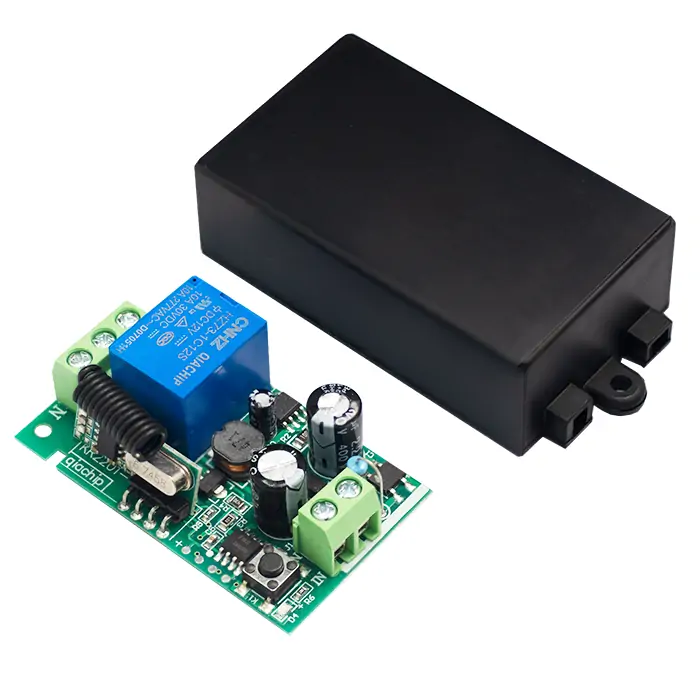
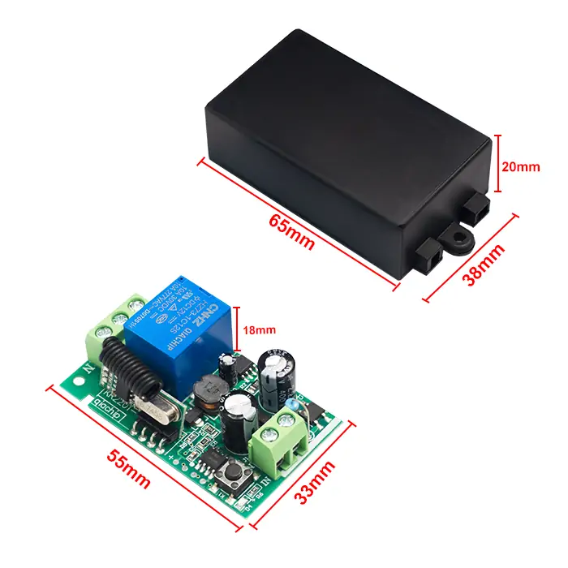
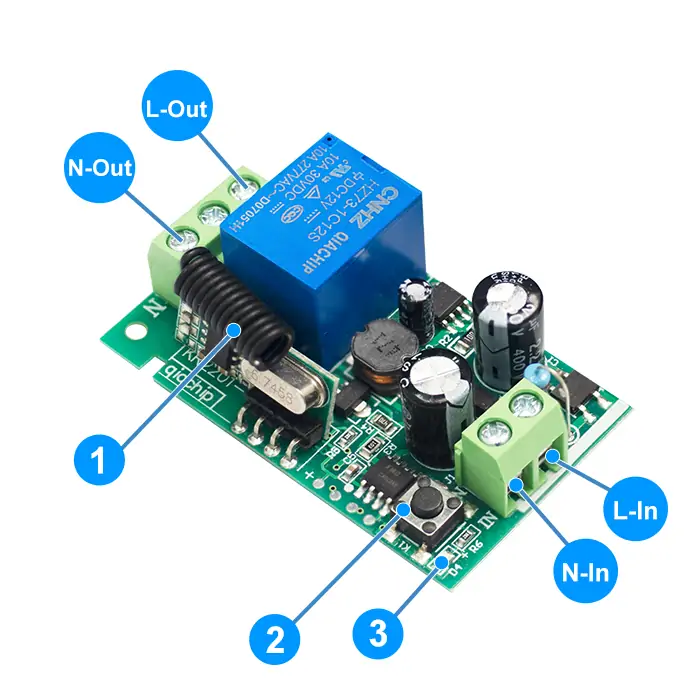
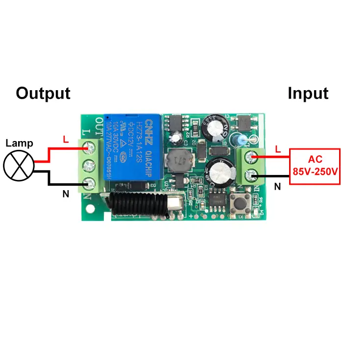

# QIACHIP KR2201-4 Instruction Manual AC 110V 220V 433MHz RF Remote Control Switch 1-CH Relay Receiver

{ width="50%" .center loading="lazy" }

> Version: V1.0
> 

> Last Updated: 2025-07-27
> 

> Model: KR2201-4
> 

## Product Size

{ width="68%" .center loading="lazy" }

- Receiver Length (L) × Width (W) × Height (H): 55mm × 33mm × 18mm
- Housing Length (L) × Width (W) × Height (H): 65mm × 38mm × 20mm

## Component description

{ width="50%" .center loading="lazy" }

  <ul style="flex: 1 1 45%; margin-right: 1%;">
    <li>1: Learning button</li>
    <li>2: Indicator light</li>
    <li>3: Antenna</li>
    <li>L-Out: Output Live wire terminal</li>
  </ul>
  <ul style="flex: 1 1 45%; margin-left: 1%;">
    <li>N-Out: Output Neutral wire terminal</li>
    <li>L-In: Input Live wire terminal</li>
    <li>N-In: Input Neutral wire terminal</li>
  </ul>

## Wiring diagram

Disconnect power before wiring.

### Figure 1

{ width="50%" .center loading="lazy" }

Figure 1: Wiring diagram for Lamp

- Load: Lamp

- Input Power: AC 85V-250V

---

## Function description and setting method

**(1) Momentary mode; (2) Toggle mode; (3) Latching mode; (4) Reset function.**

- When you use the third working mode, a remote control with at least two buttons is required.
- When pairing a second remote, you don't need to press the button on the receiver 8 times again to reset it.
- Once the receiver and transmitter are paired and a working mode is selected, the receiver will retain this mode even if powered off and on again.
- The following working modes require the use of QIACHIP brand remote controls (transmitters) and controllers (receivers/wireless remote control switches). Compatibility with other brands is not guaranteed

### **(1) Momentary mode**

 In this mode: 

- Press and hold the remote control button (such as A), and the corresponding relay on the receiver is turned on.
- Release the remote control button (such as A), and the corresponding relay on the receiver will turn off.

### **How to set momentary mode**

**Step 1**

Click the learning button of the receiver once. The indicator light on the receiver turns on and the receiver enters the setting state.

**Step 2**

Press the button on the remote control (such as A) once. The indicator light on the receiver will flash and then turns off. The momentary mode is set successfully. 

### **(2) Toggle mode**

In this mode: 

- Press the remote control button (such as A), and the corresponding relay on the receiver will turn on.
- Press the remote control button (such as A) again, and the corresponding relay on the receiver will turn off.

### **How to set toggle mode**

**Step 1**

Click the learning button of the receiver twice. The indicator light on the receiver turns on, and the receiver enters the setting state.

**Step 2**

Press the button on the remote control (such as A) once. The indicator light on the receiver will flash and then turns off. The toggle mode is set successfully. 

### **(3) Latching mode**

In this mode:

- Press the remote control button (such as A), and the receiver's relay turns on.
- Press the remote control button (such as B), and the receiver's relay turns off.

### **How to set latching mode**

**Step 1** 

Click the learning button of the receiver three times. The indicator light on the receiver turns on, and the receiver enters the setting state.

**Step 2**

Press the button on the remote control (such as A) once. The indicator light on the receiver will flash and then turns on.

**Step 3**

After the indicator light goes out, press another button (such as B) on the same remote control. The indicator light on the receiver will flash and then turn on. The latching mode is set successfully. 

### **(4) Reset function**

- When the KR2201-4 receiver is reset, all paired transmitters will be unpaired and can no longer control the receiver.

### How to Reset

Click the learning button on the receiver 8 times. The reset is complete when the indicator light flashes and then turns off.

## Electrical characteristics

| Parameter | Value |
| --- | --- |
| Input voltage | AC 85V-250V |
| RF frequency | 433.92MHz |
| Maximum Load Current | 10A |
| Rated Load | Max 2200W |
| Receiver sensitivity | -108dBm |
| Operation mode | Momentary mode/Toggle mode/Latching mode |
| Working temperature | -10℃~70℃ |
| Size | 55x33x18mm |

Note: Rated Load breakdown by scenario: resistive load 2200W, LED light 300W, inductive load 500W, capacitive load 200W, incandescent lamp 2200W, energy-saving lamp 300W.

## Warning

- L and N wires must not be reversed.
- When using wireless electronic devices, avoid proximity to metal objects, large electronic equipment, electromagnetic fields, and other sources of strong interference