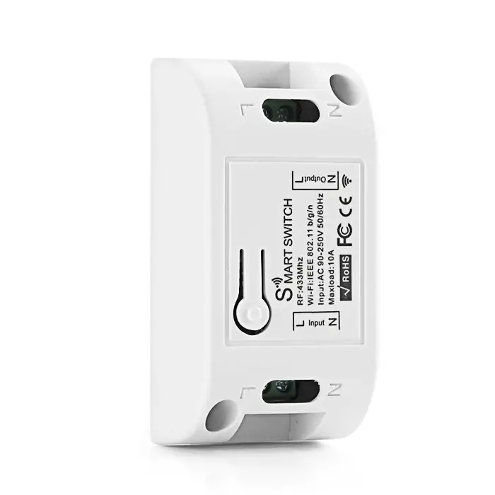
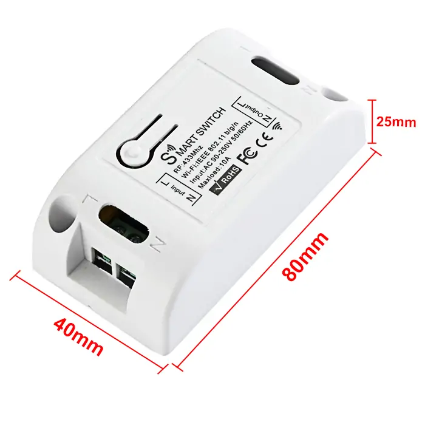
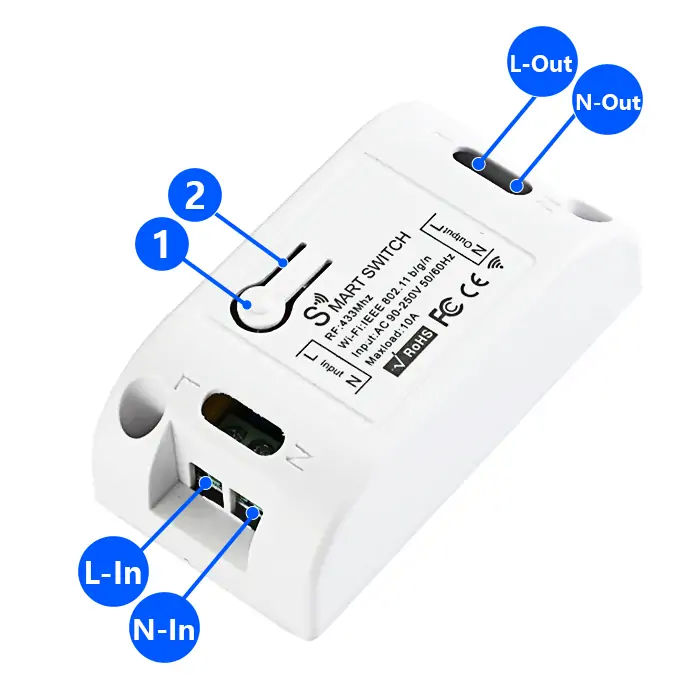
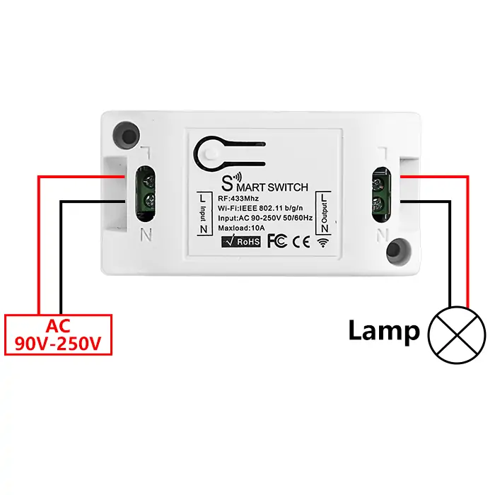
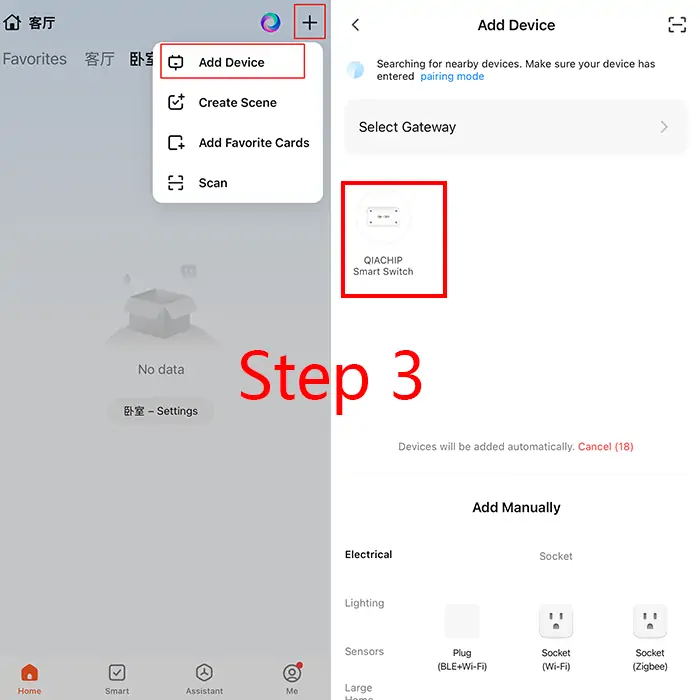
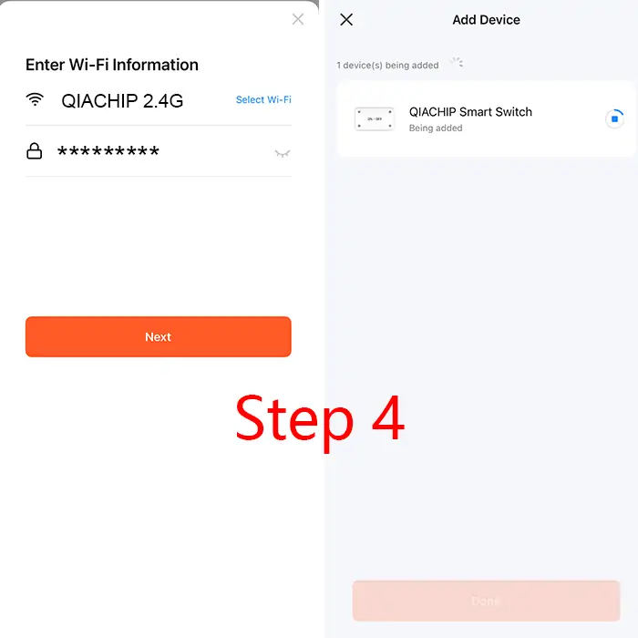
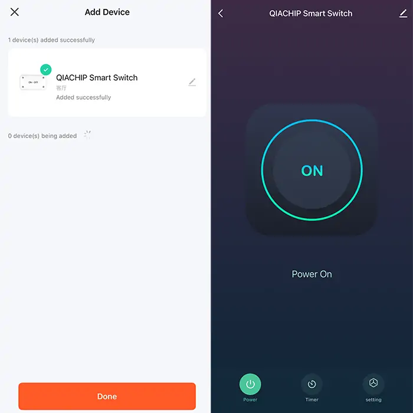

# QIACHIP KR2201W-4 ( KR2201 Series ) Instruction Manual AC 110V 220V RF+WIFI Tuya Smart Remote Control Switch 1-CH Relay Receiver

{ width="50%" .center loading="lazy" }

> Version: V1.0

> Last Updated: 2026-01-28

> Model: KR2201W-4 ( KR2201 Series )

## Product Size

{ width="68%" .center loading="lazy" }

- Receiver Length (L) x Width (W) x Height (H): 80mm x 40mm x 25mm

## Component Description

{ width="50%" .center loading="lazy" }

  <ul style="flex: 1 1 45%; margin-right: 1%;">
    <li>1: Learning button</li>
    <li>2: Indicator light</li>
  </ul>
  <ul style="flex: 1 1 45%; margin-left: 1%;">
    <li>L-In: Live wire Input terminal</li>
    <li>N-In: Neutral wire Input terminal</li>
    <li>L-Out: Live wire Output terminal</li>
    <li>N-Out: Neutral wire Output terminal</li>
  </ul>

## Wiring Diagram

Disconnect power before wiring.

### Figure 1

{ width="68%" .center loading="lazy" }

Figure 1: Wiring diagram for Lamp

- Load: Lamp
- Input Power: AC 90V-250V

---

## Wireless Remote Control Function Description (RF Function)

**(1) Momentary mode; (2) Toggle mode; (3) Latching mode; (4) Reset function; (5) Power-On Auto-Engagement.**

- **When you use the third working mode, a remote control with at least two buttons is required.**
- **When pairing a second remote, you don't need to press the button on the receiver 8 times again to reset it.**
- **Once the receiver and transmitter are paired and a working mode is selected, the receiver will retain this mode even if powered off and on again.**
- **The following working modes require the use of QIACHIP brand remote controls (transmitters) and controllers (receivers/wireless remote control switches). Compatibility with other brands is not guaranteed.**

### (1) Momentary mode

In this mode:

- Press and hold the remote control button (such as A), and the corresponding relay on the receiver will turn on.
- Release the remote control button (such as A), and the corresponding relay on the receiver will turn off.

### How to set momentary mode

**Step 1**

Click the learning button of the receiver four times. The indicator light on the receiver will turn on, and the receiver will enter the setting state.

**Step 2**

Press the button on the remote control (such as A) once. The indicator light on the receiver will flash and then will turn off. The momentary mode will be set successfully.

### (2) Toggle mode

In this mode:

- Press the remote control button (such as A), and the corresponding relay on the receiver will turn on.
- Press the remote control button (such as A) again, and the corresponding relay on the receiver will turn off.

### How to set toggle mode

**Step 1**

Click the learning button of the receiver twice. The indicator light on the receiver will turn on, and the receiver will enter the setting state.

**Step 2**

Press the button on the remote control (such as A) once. The indicator light on the receiver will flash and then will turn off (Pairing successful). The toggle mode will be set successfully.

### (3) Latching mode

In this mode:

- Press the remote control button (such as A), and the receiver's relay will turn on.
- Press the remote control button (such as B), and the receiver's relay will turn off.

### How to set latching mode

**Step 1**

Click the learning button of the receiver three times. The indicator light on the receiver will turn on, and the receiver will enter the setting state.

**Step 2**

Press the button on the remote control (such as A) once. The indicator light on the receiver will flash and then will turn on (Setting in progress).

**Step 3**

After the indicator light turns on, press another button (such as B) on the same remote control. The indicator light on the receiver will flash and then turn off (Pairing successful). The latching mode will be set successfully.

### (4) Reset function

- When the KR2201W-4 receiver is reset, all paired transmitters will be unpaired and will no longer be able to control the receiver.

### How to reset

Click the learning button on the receiver 8 times. The indicator light will flash and then will turn off. The reset will be complete.

### (5) Power-On Auto-Engagement

- After this mode is set, the relay will automatically turn on when the receiver is powered back on after a power outage.

### How to set power-on auto-engagement

Press the receiver's learning button 6 times in quick succession until the indicator light flashes and then goes off (Setting successful).
(After successful setup, the relay will remain in the energized state when the device is powered back on, regardless of its state before the power outage.)

## Pairing with Tuya APP

**Step 1**

Connect your phone to 2.4GHz WIFI and turn on Bluetooth.

**Step 2**

Long press the learning button on the receiver for more than 6 seconds until the indicator light flashes, and the WIFI pairing mode will be successfully activated.

**Step 3**

Open the Tuya APP. Tap "+" to add a device in the top right corner of the screen, and then tap the device that appears to start the pairing process.

{ width="50%" .center loading="lazy" }

**Step 4**

Enter the password of the connected 2.4G WIFI, and then wait until the device pairing is completed.

{ width="50%" .center loading="lazy" }

{ width="50%" .center loading="lazy" }

## Electrical characteristics

| Parameter | Value |
| --- | --- |
| Input voltage | AC 90V-250V |
| WIFI frequency | IEEE 802.11 b/g/n |
| RF frequency | 433.92MHz |
| Maximum Load Current | ≤10A |
| Rated Load | Max 2200W |
| Receiver sensitivity | -108dBm |
| Operation mode | Momentary mode/Toggle mode/Latching mode/Power-On Auto-Engagement |
| Working temperature | -10℃~70℃ |
| Size | 80x40x25mm |

Note: Rated Load breakdown by scenario: resistive load 2200W, LED light 300W, inductive load 500W, capacitive load 200W, incandescent lamp 2200W, energy-saving lamp 300W.

## Warning

- L and N wires must not be reversed.
- When using wireless electronic devices, avoid proximity to metal objects, large electronic equipment, electromagnetic fields, and other sources of strong interference.
