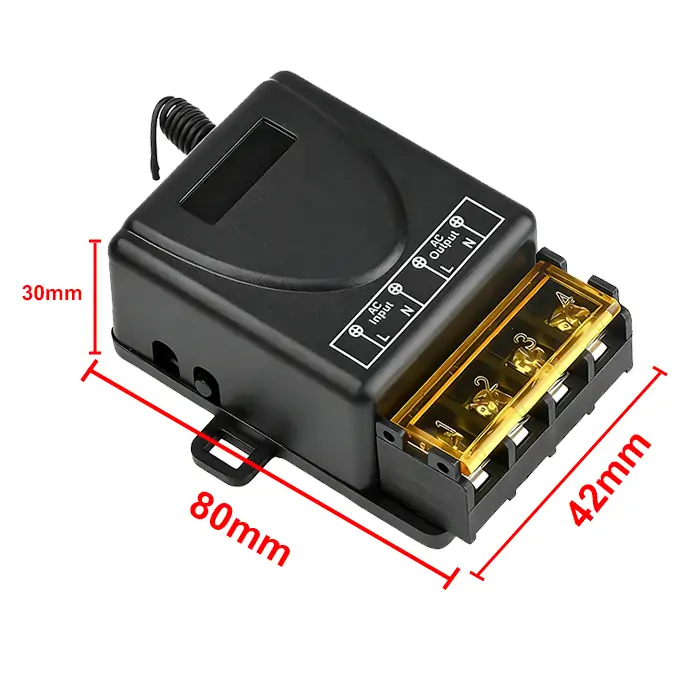
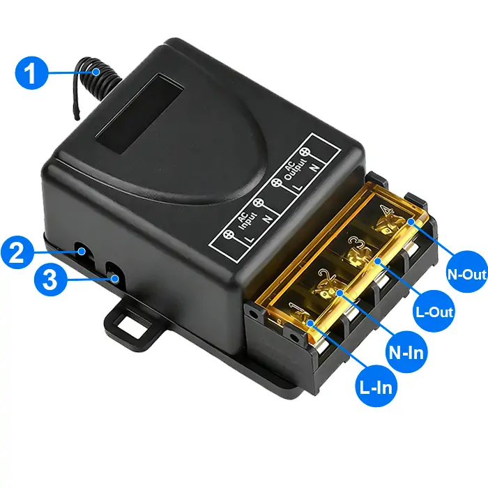
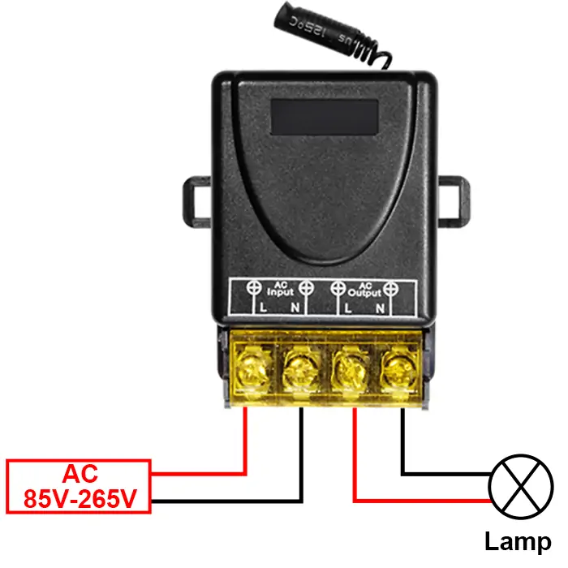
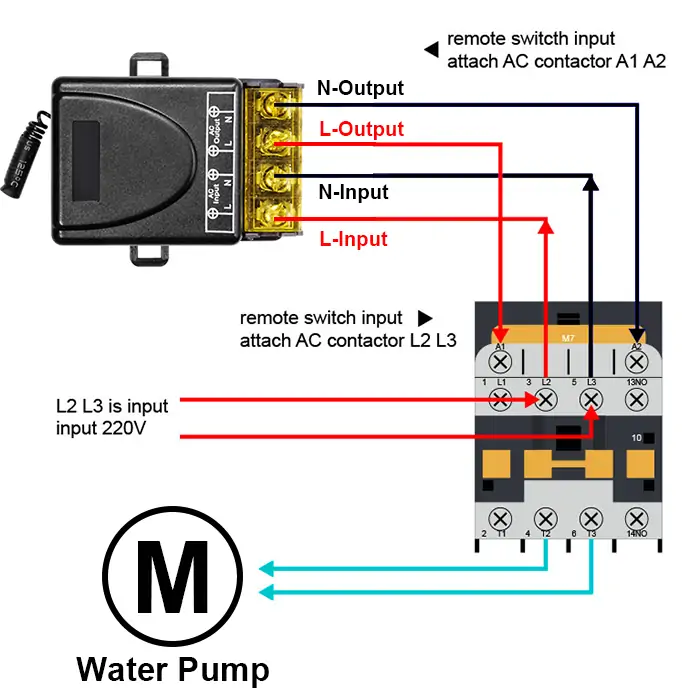

# QIACHIP KR2201BL-4 Instruction Manual AC 110V 220V 433MHz RF Remote Control Switch 1-CH Relay Receiver

{ width="50%" .center loading="lazy" }

> Version: V1.0

> Last Updated: 2026-01-19

> Model: KR2201BL-4

## Product Size

{ width="68%" .center loading="lazy" }

- Receiver Length (L) x Width (W) x Height (H): 80mm x 42mm x 30mm

## Component Description

{ width="50%" .center loading="lazy" }

  <ul style="flex: 1 1 45%; margin-right: 1%;">
    <li>1: Antenna</li>
    <li>2: Indicator light</li>
    <li>3: Learning button</li>
  </ul>
  <ul style="flex: 1 1 45%; margin-left: 1%;">
    <li>L-In: Live wire input terminal</li>
    <li>N-In: Neutral wire input terminal</li>
    <li>L-Out: Live wire output terminal</li>
    <li>N-Out: Neutral wire output terminal</li>
  </ul>

## Wiring Diagram

Disconnect power before wiring.

### Figure 1

{ width="68%" .center loading="lazy" }

Figure 1: Wiring diagram for Lamp

- Load: Lamp
- Input Power: AC 85V-265V

---

### Figure 2

{ width="68%" .center loading="lazy" }

Figure 2: Wiring diagram for Water pump

- Load: Water pump
- Input Power: AC 85V-265V

## Function description and setting method

**(1) Momentary mode; (2) Toggle mode; (3) Latching mode; (4) Reset function.**

- **When you use the third working mode, a remote control with at least two buttons is required.**
- **When pairing a second remote, you don't need to press the button on the receiver 8 times again to reset it.**
- **Once the receiver and transmitter are paired and a working mode is selected, the receiver will retain this mode even if powered off and on again.**
- **The following working modes require the use of QIACHIP brand remote controls (transmitters) and controllers (receivers/wireless remote control switches). Compatibility with other brands is not guaranteed.**

### (1) Momentary mode

In this mode:

- Press and hold the remote control button (such as A), and the corresponding relay on the receiver will turn on.
- Release the remote control button (such as A), and the corresponding relay on the receiver will turn off.

### How to set momentary mode

**Step 1**

Click the learning button of the receiver once. The indicator light on the receiver will flash and then turn on, and the receiver will enter the setting state.

**Step 2**

Press the button on the remote control (such as A) once. The indicator light on the receiver will flash and then will turn off. The momentary mode will be set successfully.

### (2) Toggle mode

In this mode:

- Press the remote control button (such as A), and the corresponding relay on the receiver will turn on.
- Press the remote control button (such as A) again, and the corresponding relay on the receiver will turn off.

### How to set toggle mode

**Step 1**

Click the learning button of the receiver twice. The indicator light on the receiver will flash and then turn on, and the receiver will enter the setting state.

**Step 2**

Press the button on the remote control (such as A) once. The indicator light on the receiver will flash and then will turn off. The toggle mode will be set successfully.

### (3) Latching mode

In this mode:

- Press the remote control button (such as A), and the receiver's relay will turn on.
- Press the remote control button (such as B), and the receiver's relay will turn off.

### How to set latching mode

**Step 1**

Click the learning button of the receiver three times. The indicator light on the receiver will flash and then turn on, and the receiver will enter the setting state.

**Step 2**

Press the button on the remote control (such as A) once. The indicator light on the receiver will flash and then will turn on.

**Step 3**

After the indicator light turns on, press another button (such as B) on the same remote control. The indicator light on the receiver will flash and then turn off. The latching mode will be set successfully.

### (4) Reset function

- When the KR2201BL-4 receiver is reset, all paired transmitters will be unpaired and will no longer be able to control the receiver.

### How to reset

Click the learning button on the receiver 8 times. The indicator light will flash and then will turn off. The reset will be complete.

## Electrical characteristics

| Parameter | Value |
| --- | --- |
| Input voltage | AC 85V-265V |
| RF frequency | 433.92MHz |
| Maximum Load Current | 30A |
| Rated Load | Max 3000W |
| Receiver sensitivity | -97dBm |
| Operation mode | Momentary mode/Toggle mode/Latching mode |
| Working temperature | -10℃~70℃ |
| Size | 80x42x30mm |

## Warning

- L and N wires must not be reversed.
- When using wireless electronic devices, avoid proximity to metal objects, large electronic equipment, electromagnetic fields, and other sources of strong interference.
