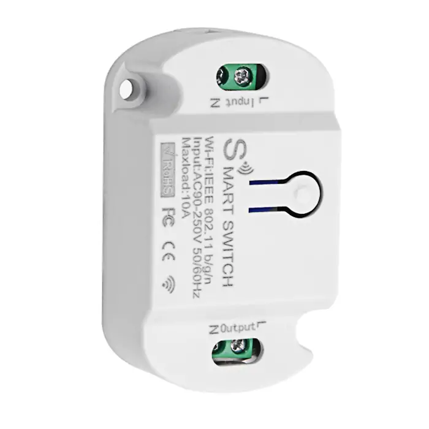
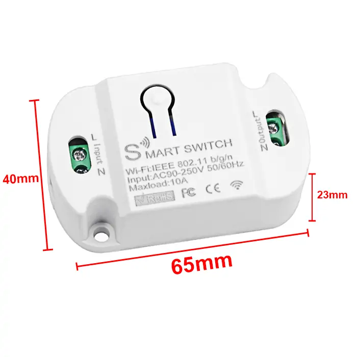
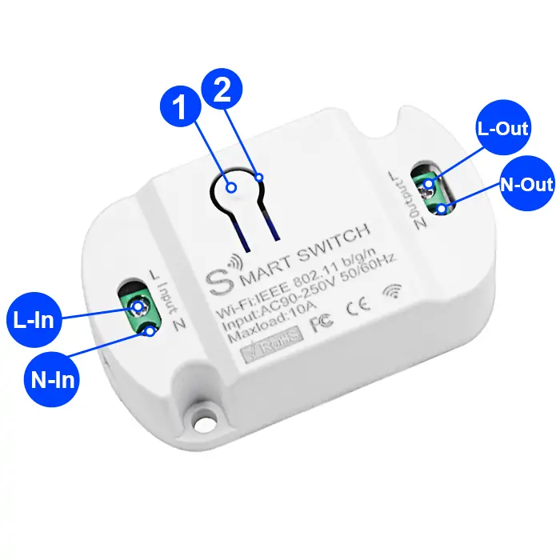
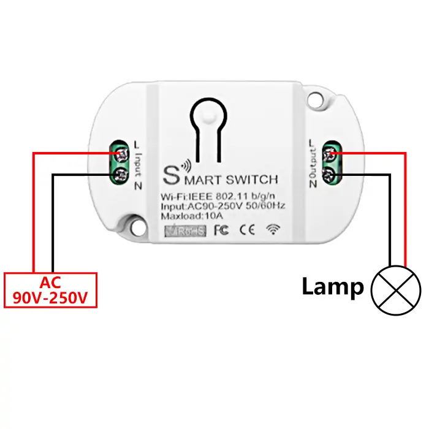
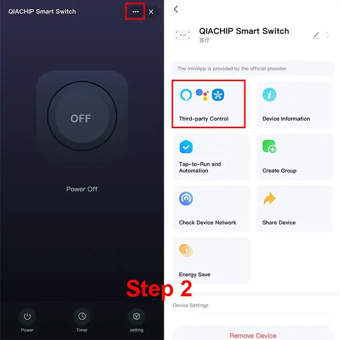
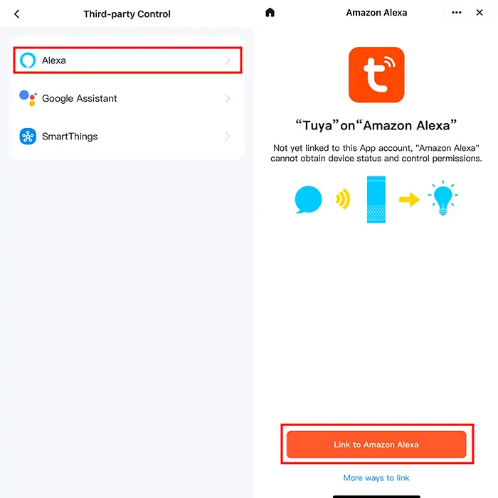
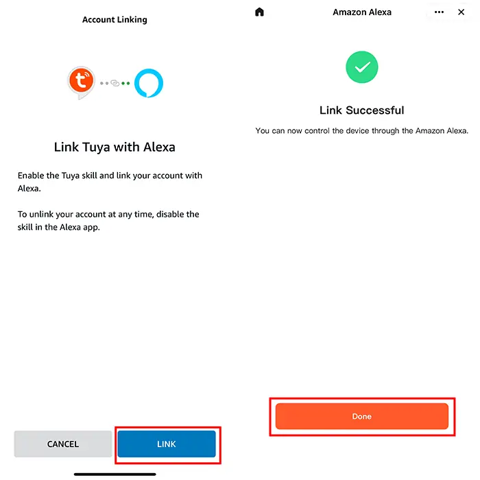

# QIACHIP KR2201WB Instruction Manual AC 110V 220V WIFI Tuya Smart Remote Control Switch 1-CH Relay Receiver

{ width="50%" .center loading="lazy" }

> Version: V1.0

> Last Updated: 2026-02-02

> Model: KR2201WB

## Product Size

{ width="68%" .center loading="lazy" }

- Receiver Length (L) x Width (W) x Height (H): 65mm x 40mm x 23mm

## Component Description

{ width="50%" .center loading="lazy" }

  <ul style="flex: 1 1 45%; margin-right: 1%;">
    <li>1: Learning button</li>
    <li>2: Indicator light</li>
    <li>L-In: Live wire Input terminal</li>
    <li>N-In: Neutral wire Input terminal</li>
  </ul>
  <ul style="flex: 1 1 45%; margin-left: 1%;">
    <li>L-Out: Live wire Output terminal</li>
    <li>N-Out: Neutral wire Output terminal</li>
  </ul>

## Wiring Diagram

Disconnect power before wiring.

### Figure 1

{ width="68%" .center loading="lazy" }

Figure 1: Wiring diagram for Lamp

- Load: Lamp
- Input Power: AC 90V-250V

---

## Pairing with Tuya APP

**Step 1**

Connect your phone to 2.4GHz WIFI and turn on Bluetooth.

**Step 2**

Long press the learning button on the receiver for more than 6 seconds until the indicator light flashes, and the WIFI pairing mode will be successfully activated.

**Step 3**

Open the Tuya APP. Tap "+" to add a device in the top right corner of the screen, and then tap the device that appears to start the pairing process.

{ width="68%" .center loading="lazy" }

**Step 4**

Enter the password of the connected 2.4G WIFI, and then wait until the device pairing is completed.

{ width="68%" .center loading="lazy" }

{ width="68%" .center loading="lazy" }

---

## How to connect to third-party applications such as Alexa and Google assistant

**Step 1**

Open the Tuya APP and select the device to be connected.

**Step 2**

Access the device control page and tap the "···" settings icon in the top-right corner.

On the device information page, view the list of third-party control platforms supported by the device.

{ width="68%" .center loading="lazy" }

**Step 3**

Select the platform you want to connect to (e.g., Alexa), tap the corresponding icon to enter the binding interface, and follow the on-screen prompts to complete the binding.

{ width="68%" .center loading="lazy" }

{ width="68%" .center loading="lazy" }

## Electrical characteristics

| Parameter | Value |
| --- | --- |
| Input voltage | AC 90V-250V |
| WIFI frequency | IEEE 802.11 b/g/n |
| Maximum Load Current | 10A |
| Rated Load | Max 2200W |
| Receiver sensitivity | -108dBm |
| Working temperature | -10℃~70℃ |
| Size | 65x40x23mm |

Note: Rated Load breakdown by scenario: resistive load 2200W, LED light 300W, inductive load 500W, capacitive load 200W, incandescent lamp 2200W, energy-saving lamp 300W.

## Warning

- L and N wires must not be reversed.
- When using wireless electronic devices, avoid proximity to metal objects, large electronic equipment, electromagnetic fields, and other sources of strong interference.
