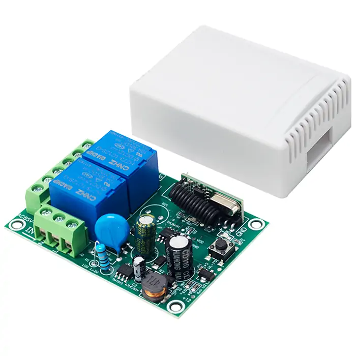
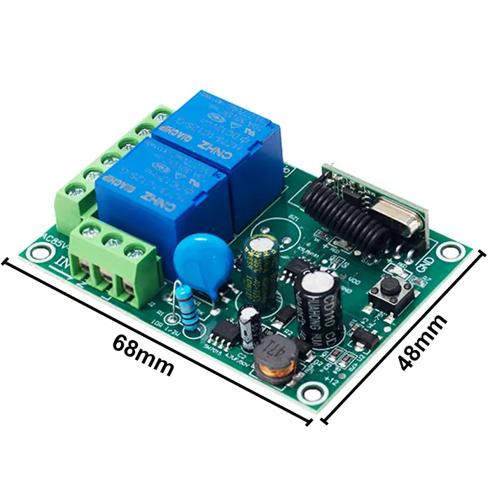
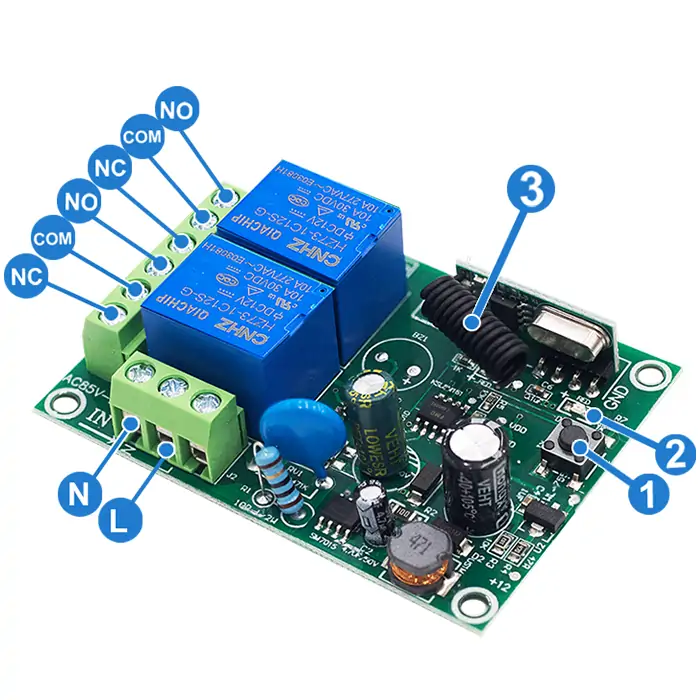
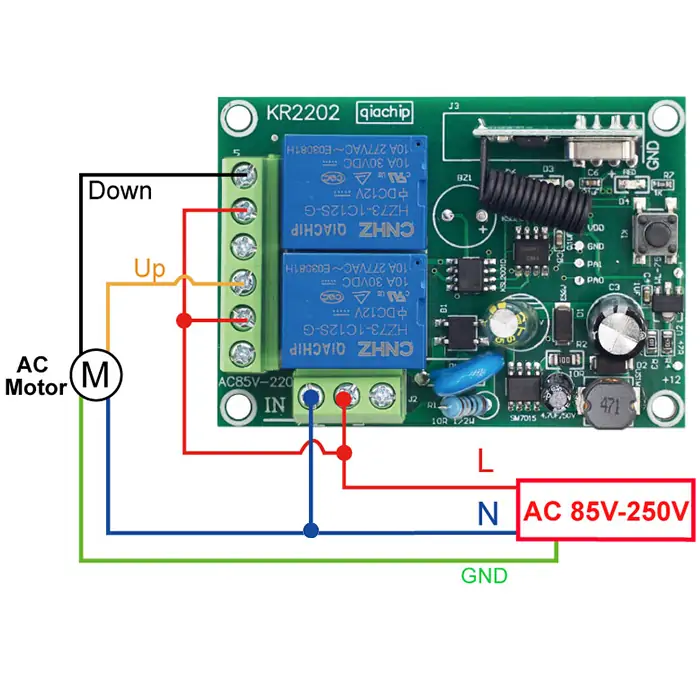
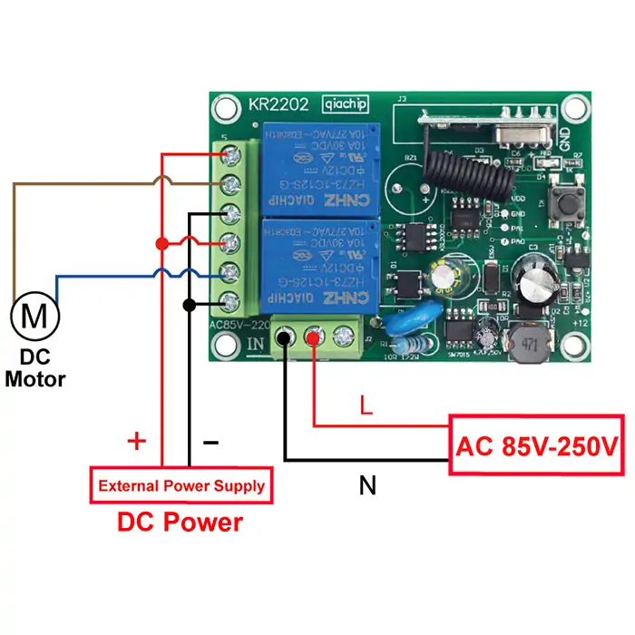
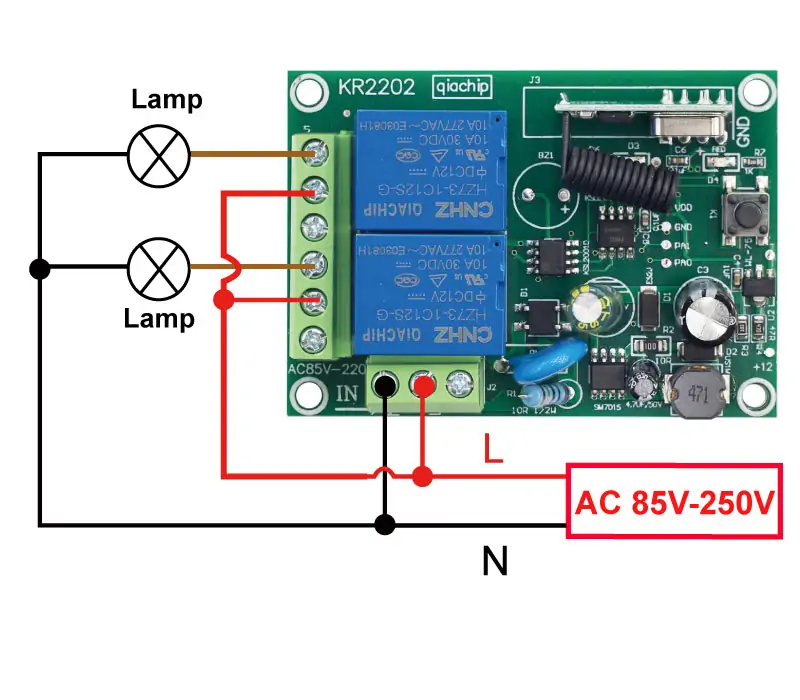

# QIACHIP KR2202 Instruction Manual AC 110V 220V 433MHz RF Remote Control Switch 2-CH Relay Receiver

{ width="50%" .center loading="lazy" }

> Version: V1.0
> 

> Last Updated: 2025-05-27
> 

> Model: KR2202
> 

## Product Size

{ width="68%" .center loading="lazy" }

- Receiver Length (L) x Width (W) x Height (H): 68mm x 48mm x 20mm
- Housing Length (L) x Width (W) x Height (H): 75mm x 54mm x 25mm
- Receiver hole horizontal spacing: 60mm; Vertical spacing: 42mm; Hole Diameter: Ø5mm

## Component Description

{ width="50%" .center loading="lazy" }

  <ul style="flex: 1 1 45%; margin-right: 1%;">
    <li>1: Learning button</li>
    <li>2: Indicator light</li>
    <li>3: Antenna</li>
  </ul>
  <ul style="flex: 1 1 45%; margin-left: 1%;">
    <li>L: Live wire</li>
    <li>N: Neutral wire</li>
    <li>NO: Normally open terminal</li>
    <li>COM: Common terminal</li>
    <li>NC: Normally closed terminal</li>
  </ul>

## Wiring Diagram

Disconnect power before wiring.

### Figure 1

{ width="50%" .center loading="lazy" }

Figure 1: Wiring diagram for AC motors

- Load: AC Motor

- Input Power: AC 85V-250V

---

### Figure 2

{ width="50%" .center loading="lazy" }

Figure 2: Wiring diagram for DC motors

- Load: DC motor
- Input power: AC 85V-250V
- External power supply: DC Power

---

### Figure 3

{ width="50%" .center loading="lazy" }

Figure 3: Wiring diagram for lamps

- Load: lamp
- Input power: AC 85V-250V

---

## Function description and setting method

**(1) Momentary mode; (2) Toggle mode; (3) Latching mode; (4) Reset function.**

**NOTE**

- **When you use the first and second working modes, a remote control with at least two buttons is required.**
- **When you use the third working mode, a remote control with at least three buttons is required.**
- **When pairing a second remote, you don't need to press the button on the receiver 8 times again to reset it.**
- **Once the receiver and transmitter are paired and a working mode is selected, the receiver will retain this mode even if powered off and on again.**
- **The following working modes require the use of QIACHIP brand remote controls (transmitters) and controllers (receivers/wireless remote control switches). Compatibility with other brands is not guaranteed.**

### (1) Momentary mode

 In this mode: 

- Press and hold the remote control button (such as A), and the corresponding relay on the receiver will turn on.
- Release the remote control button (such as A), and the corresponding relay on the receiver will turn off.

### How to set momentary mode

NOTE

<ul>
<li>The KR2202 can only be properly set up after being successfully paired with two different buttons on the remote control.</li>
</ul>

**Step 1**

Click the learning button of the receiver once. The indicator light on the receiver will turn off, and the receiver will enter the setting state.

**Step 2**

Press the button on the remote control (such as A) once. The indicator light on the receiver will flash and then will turn off.

**Step 3**

After the indicator light goes out, press another button (such as B) on the same remote control. The indicator light on the receiver will flash and then will turn on. The momentary mode will be set successfully.

### (2) Toggle mode

In this mode: 

- Press the remote control button (such as A), and the corresponding relay on the receiver will turn on.
- Press the remote control button (such as A) again, and the corresponding relay on the receiver will turn off.

### How to set toggle mode

NOTE

<ul>
<li>The KR2202 can only be properly set up after being successfully paired with two different buttons on the remote control.</li>
</ul>

**Step 1**

Click the learning button of the receiver twice. The indicator light on the receiver will turn off, and the receiver will enter the setting state.

**Step 2**

Press the button on the remote control (such as A) once. The indicator light on the receiver will flash and then will turn off.

**Step 3**

After the indicator light goes out, press another button (such as B) on the same remote control. The indicator light on the receiver will flash and then will turn on. The toggle mode will be set successfully.

### (3) Latching mode

In this mode:

- Press the remote control button (such as A), and the corresponding relay A on the receiver will turn on.
- Press the remote control button (such as B), and relay B on the receiver will turn on while relay A on the receiver will turn off.
- Press the remote control button (such as C), and the currently activated relay on the receiver will turn off.

### How to set latching mode

NOTE

<ul>
<li>The KR2202 can only be properly set up after being successfully paired with two different buttons on the remote control.</li>
</ul>

**Step 1**

Click the learning button of the receiver three times. The indicator light on the receiver will turn off, and the receiver will enter the setting state.

**Step 2**

Press the button on the remote control (such as A) once. The indicator light on the receiver will flash and then will turn off.

**Step 3**

After the indicator light goes out, press another button (such as B) on the same remote control. The indicator light on the receiver will flash and then will turn on. The latching mode will be set successfully.

### (4) Reset function

- When the KR2202 receiver is reset, all paired transmitters will be unpaired and will no longer be able to control the receiver.

### How to reset

Click the learning button on the receiver 8 times. The indicator light will flash and then will turn on. The reset will be complete.

## Electrical characteristics

| Parameter | Value |
| --- | --- |
| Input voltage | AC 85V-250V |
| RF frequency | 433.92MHz |
| Standby current | 8.5 mA |
| Rated Load | Max 1100W |
| Receiver sensitivity | -108dBm |
| Operation mode | Momentary mode/Toggle mode/Latching mode |
| Working temperature | -10℃~70℃ |
| Size | 68x48x18mm |

## Warning

- L and N wires must not be reversed.
- When using wireless electronic devices, avoid proximity to metal objects, large electronic equipment, electromagnetic fields, and other sources of strong interference.

## Frequently Asked Questions（Q&A）

**Question 1:** Why can my remote control Relay 1 but not Relay 2 in KR2202 Momentary mode?

**Answer:**

Your pairing steps may be wrong, so your remote can only control Relay 1.

Pair the receiver again with the steps below:

1. Press the receiver's Learning button 8 times to reset the receiver.
2. Press the receiver's Learning button 1 time for Momentary mode.
3. Press one button on the remote (such as A). Wait until the receiver's indicator light flashes, then turns off.
4. Press another button on the remote (such as B). Wait until the receiver's indicator light flashes, then turns on.

This sets both relays in Momentary mode.

**Question 2:** Why do button A and button B both control Relay 1 after KR2202 Momentary pairing?

**Answer:**

Your pairing steps may be wrong, so button A and button B both control Relay 1.

Pair the receiver again with the steps below:

1. Press the receiver's Learning button 8 times to reset the receiver.
2. Press the receiver's Learning button 1 time for Momentary mode.
3. Press button A on the remote. Wait until the receiver's indicator light flashes, then turns off.
4. Press button B on the remote. Wait until the receiver's indicator light flashes, then turns on.

This sets button A for Relay 1 and button B for Relay 2 in Momentary mode.

**Question 3:** What is the difference between KR2202 Momentary, Toggle, and Latching modes?

**Answer:**

KR2202 has three working modes.

Momentary mode: the relay turns on while you hold the remote button. The relay turns off when you release it.

Toggle mode: press the remote button once, and the relay turns on. Press the same remote button again, and the relay turns off.

Latching mode: press remote button A, and Relay 1 turns on. Press remote button B, and Relay 2 turns on while Relay 1 turns off. Press STOP, and the active relay turns off.

Use Momentary mode for hold-to-run control. Use Toggle mode for on / off control. Use Latching mode when two directions must not turn on at the same time.

**Question 4:** Can KR2202 trigger Relay 1 and Relay 2 one by one automatically?

**Answer:**

No, KR2202 does not have an automatic sequence mode.

Relay 1 and Relay 2 are controlled by paired remote buttons. In Momentary mode or Toggle mode, remote button A can control Relay 1, and remote button B can control Relay 2.

**Question 5:** How do I set two remotes to control Relay 1 and Relay 2 on KR2202?

**Answer:**

Pair one button on each remote in the same setup. The first button you pair controls Relay 1. The second button you pair controls Relay 2.

Example for Toggle mode:

1. Press the receiver's Learning button 2 times for Toggle mode. Wait until the receiver's indicator light turns off.
2. Press a button on the first remote. Wait until the receiver's indicator light flashes, then turns off.
3. Press a button on the second remote. Wait until the receiver's indicator light flashes, then turns on.

**Question 6:** Can I pair multiple remotes to channels A and B in Momentary mode?

**Answer:**

Yes, KR2202 can pair multiple remotes to channels A and B in Momentary mode.

For each new remote, pair button A and button B in the same Momentary setup. Do not pair button A alone.

Press the receiver's Learning button 8 times only if you want to reset the receiver. Reset deletes all paired remotes.

**Question 7:** Why does my 3-button UP / STOP / DOWN remote not work for motor control in Toggle mode?

**Answer:**

Toggle mode is not the right mode for UP / STOP / DOWN motor control. Use Latching mode instead.

Pair UP and DOWN in the same Latching mode setup:

1. Press the receiver's Learning button 8 times to reset the receiver.
2. Press the receiver's Learning button 3 times for Latching mode.
3. Press the UP button. Wait until the receiver's indicator light flashes, then turns off.
4. Press the DOWN button. Wait until the receiver's indicator light flashes, then turns on.

After this setup:

UP: the motor runs up.
DOWN: the motor runs down and UP turns off.
STOP: the active relay turns off.

For motor control, the up and down directions must not turn on at the same time.

**Question 8:** How do I use KR2202 Momentary mode to control a two-direction motor with button A and button B?

**Answer:**

Use KR2202 Momentary mode through the motor controller control inputs, not by connecting KR2202 directly to the motor wires.

Pair the receiver with the steps below:

1. Press the receiver's Learning button 1 time for Momentary mode. Wait until the receiver's indicator light turns off.
2. Press remote button A for one motor direction. Wait until the receiver's indicator light flashes, then turns off.
3. Press remote button B for the other motor direction. Wait until the receiver's indicator light flashes, then turns on.

Button A: one motor direction runs while you hold button A.
Button B: the other motor direction runs while you hold button B.

The motor controller must prevent both directions from running at the same time.

**Question 9:** Does the KR2202 relay stay on after power loss?

**Answer:**

No, the relay cannot stay on when the power is off.

KR2202 can remember the paired remote and working mode after power loss. The relay state still needs power. After power comes back, the next relay action depends on the mode and remote command.

**Question 10:** Is the KR2202 receiver powered by 220V, or are the relay contacts rated for 220V?

**Answer:**

Yes, the KR2202 receiver can be powered by 220V AC. No, the relay contacts do not output 220V by themselves.

The relay output is a dry contact. This means the relay output works like a switch. It does not output power by itself.

Relay output terminals: NO / COM / NC.

**Question 11:** Is KR2202 compatible with 230V AC?

**Answer:**

Yes, KR2202 can work with 230V AC power.

Its input voltage range is AC 85V-250V, so 230V AC is within the supported power range.

**Question 12:** How should I wire KR2202 for my load?

**Answer:**

It depends on what load you want to control.

Use the KR2202 wiring diagram that matches your load. Turn off power before wiring.

L / N: receiver power input, AC 85V-250V.

Relay output terminals: NO / COM / NC.

Rated load: Max 1100W.

The relay output is a dry contact. This means the relay output works like a switch. It does not output power by itself.

**Question 13:** Can one KR2202 remote control two garage door motors?

**Answer:**

It depends on what you mean by garage door motor.

If you mean a garage door opener or motor controller with a compatible control input, yes. KR2202 can trigger that input.

Do not use KR2202 to drive bare garage door motors directly. KR2202 is a relay receiver, not a motor controller.

**Question 14:** Can KR2202 control a winch raise and lower motor?

**Answer:**

It depends on the winch control method.

If the winch controller has compatible raise and lower control inputs, KR2202 can trigger those inputs.

Connect KR2202 to the winch controller input or manual switch terminals.

Do not connect KR2202 directly to the winch motor wires.

**Question 15:** Is KR2202 suitable for a roller shutter or garage shutter motor?

**Answer:**

Yes, if the shutter motor or controller matches the KR2202 power and load limits.

Key points:

- KR2202 input voltage is AC 85V-250V.
- The load must stay within Max 1100W.
- If the shutter has a wall switch input, connect the KR2202 relay output to that input.

**Question 16:** Can KR2202 use button A and button B for gate open and close in Momentary mode?

**Answer:**

Yes, if your gate controller has dry contact OPEN and CLOSE inputs.

Use Relay 1 for OPEN and Relay 2 for CLOSE. Set KR2202 to Momentary mode.

Connect KR2202 only to the gate controller dry contact input terminals.

**Question 17:** How do I identify a 3-wire roller shutter motor? Does KR2202 stop at the end position?

**Answer:**

For the 3-wire motor: check the motor label or manual before wiring.

A 3-wire shutter motor may be Live / Neutral / Ground, or it may be Common / Up / Down.

For the end position: no. KR2202 does not stop the shutter at the end position by itself.

KR2202 only turns its relay on and off.

**Question 18:** Why does KR2202 work with no load but fail when I connect a pool cover motor?

**Answer:**

If KR2202 works with no load but fails with a pool cover motor, the cause is more likely the motor load or motor control method.

The two most likely reasons are:

1. The motor starting current is too high. A motor needs more current when it starts than when it runs. Even if the running power is under Max 1100W, the starting current may still be too high for KR2202. Do not connect KR2202 directly to the pool cover motor wires. Use a motor controller or contactor for the motor circuit.

2. The pool cover controller may need its own control input. KR2202 is a relay receiver, not a motor controller. If the pool cover controller has a wall switch input or control input, connect KR2202 relay output COM and NO to that input.

Check the motor label or manual for starting current and control input type. If you are not sure, ask an electrician before wiring.

**Question 19:** Can one remote control two KR2202 receivers in Momentary mode and Toggle mode?

**Answer:**

Yes, it is possible, but we do not recommend it if the two receivers are close to each other.

One remote sends the same RF signal. If both receivers are within the same remote-control range, both may receive the signal and operate.

Momentary mode and Toggle mode do not separate the RF signal. To avoid interference, keep the two receivers far enough apart, or use separate remotes.

**Question 20:** Can I add a signal amplifier to KR2202 to reach 100 meters?

**Answer:**

No, we do not recommend adding a signal amplifier to the receiver.

Changing the receiver may damage KR2202 or make the remote signal unstable.

To improve remote-control range, fully extend the receiver antenna. Keep the receiver antenna away from metal parts and motor wires.

If you need about 100 meters, use a longer-range remote with an antenna.
