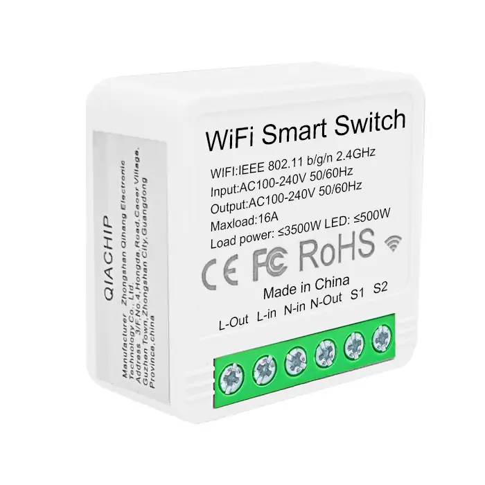
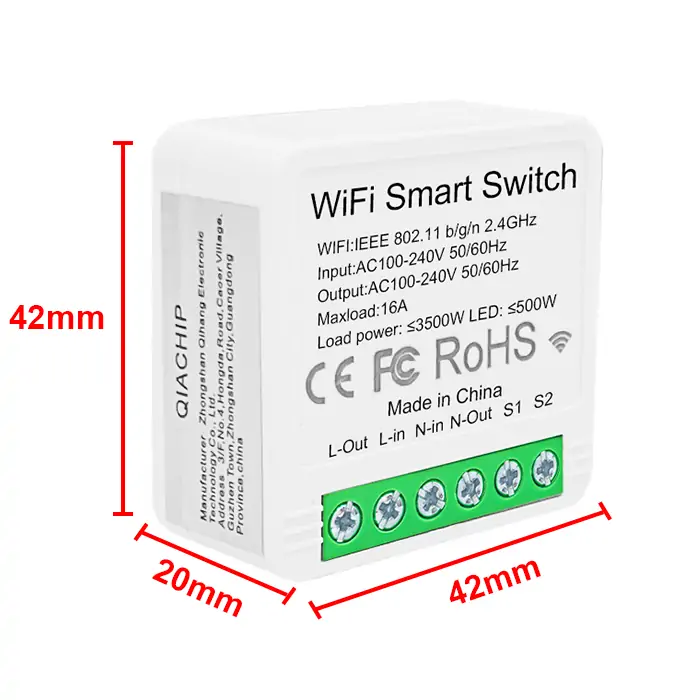
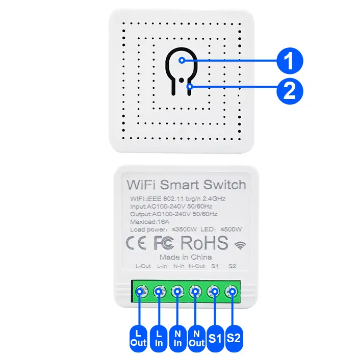
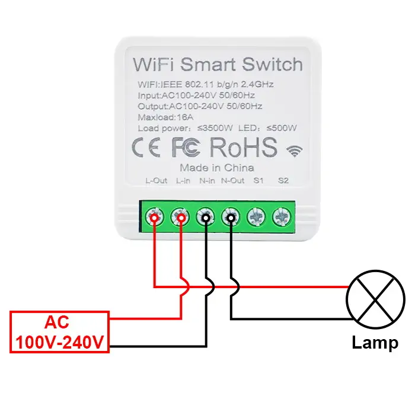
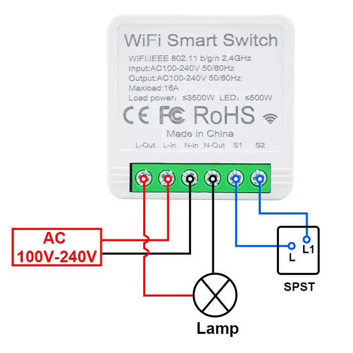
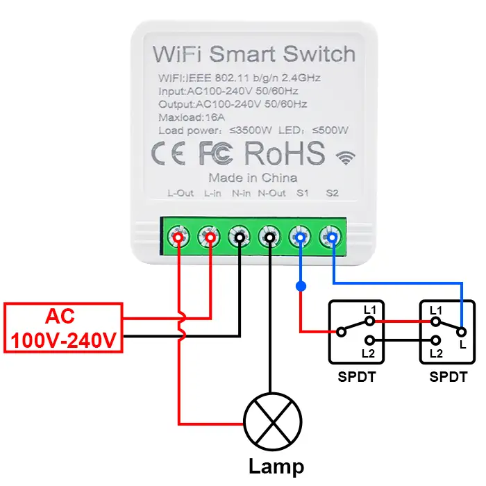
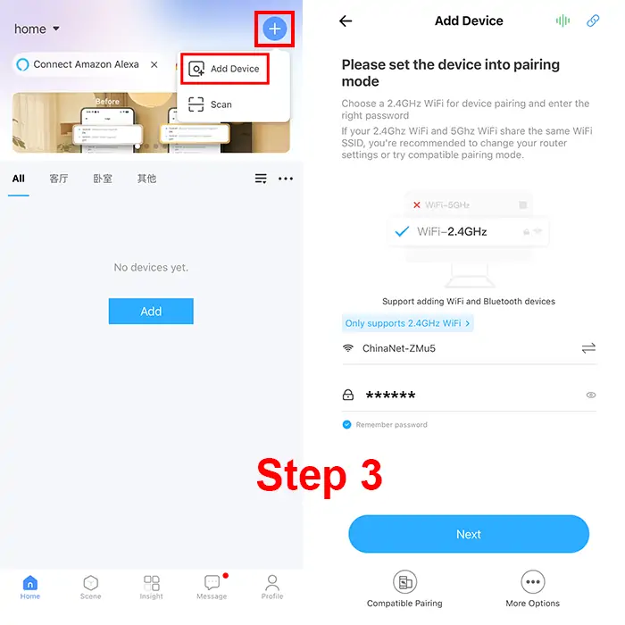
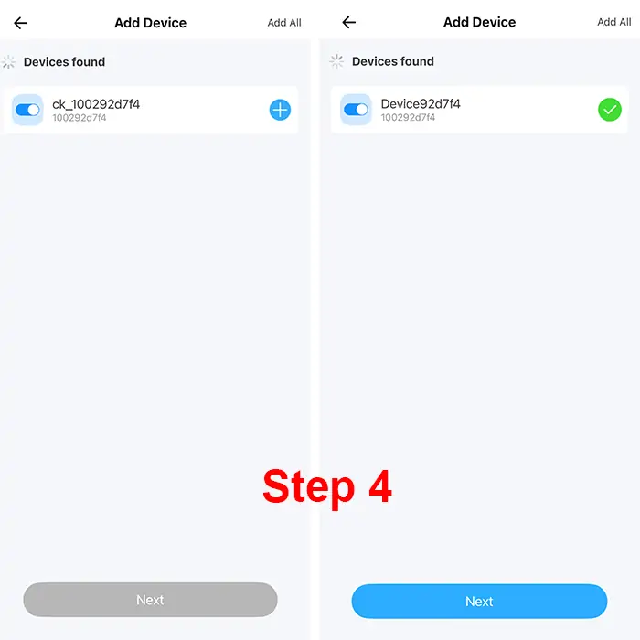
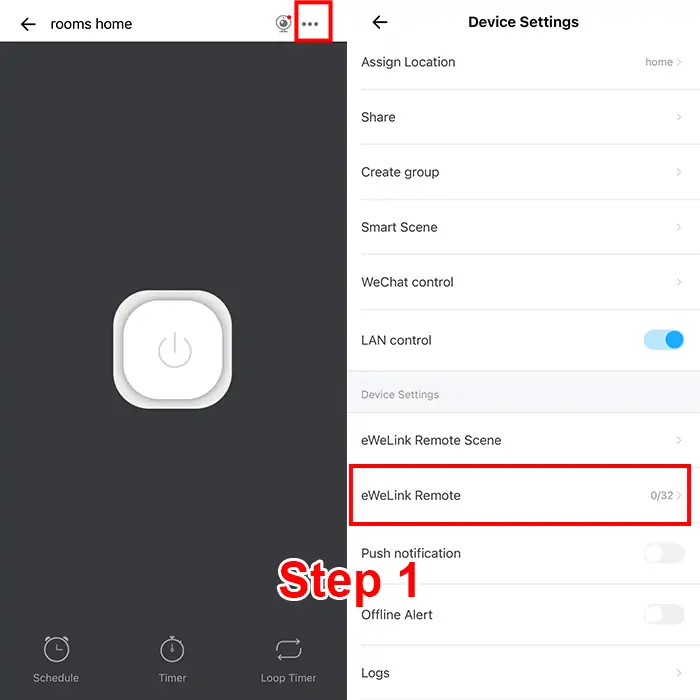

# QIACHIP KR2301-4 Instruction Manual AC 110V 220V WIFI Ewelink Smart Remote Control Switch 1-CH Relay Receiver

{ width="50%" .center loading="lazy" }

> Version: V1.0

> Last Updated: 2026-01-29

> Model: KR2301

## Product Size

{ width="68%" .center loading="lazy" }

- Receiver Length (L) x Width (W) x Height (H): 42mm x 42mm x 20mm

## Component Description

{ width="50%" .center loading="lazy" }

  <ul style="flex: 1 1 45%; margin-right: 1%;">
    <li>1: Learning button</li>
    <li>2: Indicator light</li>
    <li>S1: External Switch Terminal</li>
    <li>S2: External Switch Terminal</li>
  </ul>
  <ul style="flex: 1 1 45%; margin-left: 1%;">
    <li>L-Out: Output Live wire terminal</li>
    <li>N-Out: Output Neutral wire terminal</li>
    <li>L-In: Input Live wire terminal</li>
    <li>N-In: Input Neutral wire terminal</li>
  </ul>

## Wiring Diagram

Disconnect power before wiring.

### Figure 1

{ width="68%" .center loading="lazy" }

Figure 1: Wiring diagram for Lamp

- Load: Lamp
- Input Power: AC 100V-240V

---

### Figure 2

{ width="68%" .center loading="lazy" }

Figure 2: Wiring diagram for Lamp (SPDT External 1-Way Switch)

- Load: Lamp
- External Switch: SPST 1-Way
- Input Power: AC 100V-240V

---

### Figure 3

{ width="68%" .center loading="lazy" }

Figure 3: Wiring diagram for Lamp (SPDT External 2-Way Switch)

- Load: Lamp
- External Switch: SPDT 2-Way
- Input Power: AC 100V-240V

---

## Pairing with Ewelink APP

**Step 1**

Connect your phone to 2.4GHz WIFI and turn on Bluetooth.

**Step 2**

Long press the learning button on the receiver for more than 6 seconds until the indicator light flashes twice quickly and then stays on once, and the WIFI pairing mode will be successfully activated.

**Step 3**

Open the Ewelink APP. Tap "+" to add a device in the top right corner of the screen, and enter the password of the connected 2.4G WIFI.

{ width="50%" .center loading="lazy" }

**Step 4**

Tap the icon of the device that appears to start the pairing process, and then wait until the pairing is completed.

{ width="50%" .center loading="lazy" }

---

## Compatible Pairing Mode

If you fail to enter Quick Pairing Mode (Touch), please try "Compatible Pairing Mode" to pair.

**Step 1**

Long press the learning button on the receiver for more than 5 seconds until the LED indicator flashes twice rapidly and then remains on steadily. Then release the button. Long press the pairing button for 5 seconds again until the indicator flashes rapidly. Subsequently, the device enters the compatible pairing mode.

**Step 2**

Tap "+" and select "Compatible Pairing Mode" on APP. Select Wi-Fi SSID with ITEAD-****** and enter the password 12345678, and then go back to eWeLink APP and tap "Next". Be patient until pairing completes.

{ width="50%" .center loading="lazy" }

---

## Pairing with RM2.4G remote control

### Offline Pairing

**Step 1**

Press the learning button on the receiver twice in quick succession.

**Step 2**

The pairing can be completed by pressing the button of the remote control to be paired again.

To delete the paired remote control buttons, you need to go to the "eWelink Remote" page in the App settings for deletion.

### Pairing within APP

**Step 1**

Click on the added device, then click the settings icon in the upper - right corner, and then select "eWelink Remote".

{ width="50%" .center loading="lazy" }

**Step 2**

Simply operate according to the prompts.

{ width="50%" .center loading="lazy" }

## Electrical characteristics

| Parameter | Value |
| --- | --- |
| Input voltage | AC 100V-240V |
| WIFI frequency | IEEE 802.11 b/g/n 2.4GHz |
| Maximum Load Current | 16A |
| Rated Load | Max 3500W |
| Receiver sensitivity | -108dBm |
| Working temperature | -10℃~70℃ |
| Size | 42x42x20mm |

Note: Rated Load breakdown by scenario: resistive load 3500W, LED light 500W

## Warning

- L and N wires must not be reversed.
- When using wireless electronic devices, avoid proximity to metal objects, large electronic equipment, electromagnetic fields, and other sources of strong interference.
