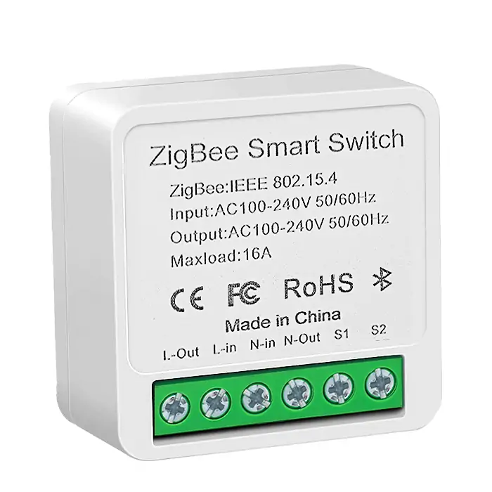
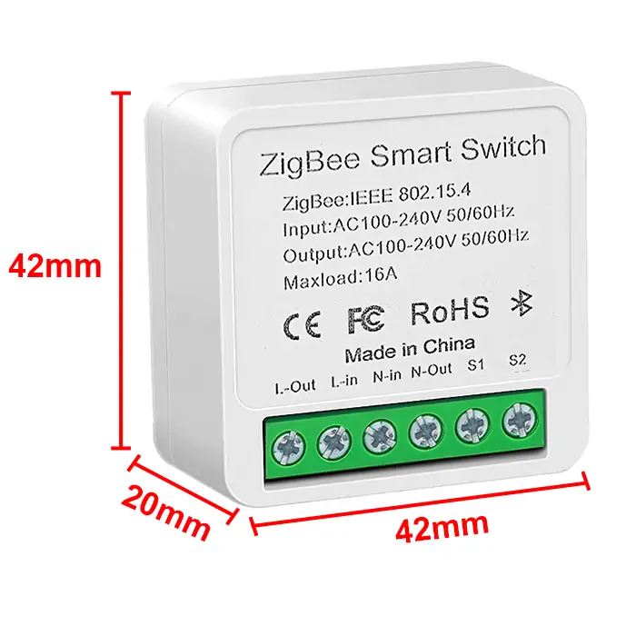
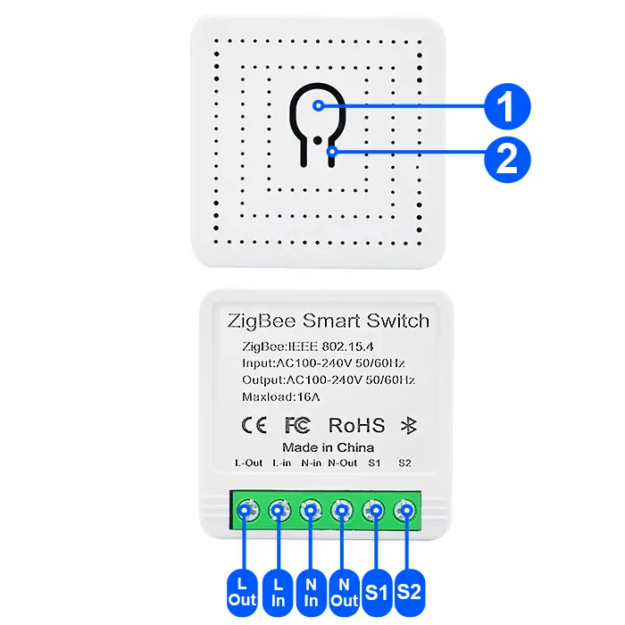
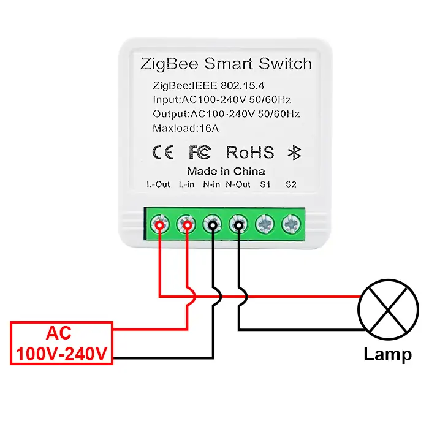
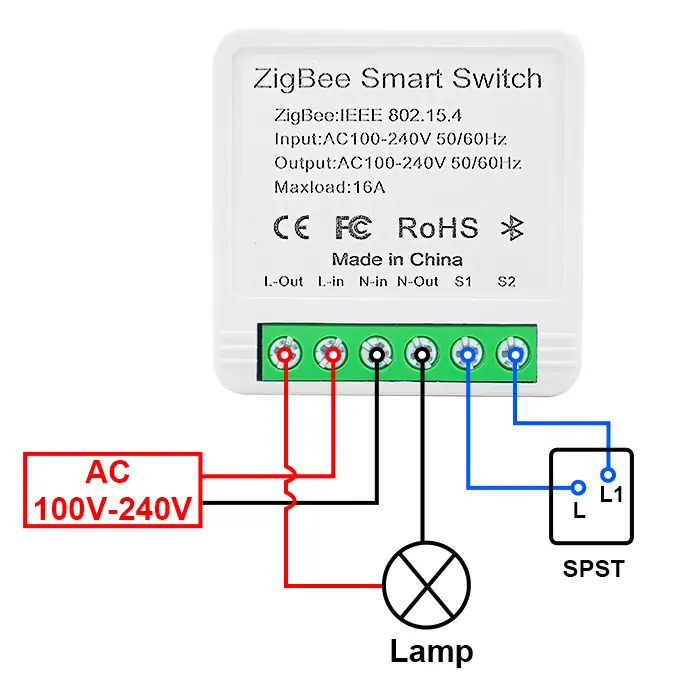
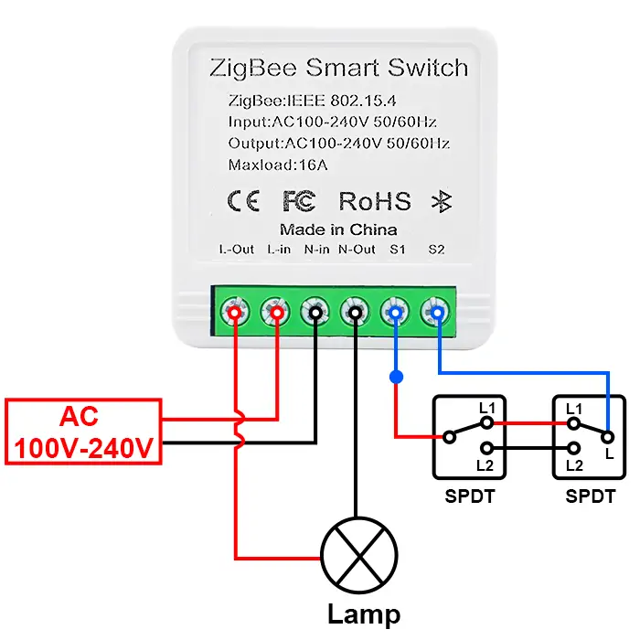
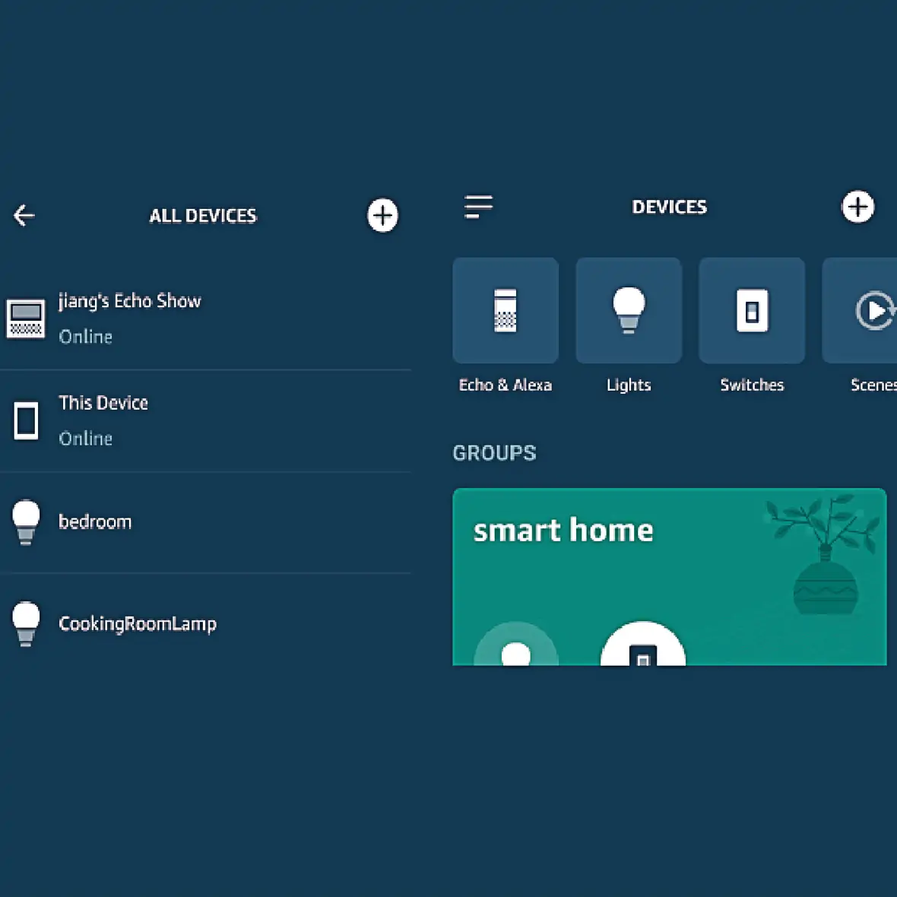
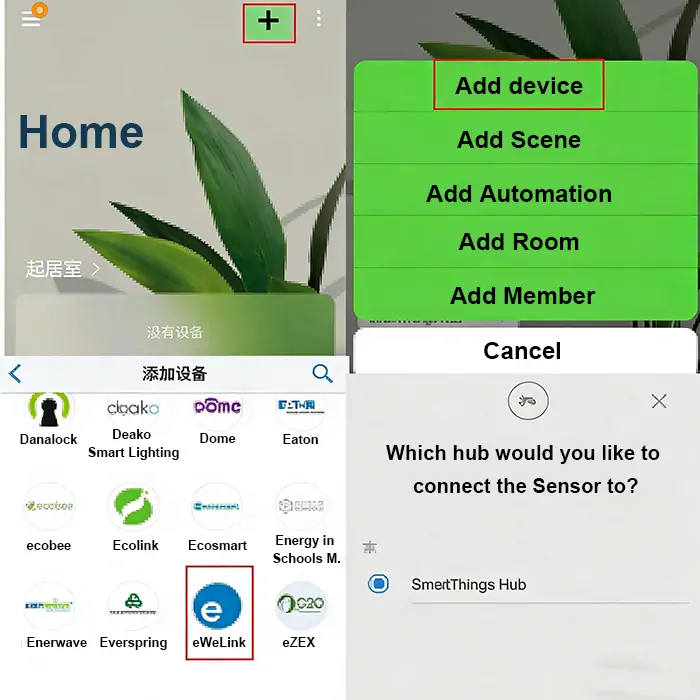
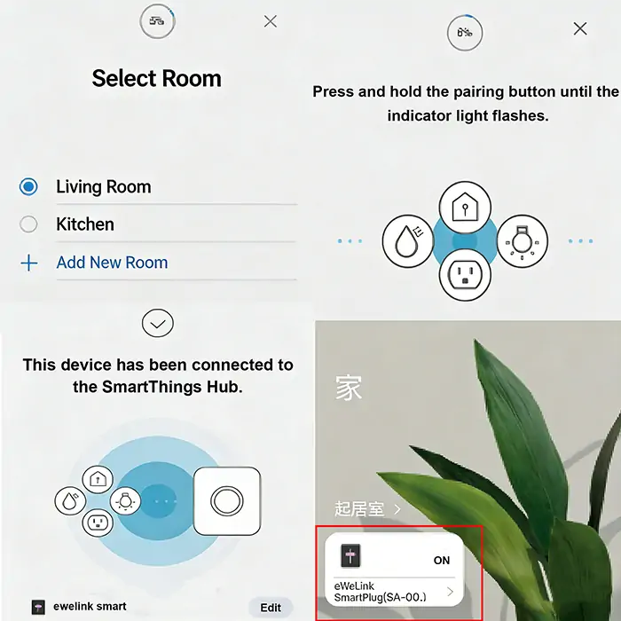

# QIACHIP KR2303 Instruction Manual AC 110V 220V ZigBee Ewelink Smart Remote Control Switch 1-CH Relay Receiver

{ width="50%" .center loading="lazy" }

> Version: V1.0

> Last Updated: 2026-02-05

> Model: KR2303

## Product Size

{ width="68%" .center loading="lazy" }

- Receiver Length (L) x Width (W) x Height (H): 42mm x 42mm x 20mm

## Component Description

{ width="50%" .center loading="lazy" }

  <ul style="flex: 1 1 45%; margin-right: 1%;">
    <li>1: Learning button</li>
    <li>2: Indicator light</li>
    <li>S1: External Switch Terminal</li>
    <li>S2: External Switch Terminal</li>
  </ul>
  <ul style="flex: 1 1 45%; margin-left: 1%;">
    <li>L-Out: Output Live wire terminal</li>
    <li>N-Out: Output Neutral wire terminal</li>
    <li>L-In: Input Live wire terminal</li>
    <li>N-In: Input Neutral wire terminal</li>
  </ul>

## Wiring Diagram

Disconnect power before wiring.

### Figure 1

{ width="68%" .center loading="lazy" }

Figure 1: Wiring diagram for Lamp

- Load: Lamp
- Input Power: AC 100V-240V

---

### Figure 2

{ width="68%" .center loading="lazy" }

- Figure 2: Wiring diagram for Lamp (SPDT External 1-Way Switch)
- Load: Lamp
- External Switch: SPST 1-Way
- Input Power: AC 100V-240V

---

### Figure 3

{ width="68%" .center loading="lazy" }

- Figure 3: Wiring diagram for Lamp (SPDT External 2-Way Switch)
- Load: Lamp
- External Switch: SPDT 2-Way
- Input Power: AC 100V-240V

---

## Pairing with Alexa APP

**NOTE**

This product requires a Zigbee gateway for operation. Supported gateways are as follows:

- eWeLink Hub
- IKEA Hub
- SmartThings Hub
- Philips Hue Hub
- ECHO Plus

**Step 1**

Press and hold the learning button on the receiver for more than 6 seconds until the indicator light flashes to activate pairing mode successfully. Alternatively, power off the receiver, then power it on for 3-8 seconds and repeat this operation 5 times to enter pairing mode. Either method is applicable.

**Step 2**

"Ask: 'Alexa, discover devices.'"

**Step 3**

Wait for the receiver's indicator light to stay solid on, at which point the device will be connected to your Echo.

You can control the device, or modify its type and name, in the device list interface. You can also control the device from the Smart Home main interface of the Alexa app.

{ width="68%" .center loading="lazy" }

---

## Pairing with SmartThings APP

**Step 1**

Press and hold the learning button on the receiver for more than 6 seconds until the indicator light flashes to activate pairing mode successfully. Alternatively, power off the receiver, then power it on for 3-8 seconds and repeat this operation 5 times to enter pairing mode. Either method is applicable.

**Step 2**

Open the SmartThings app, tap the "+" icon in the upper right corner, and select "Add device".

{ width="68%" .center loading="lazy" }

**Step 3**

Follow the on-screen prompts and wait patiently for the device to complete pairing.

{ width="68%" .center loading="lazy" }

## Pairing with RM2.4G remote control

Press the receiver's learning button 6 times in a row — the indicator flashes once, meaning it's in pairing mode. Then press the remote 4 times in a row to finish pairing. (Pairing mode valid for only 5s.)

**Method for Clearing RM2.4G Remote Control**

Press the learning button on the receiver 9 times in succession; the receiver's indicator light will flash, indicating successful code clearing.

## Electrical characteristics

| Parameter | Value |
| --- | --- |
| Input voltage | AC 100V-240V |
| WIFI frequency | IEEE 802.15.4 |
| Maximum Load Current | 16A |
| Rated Load | Max 3500W |
| Receiver sensitivity | -108dBm |
| Working temperature | -10℃~70℃ |
| Size | 42x42x20mm |

Note: Rated Load breakdown by scenario: resistive load 3500W, LED light 500W

## Warning

- L and N wires must not be reversed.
- When using wireless electronic devices, avoid proximity to metal objects, large electronic equipment, electromagnetic fields, and other sources of strong interference.
