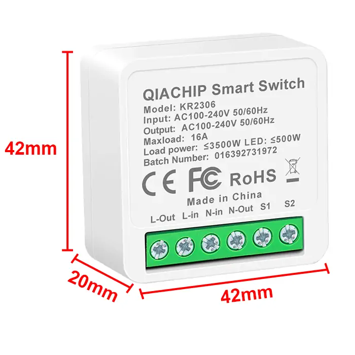
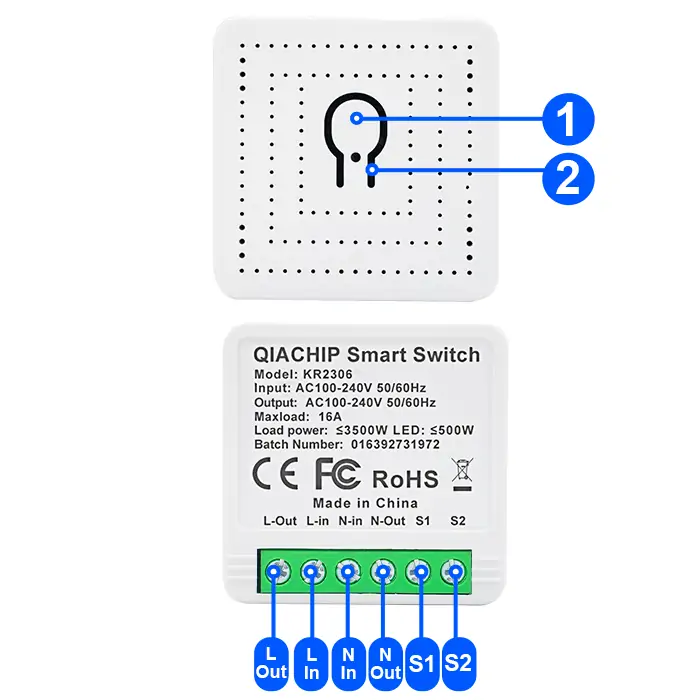
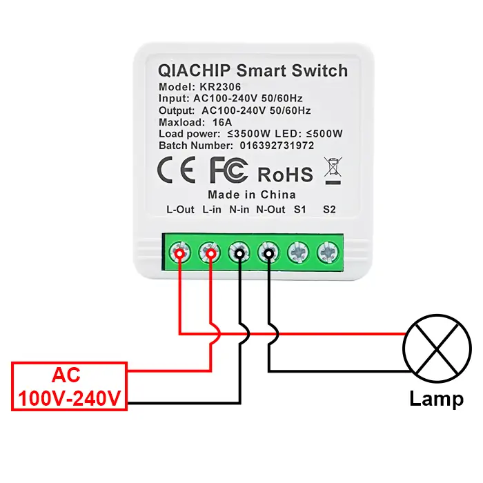
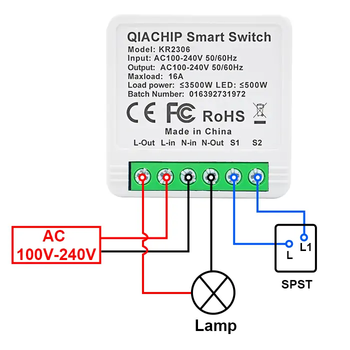
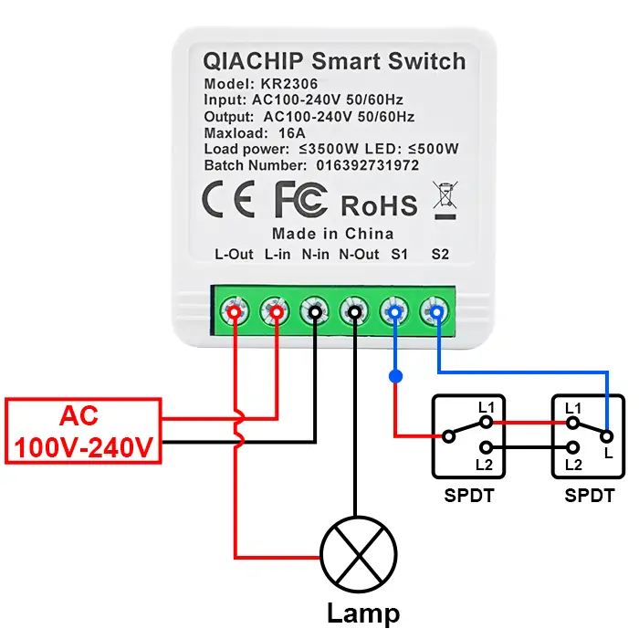
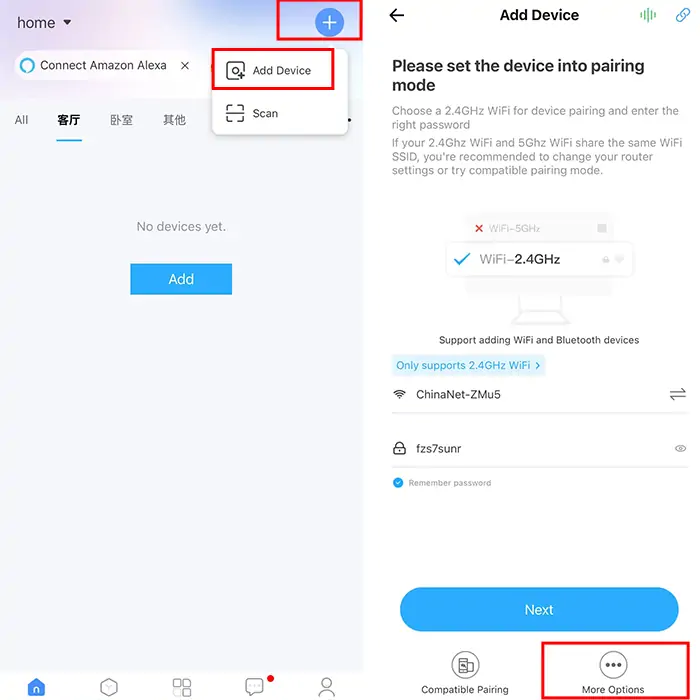
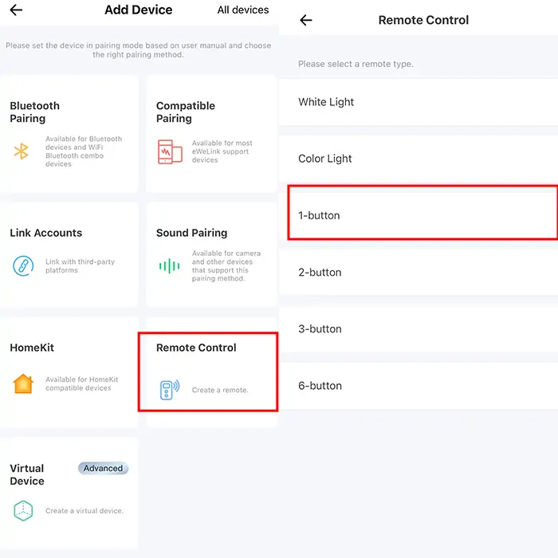
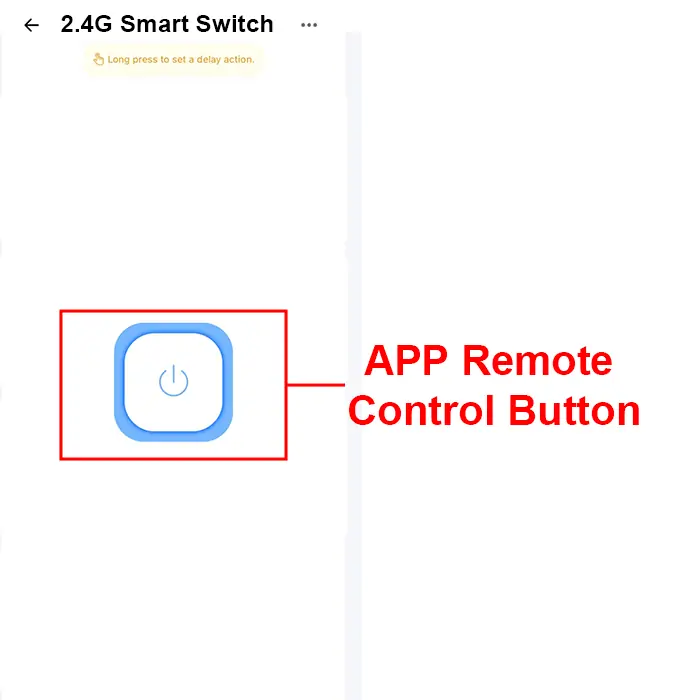

# QIACHIP KR2306EW Instruction Manual AC 110V 220V 2.4G Ewelink Smart Remote Control Switch 1-CH Relay Receiver

{ width="50%" .center loading="lazy" }

> Version: V1.0

> Last Updated: 2026-02-06

> Model: KR2306EW

## Product Size

{ width="68%" .center loading="lazy" }

- Receiver Length (L) x Width (W) x Height (H): 42mm x 42mm x 20mm

## Component Description

{ width="50%" .center loading="lazy" }

  <ul style="flex: 1 1 45%; margin-right: 1%;">
    <li>1: Learning button</li>
    <li>2: Indicator light</li>
    <li>S1: External Switch Terminal</li>
    <li>S2: External Switch Terminal</li>
  </ul>
  <ul style="flex: 1 1 45%; margin-left: 1%;">
    <li>L-Out: Output Live wire terminal</li>
    <li>N-Out: Output Neutral wire terminal</li>
    <li>L-In: Input Live wire terminal</li>
    <li>N-In: Input Neutral wire terminal</li>
  </ul>

## Wiring Diagram

Disconnect power before wiring.

### Figure 1

{ width="68%" .center loading="lazy" }

Figure 1: Wiring diagram for Lamp

- Load: Lamp
- Input Power: AC 100V-240V

---

### Figure 2

{ width="68%" .center loading="lazy" }

- Figure 2: Wiring diagram for Lamp (SPDT External 1-Way Switch)
- Load: Lamp
- External Switch: SPST 1-Way
- Input Power: AC 100V-240V

---

### Figure 3

{ width="68%" .center loading="lazy" }

- Figure 3: Wiring diagram for Lamp (SPDT External 2-Way Switch)
- Load: Lamp
- External Switch: SPDT 2-Way
- Input Power: AC 100V-240V

---

## Adding 2.4G Remote Control

**NOTE**

**The receiver can support up to 4 paired 2.4G remote controls (including the APP remote control). If more than 4 are added, the first paired remote control will be overwritten automatically.**

**Step 1**

Press and hold the learning button on the receiver for more than 3 seconds until the receiver's indicator light flashes once, then release.

**Step 2**

Next, press the button on the 2.4G remote control that needs pairing once. The indicator light will flash, confirming that pairing is complete.

---

## Adding a 2.4G Remote Control via eWeLink APP

**Step 1**

Open the eWeLink APP, tap the "+" icon in the upper right corner, select Add Device, choose More Options at the bottom, select Remote Control, and finally select 1-button.

{ width="68%" .center loading="lazy" }

{ width="68%" .center loading="lazy" }

**Step 2**

Press and hold the learning button on the receiver for more than 3 seconds until the receiver's indicator light flashes once, then release it. Next, tap the remote control button on the APP; the indicator light will flash, confirming the pairing is complete.

{ width="68%" .center loading="lazy" }

## Reset function

Press and hold the learning button on the receiver for more than 10 seconds until the receiver's indicator light flashes. All paired remote controls (including the APP remote control) will be unpaired and no longer able to control the receiver.

## Electrical characteristics

| Parameter | Value |
| --- | --- |
| Input voltage | AC 100V-240V |
| WIFI frequency | 2.4GHz |
| Maximum Load Current | 16A |
| Rated Load | Max 3500W |
| Receiver sensitivity | -108dBm |
| Working temperature | -10℃~70℃ |
| Size | 42x42x20mm |

Note: Rated Load breakdown by scenario: resistive load 3500W, LED light 500W

## Warning

- L and N wires must not be reversed.
- When using wireless electronic devices, avoid proximity to metal objects, large electronic equipment, electromagnetic fields, and other sources of strong interference.
