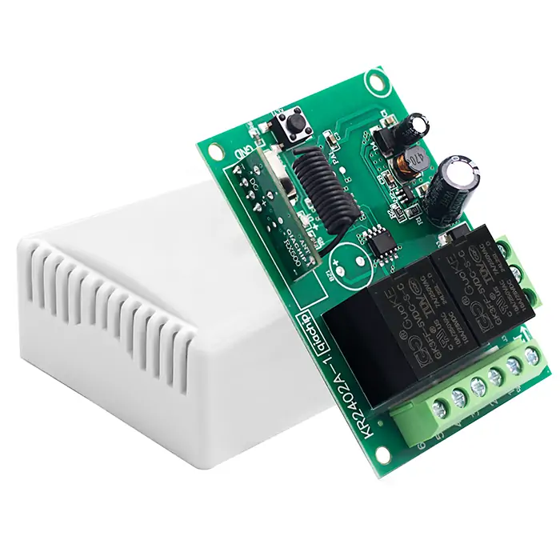
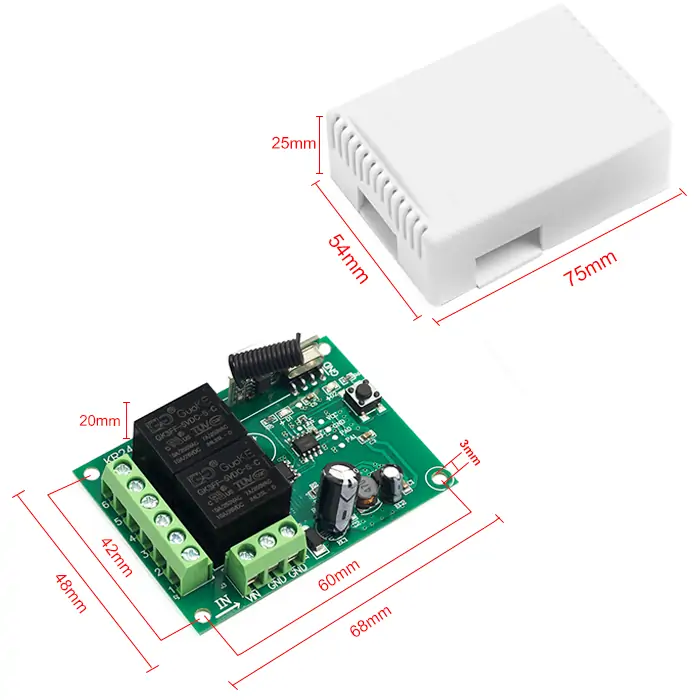
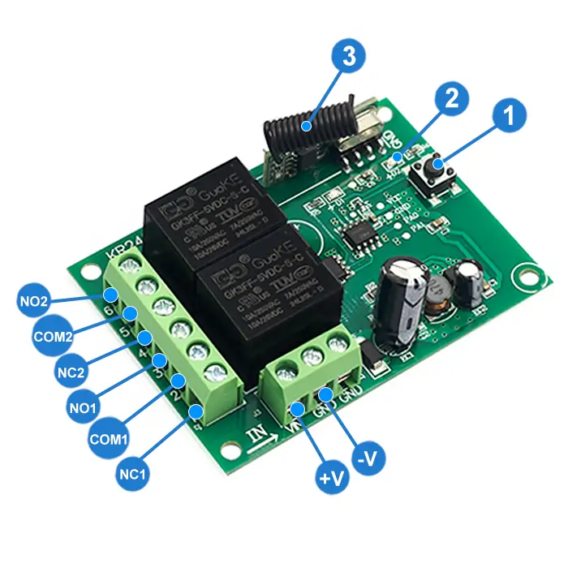
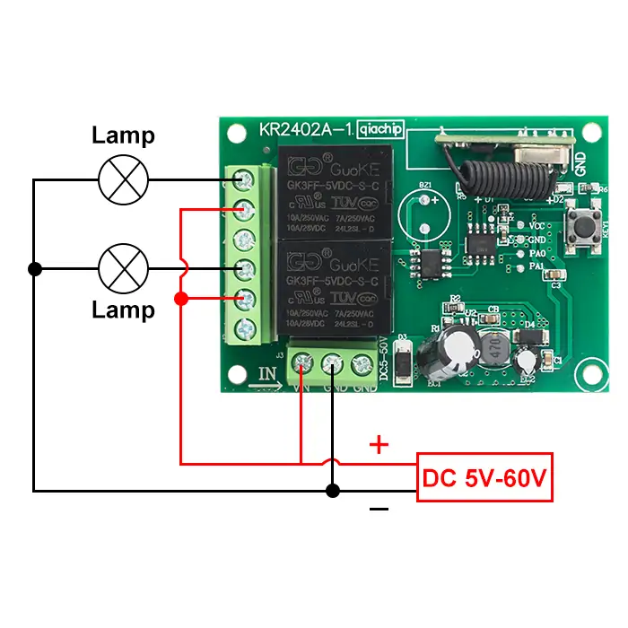
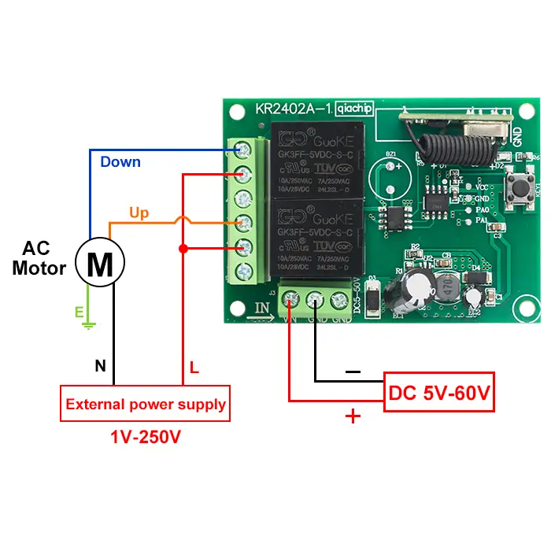
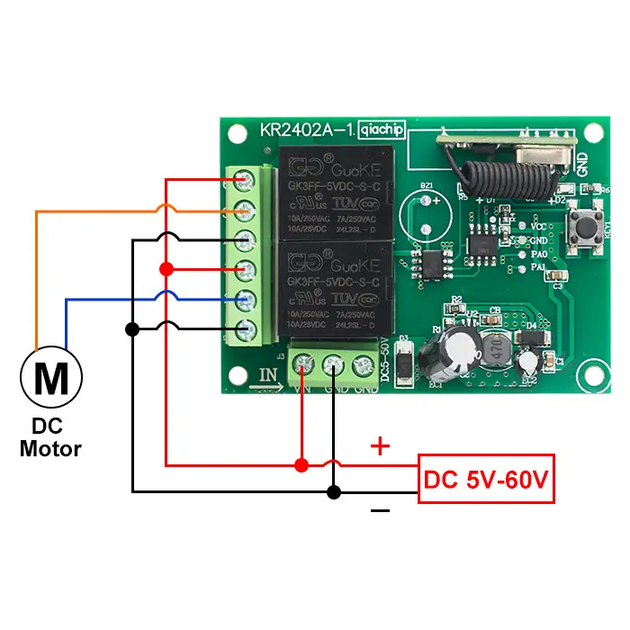

# QIACHIP KR2402A Instruction Manual DC 5V-60V 433MHz RF Remote Control Switch 2-CH Relay Receiver

{ width="50%" .center loading="lazy" }

> Version: V1.0
> 

> Last Updated: 2025-06-24
> 

> Model: KR2402A
> 

## Product Size

{ width="68%" .center loading="lazy" }

- Receiver Length (L) × Width (W) × Height (H): 68mm × 48mm × 20mm
- Housing Length (L) × Width (W) × Height (H): 75mm × 54mm × 25mm
- Receiver hole horizontal spacing: 60mm; Vertical spacing: 42mm; Hole Diameter: Ø5mm

## Component description

{ width="50%" .center loading="lazy" }

  <ul style="flex: 1 1 45%; margin-right: 1%;">
    <li>1: Learning button</li>
    <li>2: Indicator light</li>
    <li>3: Antenna</li>
    <li>+V: Positive input terminal</li>
    <li>-V: Negative input terminal</li>
  </ul>
  <ul style="flex: 1 1 45%; margin-left: 1%;">
    <li>NO1: Normally open terminal of relay1</li>
    <li>COM1: Common terminal of relay1</li>
    <li>NC1: Normally closed terminal of relay1</li>
    <li>NO2: Normally open terminal of relay2</li>
    <li>COM2: Common terminal of relay2</li>
    <li>NC2: Normally closed terminal of relay2</li>
  </ul>

## Wiring diagram

Disconnect power before wiring.

### Figure 1

{ width="50%" .center loading="lazy" }

Figure 1: Wiring diagram for lamps

- Load: lamps

- Input Power: DC 5V-60V

---

### Figure 2

{ width="50%" .center loading="lazy" }

Figure 2: Wiring diagram for AC motors

- Load: AC motors
- Input Power: DC 5V-60V
- External power supply: 1V-250V

---

### Figure 3

{ width="50%" .center loading="lazy" }

Figure 3: Wiring diagram for DC motors

- Load: DC motors
- Input Power: DC 5V-60V

---

## Function description and setting method

**(1) Momentary mode; (2) Toggle mode; (3) Latching mode; (4) Reset function.**

**NOTE**

- When you use the first and second working modes, a remote control with at least two buttons is required.
- When you use the third working mode, a remote control with at least three buttons is required.
- When pairing a second remote, you don't need to press the button on the receiver 8 times again to reset it.
- Once the receiver and transmitter are paired and a working mode is selected, the receiver will retain this mode even if powered off and on again.
- The following working modes require the use of QIACHIP brand remote controls (transmitters) and controllers (receivers/wireless remote control switches). Compatibility with other brands is not guaranteed

### **(1) Momentary mode**

 In this mode: 

- Press and hold the remote control button (such as A), and the corresponding relay on the receiver is turned on.
- Release the remote control button (such as A), and the corresponding relay on the receiver will turn off.

### **How to set momentary mode**

NOTE

<ul>
<li>The KR2402 can only be properly set up after being successfully paired with two different buttons on the remote control.</li>
</ul>

**Step 1**

Click the learning button of the receiver once. The indicator light on the receiver turns off and the receiver enters the setting state.

**Step 2**

Press the button on the remote control (such as A) once. The indicator light on the receiver will flash and then turns off.

**Step 3**

After the indicator light goes out, press another button (such as B) on the same remote control. The indicator light on the receiver will flash and then turn on. The momentary mode is set successfully.

### **(2) Toggle mode**

In this mode: 

- Press the remote control button (such as A), and the corresponding relay on the receiver will turn on.
- Press the remote control button (such as A) again, and the corresponding relay on the receiver will turn off.

### **How to set toggle mode**

NOTE

<ul>
<li>The KR2402 can only be properly set up after being successfully paired with two different buttons on the remote control.</li>
</ul>

**Step 1**

Click the learning button of the receiver twice. The indicator light on the receiver turns off, and the receiver enters the setting state.

**Step 2**

Press the button on the remote control (such as A) once. The indicator light on the receiver will flash and then turns off.

**Step 3**

After the indicator light goes out, press another button (such as B) on the same remote control. The indicator light on the receiver will flash and then turn on. The toggle mode is set successfully. 

### **(3) Latching mode**

In this mode:

- Press the remote control button (such as A), and the corresponding receiver’s relay A is turned on.
- Press the remote control button (such as B), and the receiver’s relay B is turned on, and the receiver’s relay A is turned off.

### **How to set latching mode**

NOTE

<ul>
<li>The KR2402 can only be properly set up after being successfully paired with two different buttons on the remote control.</li>
</ul>

**Step 1** 

Click the learning button of the receiver three times. The indicator light on the receiver turns off, and the receiver enters the setting state. 

**Step 2**

Press the button on the remote control (such as A) once. The indicator light on the receiver will flash and then turns off.

**Step 3**

After the indicator light goes out, press another button (such as B) on the same remote control. The indicator light on the receiver will flash and then turn on. The latching mode is set successfully. 

### **(4) Reset function**

- When the KR2402A receiver is reset, all paired transmitters will be unpaired and can no longer control the receiver.

### How to Reset

Click the learning button on the receiver 8 times. The reset is complete when the indicator light flashes and then turns off.

## Electrical characteristics

| Parameter | Value |
| --- | --- |
| Input voltage | DC 5-60V |
| RF frequency | 433.92MHz |
| Standby current | 8.5 mA |
| Rated Load | Max 1100W |
| Receiver sensitivity | -108dBm |
| Operation mode | Momentary mode/Toggle mode/Latching mode |
| Working temperature | -10℃~70℃ |
| Size | 68x48x18mm |

## Warning

- The positive and negative terminal wires must not be reversed
- When using wireless electronic devices, avoid proximity to metal objects, large electronic equipment, electromagnetic fields, and other sources of strong interference

## Frequently Asked Questions（Q&A）

**Question 1:** Why can my remote control Relay 1 but not Relay 2 in KR2402A Momentary mode?

**Answer:**

Your pairing steps may be wrong, so your remote can only control Relay 1.

Pair the receiver again with the steps below:

1. Press the receiver's Learning button 8 times to reset the receiver.
2. Press the receiver's Learning button 1 time for Momentary mode.
3. Press one button on the remote (such as A). Wait until the receiver's indicator light flashes, then turns off.
4. Press another button on the remote (such as B). Wait until the receiver's indicator light flashes, then turns on.

This sets both relays in Momentary mode.

**Question 2:** Why do button A and button B both control Relay 1 after KR2402A Momentary pairing?

**Answer:**

Your pairing steps may be wrong, so button A and button B both control Relay 1.

Pair the receiver again with the steps below:

1. Press the receiver's Learning button 8 times to reset the receiver.
2. Press the receiver's Learning button 1 time for Momentary mode.
3. Press button A on the remote. Wait until the receiver's indicator light flashes, then turns off.
4. Press button B on the remote. Wait until the receiver's indicator light flashes, then turns on.

This sets button A for Relay 1 and button B for Relay 2 in Momentary mode.

**Question 3:** What is the difference between KR2402A Momentary, Toggle, and Latching modes?

**Answer:**

KR2402A has three working modes.

Momentary mode: the relay turns on while you hold the remote button. The relay turns off when you release it.

Toggle mode: press the remote button once, and the relay turns on. Press the same remote button again, and the relay turns off.

Latching mode: press remote button A, and Relay 1 turns on. Press remote button B, and Relay 2 turns on while Relay 1 turns off.

Use Momentary mode for hold-to-run control. Use Toggle mode for on / off control. Use Latching mode when Relay 1 and Relay 2 must not stay on at the same time.

**Question 4:** Can KR2402A trigger Relay 1 and Relay 2 one by one automatically?

**Answer:**

No, KR2402A does not have an automatic sequence mode.

Relay 1 and Relay 2 are controlled by paired remote buttons. In Momentary mode or Toggle mode, remote button A can control Relay 1, and remote button B can control Relay 2.

**Question 5:** How do I set two remotes to control Relay 1 and Relay 2 on KR2402A?

**Answer:**

Pair one button on each remote in the same setup. The first button you pair controls Relay 1. The second button you pair controls Relay 2.

Example for Toggle mode:

1. Press the receiver's Learning button 2 times for Toggle mode. Wait until the receiver's indicator light turns off.
2. Press a button on the first remote. Wait until the receiver's indicator light flashes, then turns off.
3. Press a button on the second remote. Wait until the receiver's indicator light flashes, then turns on.

**Question 6:** Can I pair multiple remotes to channels A and B in Momentary mode?

**Answer:**

Yes, KR2402A can pair multiple remotes to channels A and B in Momentary mode.

For each new remote, pair button A and button B in the same Momentary setup. Do not pair button A alone.

Press the receiver's Learning button 8 times only if you want to reset the receiver. Reset deletes all paired remotes.

**Question 7:** How do I use KR2402A Momentary mode to control a two-direction motor with button A and button B?

**Answer:**

Use KR2402A Momentary mode through the motor controller control inputs, not through the motor power wires.

Pair the receiver with the steps below:

1. Press the receiver's Learning button 1 time for Momentary mode. Wait until the receiver's indicator light turns off.
2. Press remote button A for one motor direction. Wait until the receiver's indicator light flashes, then turns off.
3. Press remote button B for the other motor direction. Wait until the receiver's indicator light flashes, then turns on.

Button A: one motor direction runs while you hold button A.
Button B: the other motor direction runs while you hold button B.

The motor controller must prevent both directions from running at the same time.

**Question 8:** Does the KR2402A relay stay on after power loss?

**Answer:**

No, the relay cannot stay on when the power is off.

KR2402A can remember the paired remote and working mode after power loss. The relay state still needs power. After power comes back, the next relay action depends on the mode and remote command.

**Question 9:** How should I wire KR2402A for my load?

**Answer:**

It depends on what load you want to control.

Use the KR2402A wiring diagram that matches your load. Turn off power before wiring.

+V / -V: receiver power input, DC 5V-60V.

Relay 1 output terminals: NO1 / COM1 / NC1.
Relay 2 output terminals: NO2 / COM2 / NC2.

The relay output is a dry contact. This means the relay output works like a switch. It does not output power by itself.

**Question 10:** Can one remote control two KR2402A receivers in Momentary mode and Toggle mode?

**Answer:**

Yes, it is possible, but we do not recommend it if the two receivers are close to each other.

One remote sends the same RF signal. If both receivers are within the same remote-control range, both may receive the signal and operate.

Momentary mode and Toggle mode do not separate the RF signal. To avoid interference, keep the two receivers far enough apart, or use separate remotes.

**Question 11:** Can I add a signal amplifier to KR2402A to reach 100 meters?

**Answer:**

No, we do not recommend adding a signal amplifier to the receiver.

Changing the receiver may damage KR2402A or make the remote signal unstable.

To improve remote-control range, fully extend the receiver antenna. Keep the receiver antenna away from metal parts and motor wires.

If you need about 100 meters, use a longer-range remote with an antenna.
