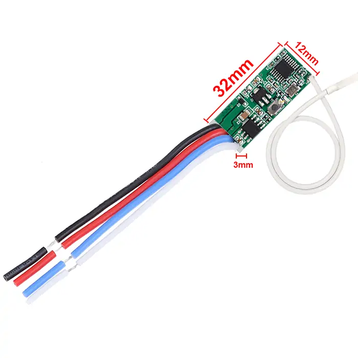
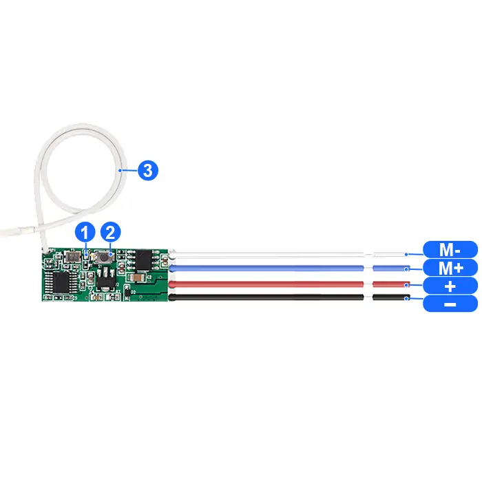
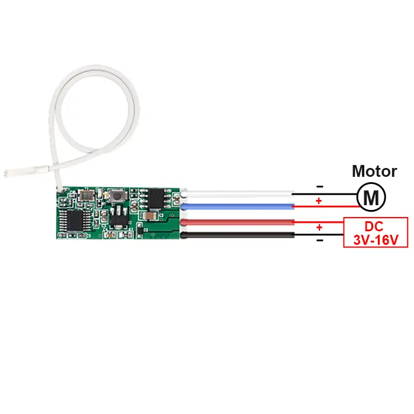

# QIACHIP MTD12A-4 Instruction Manual DC 3V-16V 433MHz RF Wireless Micro Motor Receiver Module

{ width="50%" .center loading="lazy" }

> Version: V1.0

> Last Updated: 2026-02-24

> Model: MTD12A-4

## Product Size

{ width="68%" .center loading="lazy" }

- Receiver Length (L) x Width (W) x Height (H): 32mm x 12mm x 3mm

## Component Description

{ width="50%" .center loading="lazy" }

  <ul style="flex: 1 1 45%; margin-right: 1%;">
    <li>1: Indicator light</li>
    <li>2: Learning button</li>
    <li>3: Antenna</li>
  </ul>
  <ul style="flex: 1 1 45%; margin-left: 1%;">
    <li>Input-: Negative input terminal</li>
    <li>Input+: Positive input terminal</li>
    <li>Output M+: Forward control terminal</li>
    <li>Output M-: Reverse control terminal</li>
  </ul>

## Wiring Diagram

Disconnect power before wiring.

### Figure 1

{ width="68%" .center loading="lazy" }

Figure 1: Wiring diagram for DC motors

- Load: DC motors
- Input Power: DC V-30V

---

## Function description and setting method

**(1) Momentary mode; (2) Toggle mode; (3) Latching mode; (4) Reset function.**

- **This product requires a remote control with at least two buttons. For the third mode, a remote control with at least three buttons is required.**
- **When pairing a second remote, you don't need to press the button on the receiver 8 times again to reset it.**
- **Once the receiver and transmitter are paired and a working mode is selected, the receiver will retain this mode even if powered off and on again.**
- **The following working modes require the use of QIACHIP brand remote controls (transmitters) and controllers (receivers). Compatibility with other brands is not guaranteed.**

### (1) Momentary mode

In this mode:

- Press and hold the remote control button (such as A) to rotate the motor forward; release the remote control button to stop.
- Press and hold the remote control button (such as B) to rotate the motor backward; release the remote control button to stop.

### How to set momentary mode

**Step 1**

Click the learning button of the receiver once. The indicator light on the receiver will turn on, and the receiver will enter the setting state.

**Step 2**

Press the button on the remote control (such as A) once. The indicator light on the receiver will flash and then will turn on.

**Step 3**

After the indicator light turns on, press another button (such as B) on the same remote control. The indicator light on the receiver will flash and then turn off. The momentary mode will be set successfully

### (2) Toggle mode

In this mode:

- Press the remote control button (such as A), and the motor rotates forward. Press button A again, and the motor stops.
- Press the remote control button (such as B), and the motor rotates backward. Press button B again, and the motor stops.

### How to set toggle mode

**Step 1**

Click the learning button of the receiver twice. The indicator light on the receiver will turn on, and the receiver will enter the setting state.

**Step 2**

Press the button on the remote control (such as A) once. The indicator light on the receiver will flash and then will turn on.

**Step 3**

After the indicator light turns on, press another button (such as B) on the same remote control. The indicator light on the receiver will flash and then turn off. The Toggle mode will be set successfully

### (3) Latching mode

In this mode:

- Press the remote control button (such as A), and the receiver's relay will turn on.
- Press the remote control button (such as B), and the receiver's relay will turn off.

### How to set latching mode

**Step 1**

Click the learning button of the receiver three times. The indicator light on the receiver will turn on, and the receiver will enter the setting state.

**Step 2**

Press the button on the remote control (such as A) once. The indicator light on the receiver will flash and then will turn on.

**Step 3**

After the indicator light turns on, press another button (such as B) on the same remote control. The indicator light on the receiver will flash and then will turn on.

**Step 4**

After the indicator light turns on, press another button (such as C) on the same remote control. The indicator light on the receiver will flash and then turn off. The latching mode will be set successfully

### (4) Power Saving Mode

In this mode:

The module reduces its static current from 6 mA to 1 mA. To resume control, you need to long-press a button on the remote control to reawaken the module.

### How to set Power Saving mode

- **Enter Power Saving Mode**:

Press the learn button four times. The indicator light will flash and then turn off, indicating the module has entered power saving mode.

- **Exit Power Saving Mode**:

Press the learn button five times. The indicator light will flash and then turn off, indicating the module has exited power saving mode.

### (5) Reset function

When the MTD12A-4 receiver is reset, all paired transmitters will be unpaired and will no longer be able to control the receiver.

### How to reset

**Step 1**

Click the learning button on the receiver 8 times. The indicator light will flash and then will turn off. The reset will be complete.

## Electrical characteristics

| Parameter | Value |
| --- | --- |
| Input voltage | DC 3-16V |
| RF frequency | 433.92MHz |
| Relay max contact curren | 2A |
| Quiescent Current | ≤ 6mA |
| Receiver sensitivity | -100dBm |
| Operation mode | Momentary mode/Toggle mode/Latching mode/Delay mode |
| Working temperature | -10℃~+70℃ |
| Size | 32x12x3mm |

## Warning

1. This product is a CMOS device. Please take anti-static precautions during storage, transportation and operation.
2. Ensure proper grounding when using the device.
3. RF devices are voltage-sensitive. If the power supply is unstable or has significant ripple, add filtering at the power input terminal to ensure the supply voltage does not exceed the product's maximum operating voltage.
