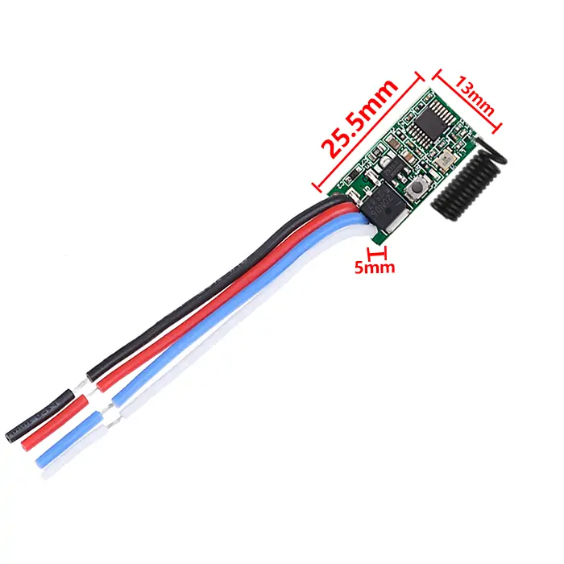
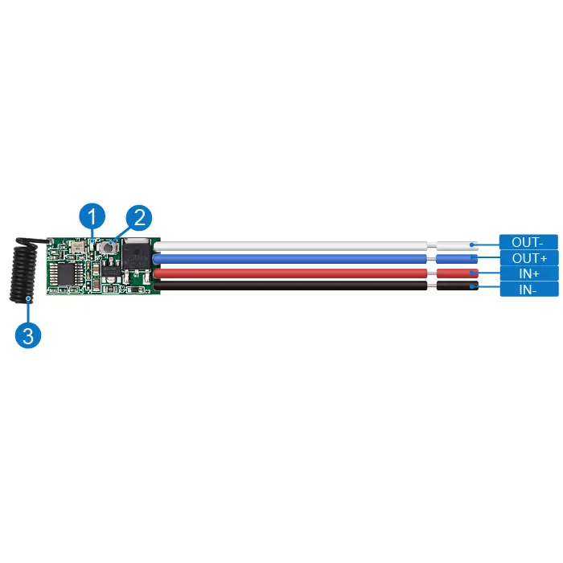
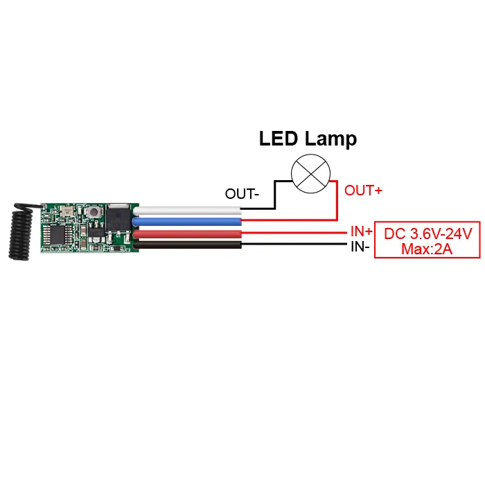

# QIACHIP QA-R-012 Instruction Manual DC 3.6V-24V 433MHz RF Lighting Control Module Receiver

{ width="50%" .center loading="lazy" }

> Version: V1.0
> 

> Last Updated: 2026-1-8
> 

> Model: QA-R-012
> 

## Product Size

{ width="68%" .center loading="lazy" }

- Receiver Length (L) x Width (W) x Height (H): 25.5mm x 13mm x 5mm

## Component Description

{ width="50%" .center loading="lazy" }

  <ul style="flex: 1 1 45%; margin-right: 1%;">
    <li>1: Indicator light</li>
    <li>2: Learning button</li>
    <li>3: Antenna</li>
  </ul>
  <ul style="flex: 1 1 45%; margin-left: 1%;">
    <li>Out+: Positive Output Terminal</li>
    <li>Output-: Negative Output terminal</li>
    <li>IN+: Positive Input terminal</li>
    <li>IN-: Negative Input terminal</li>
  </ul>

## Wiring Diagram

Disconnect power before wiring.

### Figure 1

{ width="50%" .center loading="lazy" }

Figure 1: Wiring diagram for LED Lamp

- Load: LED Lamp

- Input Power: DC 3.6V-24V Max: 2A

---

## Function description and setting method

**(1) Momentary mode;**

**(2) Toggle mode;**

**(3) Latching mode;**

**(4) Delay mode;**

**(5) Reset function;**

**(6) Power-On Auto-Engagement.**

- **When you use the third working mode, a remote control with at least two buttons is required.**
- **When pairing a second remote, you don't need to press the button on the receiver 8 times again to reset it.**
- **Once the receiver and transmitter are paired and a working mode is selected, the receiver will retain this mode even if powered off and on again.**
- **The following working modes require the use of QIACHIP brand remote controls (transmitters) and controllers (receivers/wireless remote control switches). Compatibility with other brands is not guaranteed.**

### (1) Momentary mode

 In this mode: 

- Press and hold the remote control button (such as A), and the corresponding relay on the receiver will turn on.
- Release the remote control button (such as A), and the corresponding relay on the receiver will turn off.

### How to set momentary mode

**Step 1**

Click the learning button of the receiver once. The indicator light on the receiver will turn on, and the receiver will enter the setting state.

**Step 2**

Press the button on the remote control (such as A) once. The indicator light on the receiver will flash and then will turn off. The momentary mode will be set successfully.

### (2) Toggle mode

In this mode: 

- Press the remote control button (such as A), and the corresponding relay on the receiver will turn on.
- Press the remote control button (such as A) again, and the corresponding relay on the receiver will turn off.

### How to set toggle mode

**Step 1**

Click the learning button of the receiver twice. The indicator light on the receiver will turn on, and the receiver will enter the setting state.

**Step 2**

Press the button on the remote control (such as A) once. The indicator light on the receiver will flash and then will turn off. The toggle mode will be set successfully.

### (3) Latching mode

In this mode:

- Press the remote control button (such as A), and the receiver's relay will turn on.
- Press the remote control button (such as B), and the receiver's relay will turn off.

### How to set latching mode

**Step 1**

Click the learning button of the receiver three times. The indicator light on the receiver will turn on, and the receiver will enter the setting state.

**Step 2**

Press the button on the remote control (such as A) once. The indicator light on the receiver will flash and then will turn on.

**Step 3**

After the indicator light turns on, press another button (such as B) on the same remote control. The indicator light on the receiver will flash and then turn off. The latching mode will be set successfully.

### (4) Delay mode

In this mode:

- Press the remote control button (such as A), and the corresponding relay of the receiver will enter delay mode.

### How to set delay mode

**Step 1**

Click the learning button of the receiver 4 times. The indicator light on the receiver will turn on, and the receiver will enter the setting state.

(Press the receiver button **4 times**: The corresponding relay will close after a 5-second delay);

(Press the receiver button **5 times**: The corresponding relay will close after a 10-second delay);

(Press the receiver button **6 times**: The corresponding relay will close after a 15-second delay);

(Press the receiver button **7 times**: The corresponding relay will close after a 20-second delay).

**Step 2**

Press the button on the remote control (such as A) once. The indicator light on the receiver will flash and then turn off. The delay mode will be set successfully.

### (5) Reset function

- When the QA-R-012 receiver is reset, all paired transmitters will be unpaired and will no longer be able to control the receiver.

### How to reset

Click the learning button on the receiver 8 times. The indicator light will flash and then will turn off. The reset will be complete.

### (6) Power-On Auto-Engagement

- After this mode is set, the relay will automatically turn on when the receiver is powered back on after a power outage.

### How to set power-on auto-engagement

Press and hold the receiver's learning button for more than 5 seconds until
the indicator light flashes and then goes off. Power-On Auto-Engagement
is now set successfully. 

(After successful setup, the relay will remain in the energized state when the device is powered back on, regardless of its state before the power outage.)

## Electrical characteristics

| Parameter | Value |
| --- | --- |
| Input voltage | DC 3.6V-24V |
| RF frequency | 433.92MHz |
| Relay max contact current | 2A |
| Quiescent Current | 5.0mA ~ 5.5mA |
| Receiver sensitivity | -97dBm |
| Operation mode | Momentary mode/Toggle mode/Latching mode/Delay mode/Power-On Auto-Engagement |
| Working temperature | -20~80°C |
| Size | 25.5x13x5mm |

## Warning

- The positive and negative terminal wires must not be reversed.
- When using wireless electronic devices, avoid proximity to metal objects, large electronic equipment, electromagnetic fields, and other sources of strong interference.
