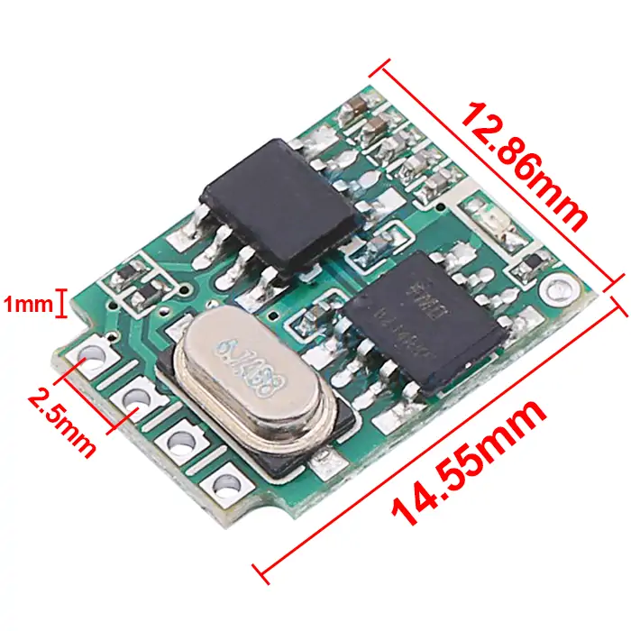
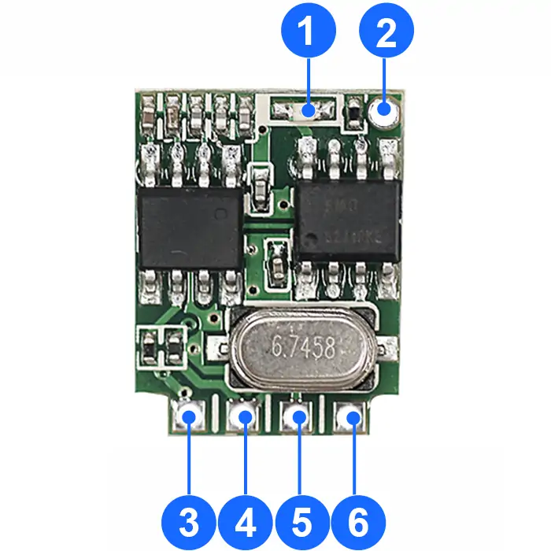
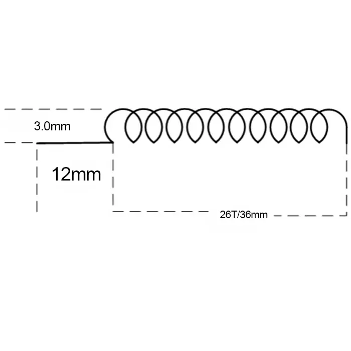

# QIACHIP RX480E-1A ( RX480E Series ) Instruction Manual DC 2V-5V 433MHz RF Decoding Wireless Receiver Module

{ width="50%" .center loading="lazy" }

> Version: V1.0

> Last Updated: 2026-2-27

> Model: RX480E-1A ( RX480E Series )

## Product Size

{ width="68%" .center loading="lazy" }

- Receiver Length (L) x Width (W) x Height (H): 14.55mm x 12.86mm x 1mm
- Receiver Pin header pitch: 2.5 mm

## Component Description

{ width="50%" .center loading="lazy" }

  <ul style="flex: 1 1 45%; margin-right: 1%;">
    <li>1: Indicator light</li>
    <li>2: ANT (Antenna Pin)</li>
    <li>3: GND (Power Ground Pin)</li>
  </ul>
  <ul style="flex: 1 1 45%; margin-left: 1%;">
    <li>4: VCC (Power Input Pin)</li>
    <li>5: OUT (Level Output Pin)</li>
    <li>6: KEY (External Key Input Pin)</li>
  </ul>

## Function description and setting method

**(1) Momentary mode; (2) Toggle mode; (3) Latching mode; (4) Reset function; (5) Power-On Auto-Engagement.**

- **Once the receiving module and transmitter are paired and a working mode is set, the receiving module will keep this mode even after power off and power on again.**
- **The following working modes require the use of QIACHIP brand remote controls (transmitters) and controllers (receiving modules/wireless remote control switches). Compatibility with other brands is not guaranteed.**

### (1) Momentary mode

In this mode:

- Press the button on the transmitter once: the output pin of the receiving module will output a high level and maintain this state.
- Press the same button again: the corresponding output pin of the receiving module will switch to a low level.

#### How to set momentary mode

**Step 1**

After connecting the external learning button, Click the external learning button connected to the receiving module four times. The LED indicator on the receiving module will flash four times, then stay on, and the receiving module will enter the pairing state.

**Step 2**

Press the button on the transmitter to be paired. The LED indicator on the receiving module will flash and then turn off, indicating that the momentary mode has been set successfully.

### (2) Toggle mode

In this mode:

- Press the matched button on the transmitter: the output pin of the receiving module outputs high level and remains unchanged.
- Press the same button again: the corresponding output pin of the receiving module switches to low level.

#### How to set toggle mode

**Step 1**

After connecting the external learning button, Click the external learning button connected to the receiving module twice. The LED indicator on the receiving module will flash twice, then stay on, and the receiving module will enter the pairing state.

**Step 2**

Press any button on the transmitter to be paired. The LED indicator on the receiving module will flash continuously and then turn off, indicating that the toggle mode has been set successfully.

### (3) Latching mode

In this mode:

- The two buttons on the transmitter control the output pin of the receiving module to output high level and low level respectively.
- The first configured button can only control the output pin to output high level, and the second configured button can only control the output pin to output low level.

#### How to set latching mode

**Step 1**

After connecting the external learning button, Click the external learning button connected to the receiving module three times. The LED indicator on the receiving module will flash three times, then stay on, and the receiving module will enter the pairing state.

**Step 2**

Press one button on the transmitter to be paired. The LED indicator on the receiving module will flash and then stay on.

**Step 3**

Press another button on the transmitter to be paired. The LED indicator on the receiving module will flash continuously and then turn off, indicating that the latching mode has been set successfully.

### (4) Reset function

When the RX480E-1A receiver module is reset, all paired transmitters will be unpaired and will no longer be able to control the receiver module.

#### How to reset

**Step 1**

After connecting the external learning button, click the external learning button connected to the receiving module 8 times. The indicator light will flash 8 times and then turn off. The reset will be complete.

### (5) Power-On Auto-Engagement

After the module is powered off and then powered on again, its output pin directly outputs high level.

#### How to set Power-On Auto-Engagement

**Step 1**

After connecting an external learning button, press the learning button 6 times. The indicator on the receiving module flashes and then turns off, and the output pin of the receiving module outputs high level.

## Antenna Size

### General Application Type

For general applications, you can directly use the market-standard specifications for the antenna. Details of the 433MHz antenna are as follows:

{ width="68%" .center loading="lazy" }

- Wire length at the soldering end: 10mm
- Total straight length of the antenna wire: 170mm
- Number of winding turns: 9 turns

---

### Special Enhanced Type

If a longer communication distance is required and the general application type antenna cannot meet the demand, an enhanced type antenna can be used to improve the receiving distance.
Details of the 433MHz antenna are as follows:

{ width="68%" .center loading="lazy" }

- Antenna core diameter (including outer sheath): 1.0 mm
- Antenna core diameter (excluding outer sheath): 0.35 mm
- Wire length at the soldering end: 12 mm
- Antenna winding diameter (excluding outer sheath): 3.0 mm
- Number of winding turns: 26 turns
- Winding length: 36 mm

---

## Electrical characteristics

| Parameter | Value |
| --- | --- |
| Input voltage | DC 2.0V-5.0V |
| RF frequency | 433.92MHz |
| Power Consumption | 4.5-6.6mA |
| Receiver sensitivity | -111dBm |
| Working temperature | -10~60℃ |
| Size | 14.55x12.86x1mm |

## NOTE

1. This product is a CMOS device. Please take anti-static precautions during storage, transportation and operation.
2. Ensure proper grounding when using the device.
3. RF devices are voltage-sensitive. If the power supply is unstable or has significant ripple, add filtering at the power input terminal to ensure the supply voltage does not exceed the product's maximum operating voltage.
