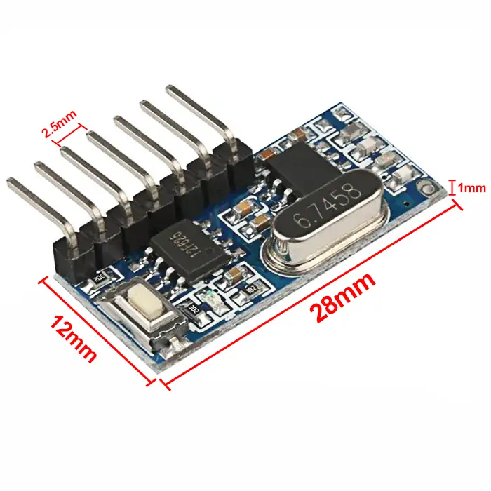
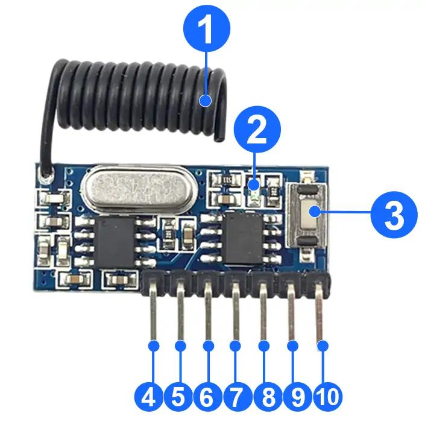
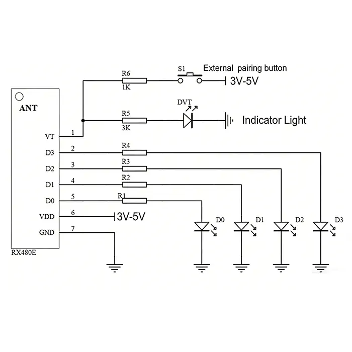

# QIACHIP RX480E-4A ( RX480E Series ) Instruction Manual DC 3V-5V 433MHz RF Decoding Wireless Receiver Module

{ width="50%" .center loading="lazy" }

> Version: V1.0
> 
> Last Updated: 2026-5-27
> 
> Model: RX480E-4A ( RX480E Series )

## Product Size

{ width="68%" .center loading="lazy" }

- Receiver Length (L) x Width (W) x Height (H): 28mm x 12mm x 1mm
- Receiver Pin header pitch: 2.5 mm

## Component Description

{ width="50%" .center loading="lazy" }

  <ul style="flex: 1 1 45%; margin-right: 1%;">
    <li>1: Antenna</li>
    <li>2: Indicator light</li>
    <li>3: Learning button</li>
    <li>4: VT (External Key Input Pin)</li>
    <li>5: D3 Signal output pin corresponds to remote control button value 8 (1000)</li>
  </ul>
  <ul style="flex: 1 1 45%; margin-left: 1%;">
    <li>6: D2 Signal output pin corresponds to remote control button value 4 (0100)</li>
    <li>7: D1 Signal output pin corresponds to remote control button value 2 (0010)</li>
    <li>8: D0 Signal output pin corresponds to remote control button value 1 (0001)</li>
    <li>9: V+ (Positive Power Input Pin)</li>
    <li>10: GND- (Power Ground Pin)</li>
  </ul>

## Wiring Diagram

Disconnect power before wiring.

### Figure 1

{ width="68%" .center loading="lazy" }

Figure 1: Wiring diagram for LED circuit

- Load: LED
- Input Power: DC 3V-5V

## Function description and setting method

**(1) Momentary mode; (2) Toggle mode; (3) Latching mode; (4) Reset function;**

- **The remote control with key value 8421 is used by default for mode setting as described in this manual.**
- **When using the third working mode, a transmitter with at least two buttons is required.**
- **Once the receiving module and transmitter are paired and a working mode is set, the receiving module will keep this mode even after power off and power on again.**
- **The following working modes require the use of QIACHIP brand remote controls (transmitters) and controllers (receiving modules/wireless remote control switches). Compatibility with other brands is not guaranteed.**

### (1) Momentary mode

In this mode:

- Press and hold the remote control button with key value 8, and the D3 pin on the receiver module will output a high-level signal "1".
- Release the remote control button with key value 8, and the output signal on D3 pin of the receiver module will change to "0".

### How to set momentary mode

**Step 1**

Click the learning button on the receiver module once. The LED indicator on the receiver module will flash and then stay on, indicating that the receiver has entered pairing mode.

**Step 2**

Press any button on the remote control once. The LED indicator on the receiver module will flash and then turn off, indicating that the momentary mode has been successfully set.

### (2) Toggle mode

In this mode:

- Press the remote control button with key value 8 once, and the D3 pin on the receiver module will continuously output a high-level signal "1".
- Press the remote control button with key value 8 again, and the output signal on the D3 pin of the receiver module will change to "0".

### How to set toggle mode

**Step 1**

Click the learning button on the receiver module twice. The LED indicator on the receiver module will flash and then stay on, indicating that the receiver has entered pairing mode.

**Step 2**

Press any button on the remote control once. The LED indicator on the receiver module will flash continuously and then turn off, indicating that the toggle mode has been successfully set.

### (3) Latching mode

In this mode:

- Press the remote control button with key value 8, and pin D3 of the receiver module will continuously output a high-level signal "1".
- Press the remote control button with key value 4, and the output signal of pin D3 of the receiver module will change to "0", then pin D2 of the receiver module will continuously output a high-level signal "1".

### How to set latching mode

**Step 1**

Click the learning button on the receiver module three times. The LED indicator on the receiver module will flash and then stay on, indicating that the receiver has entered pairing mode.

**Step 2**

Press any button on the remote control once. The LED indicator on the receiver module will flash and then remain on, indicating that the latched mode has been successfully set.

### (4) Reset function

When the RX480E-4A receiver module is reset, all paired transmitters will be unpaired and will no longer be able to control the receiver module.

### How to reset

Click the learning button on the receiver module 8 times. The indicator light will flash and then will turn off. The reset will be complete.

## Antenna Size

### General Application Type

For general applications, you can directly use the market-standard specifications for the antenna. Details of the 433MHz antenna are as follows:

{ width="68%" .center loading="lazy" }

- Wire length at the soldering end: 10mm
- Total straight length of the antenna wire: 170mm
- Number of winding turns: 9 turns

---

### Special Enhanced Type

If a longer communication distance is required and the general application type antenna cannot meet the demand, an enhanced type antenna can be used to improve the receiving distance.
Details of the 433MHz antenna are as follows:

{ width="68%" .center loading="lazy" }

- Antenna core diameter (including outer sheath): 1.0 mm
- Antenna core diameter (excluding outer sheath): 0.35 mm
- Wire length at the soldering end: 12 mm
- Antenna winding diameter (excluding outer sheath): 3.0 mm
- Number of winding turns: 26 turns
- Winding length: 36 mm

---

## Electrical characteristics

| Parameter | Value |
| --- | --- |
| Input voltage | DC 3V-5V |
| RF frequency | 433.92MHz |
| Power Consumption | 5mA |
| Receiver sensitivity | -108dBm |
| Working temperature | -42℃~85℃ |
| Size | 28x12x1mm |

## NOTE

1. This product is a CMOS device. Please take anti-static precautions during storage, transportation and operation.
2. Ensure proper grounding when using the device.
3. RF devices are voltage-sensitive. If the power supply is unstable or has significant ripple, add filtering at the power input terminal to ensure the supply voltage does not exceed the product's maximum operating voltage.
