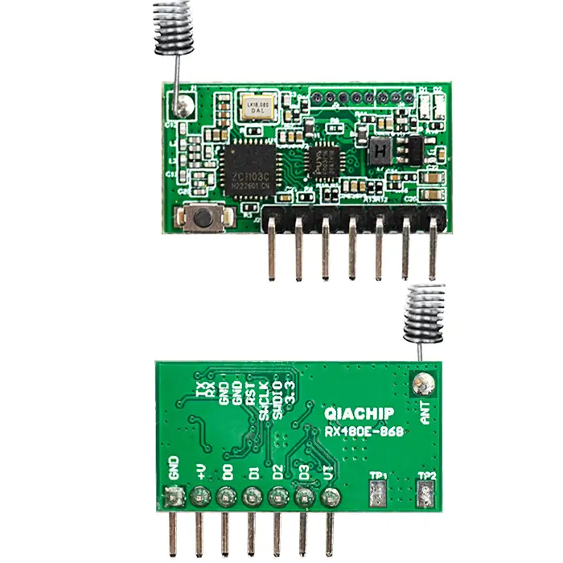
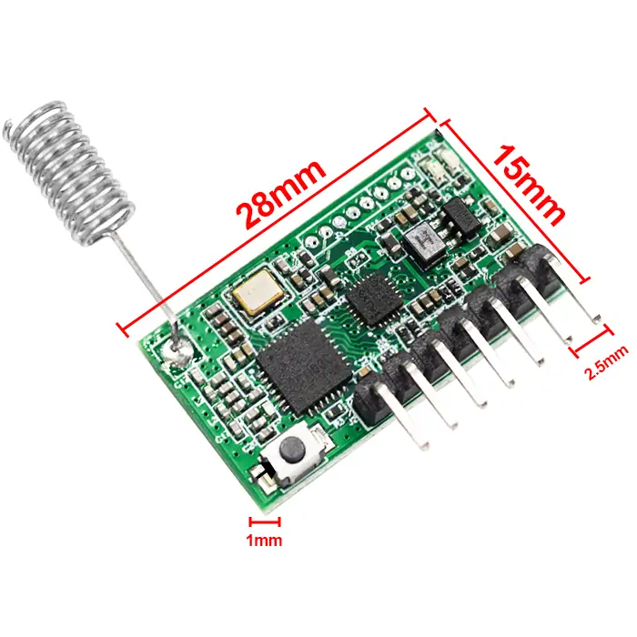
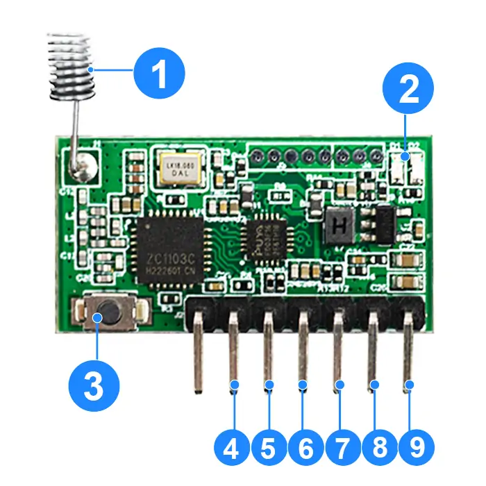

# QIACHIP RX480E-868 ( RX480E Series ) Instruction Manual DC 5V-24V 868MHz RF Wireless Encoding & Decoding Transceiver Module

{ width="50%" .center loading="lazy" }

> Version: V1.0

> Last Updated: 2026-2-27

> Model: RX480E-868 ( RX480E Series )

## Product Size

{ width="68%" .center loading="lazy" }

- Receiver Length (L) x Width (W) x Height (H): 30mm x 9.5mm x 1mm
- Receiver Pin header pitch: 2.5 mm

## Component Description

{ width="50%" .center loading="lazy" }

**Default: Receive mode**

| No. | Name | Type | Description |
| --- | --- | --- | --- |
| 1 | Antenna | - | - |
| 2 | Indicator light | - | - |
| 3 | Learning button | - | - |
| 4 | D3 | IO | High-level signal output, pin corresponding to D3 in transmit mode |
| 5 | D2 | IO | High-level signal output, pin corresponding to D2 in transmit mode |
| 6 | D1 | IO | High-level signal output, pin corresponding to D1 in transmit mode |
| 7 | D0 | IO | High-level signal output, pin corresponding to D0 in transmit mode |
| 8 | +V | P | Power supply positive input (5V-24V) |
| 9 | GND | P | Power supply negative input |

**Transmission mode**

| No. | Name | Type | Description |
| --- | --- | --- | --- |
| 1 | Antenna | - | - |
| 2 | Indicator light | - | - |
| 3 | Learning button | - | - |
| 4 | D3 | IO | Low-level signal input, pin corresponding to D3 in receive mode |
| 5 | D2 | IO | Low-level signal input, pin corresponding to D2 in receive mode |
| 6 | D1 | IO | Low-level signal input, pin corresponding to D1 in receive mode |
| 7 | D0 | IO | Low-level signal input, pin corresponding to D0 in receive mode |
| 8 | +V | P | Power supply positive input (5V-24V) |
| 9 | GND | P | Power supply negative input |

---

## Function description and setting method

### Receive mode

When the module is powered on, the red and blue indicators light up for configuration. The indicators turn off when configuration is complete.

- Two flashes of the red indicator indicate **Receive mode**.
- Two flashes of the blue indicator indicate **Transmit mode**.

**(1) Momentary mode; (2) Toggle mode; (3) Latching mode; (4) Reset function.**

- **Once the receiving module and transmitter are paired and a working mode is set, the receiving module will keep this mode even after power off and power on again.**
- **The following working modes require the use of QIACHIP brand remote controls (transmitters) and controllers (receiving modules/wireless remote control switches). Compatibility with other brands is not guaranteed.**

#### (1) Momentary mode

In this mode:

- Press and hold the button on the paired transmitter, and the corresponding output pin on the receiver module will output a high level.
- Release the button, and the corresponding output pin on the receiver module will switch to a low level.
- Each time the receiver module receives a signal, the transmitter will receive a feedback signal, and the blue indicator on the transmitter will flash 3 times and then turn off.

##### How to set momentary mode

**Step 1**

Click the learning button on the receiver module once. The red indicator on the receiver module will flash once and then stay on, and the receiver module will enter the pairing state

**Step 2**

Press the button on the transmitter to be paired. If the red indicator on the receiver module flashes 5 times, the pairing is successful.

#### (2) Toggle mode

In this mode:

- Press the button on the paired transmitter once, and the corresponding output pin on the receiver module will output a high level and hold it.
- Press the same button again, and the corresponding output pin on the receiver module will switch to a low level.
- Each time the receiver module receives a signal, the transmitter will receive a feedback signal, and the blue indicator on the transmitter will flash 3 times and then turn off.

##### How to set toggle mode

**Step 1**

Click the learning button on the receiver module twice. The red indicator on the receiver module will stay on, and the receiver module will enter the pairing state.

**Step 2**

Press the button on the transmitter module to be paired. If the red indicator on the receiver flashes 5 times, the pairing is successful.

#### (3) Latching mode

In this mode:

- Press one of the paired transmitter buttons, and the corresponding output pin on the receiver module will output a high level and hold it, while all other output pins will output a low level.
- If two transmitter buttons are pressed at the same time, all output pins on the receiver module will output a low level and hold it.
- Each time the receiver module receives a signal, the transmitter will receive a feedback signal, and the blue indicator on the transmitter will flash 3 times and then turn off.

##### How to set latching mode

**Step 1**

Click the learning button on the receiver module three times. The red indicator on the receiver module will stay on, and the receiver module will enter the pairing state.

**Step 2**

Press the button on the transmitter to be paired. If the red indicator on the receiver module flashes 5 times, the pairing is successful.

#### (4) Reset function

When the RX480E-868 receiver module is reset, all paired transmitters will be unpaired and will no longer be able to control the receiver module.

##### How to reset

**Step 1**

Click the learning button on the receiver module 8 times. The indicator light will flash 8 times and then turn off. The reset will be complete.

### Transmitters mode

#### Receive to Transmit Function

Press the learning button on the receiver module 5 times. The red indicator on the receiver module flashes twice. The module switches from receive mode to transmit mode. This indicates a successful conversion.

#### Transmit to Receive Function

Press the learning button on the transmitter module 5 times. The red indicator on the transmitter module flashes 5 times. The module switches from transmit mode to receive mode. After power off and restart, the red indicator on the transmitter module flashes twice. This indicates a successful conversion.

## Electrical characteristics

| Parameter | Value |
| --- | --- |
| Input voltage | DC 5V-24V |
| RF frequency | 868MHz |
| Receiver power consumption | 3.3mA |
| Transmit power consumption | 123mA |
| Transmit power | 20dBm |
| Working temperature | -10~60℃ |
| Size | 28x15x1mm |

## NOTE

1. This product is a CMOS device. Please take anti-static precautions during storage, transportation and operation.
2. Ensure proper grounding when using the device.
3. RF devices are voltage-sensitive. If the power supply is unstable or has significant ripple, add filtering at the power input terminal to ensure the supply voltage does not exceed the product's maximum operating voltage.
