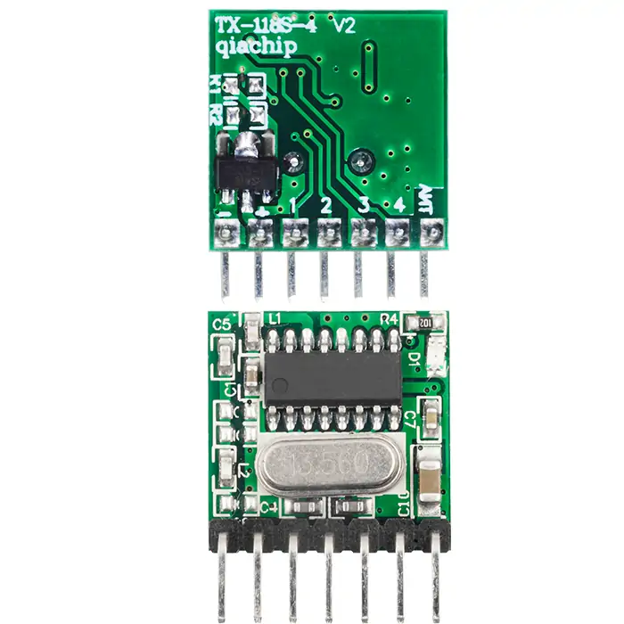
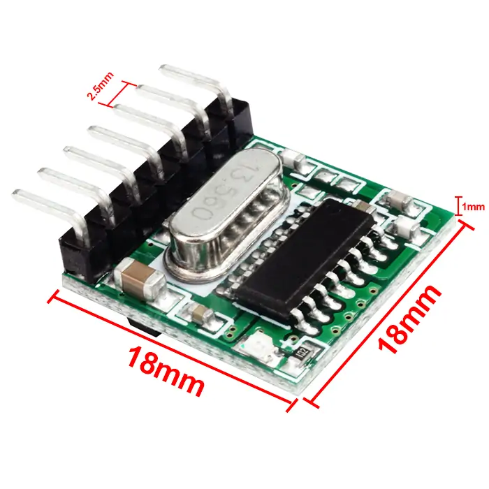
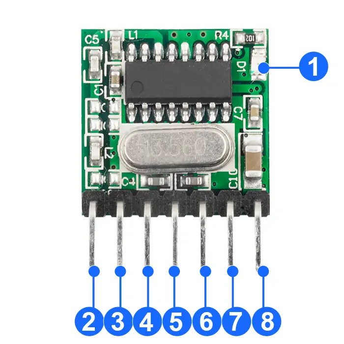
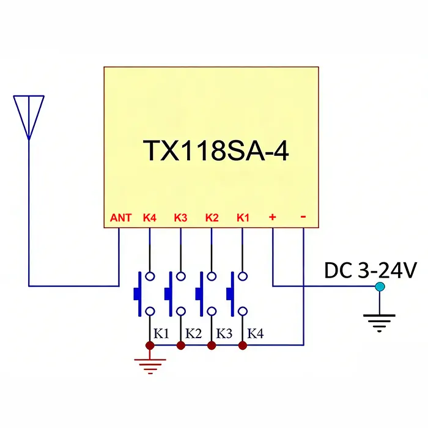

# QIACHIP TX118SA-4 Instruction Manual DC 3V-24V 433MHz RF Superheterodyne Wireless Transmitter Module

{ width="50%" .center loading="lazy" }

> Version: V1.0

> Last Updated: 2026-2-28

> Model: TX118SA-4

## Product Size

{ width="68%" .center loading="lazy" }

- Receiver Length (L) x Width (W) x Height (H): 18mm x 18mm x 1mm
- Receiver Pin header pitch: 2.5 mm

## Component Description

{ width="50%" .center loading="lazy" }

  <ul style="flex: 1 1 45%; margin-right: 1%;">
    <li>1: Indicator light</li>
    <li>2: ANT (Antenna Pin)</li>
    <li>3: K4(External input button 4 Short to GND to trigger Data 4)</li>
    <li>4: K3(External input button 3 Short to GND to trigger Data 3)</li>
  </ul>
  <ul style="flex: 1 1 45%; margin-left: 1%;">
    <li>5: K2(External input button 2 Short to GND to trigger Data 2)</li>
    <li>6: K1(External input button 1 Short to GND to trigger Data 1)</li>
    <li>+: Power Input Pin</li>
    <li>-: Power Ground Pin</li>
  </ul>

## Application Circuit Diagram

{ width="68%" .center loading="lazy" }

---

## Electrical characteristics

| Parameter | Value |
| --- | --- |
| Input voltage | DC 3.0V-24V |
| Standby Current | < 3 μA |
| RF frequency | 433.92MHz |
| Power Consumption | Current in shutdown mode is less than 0.1μA |
| Transmit Power | 11dBm |
| Transmission Distance | 50m |
| Transmit Frequency Deviation | ±7.5 kHz |
| Key Inputs | 4 Groups (A, B, C, D), Combinable into 15 Groups |
| Working temperature | -40~85℃ |
| Size | 18x18x1mm |

## NOTE

1. This product is a CMOS device. Anti-static precautions must be taken during storage, transportation and operation.
2. Ensure reliable grounding when the device is in use.
