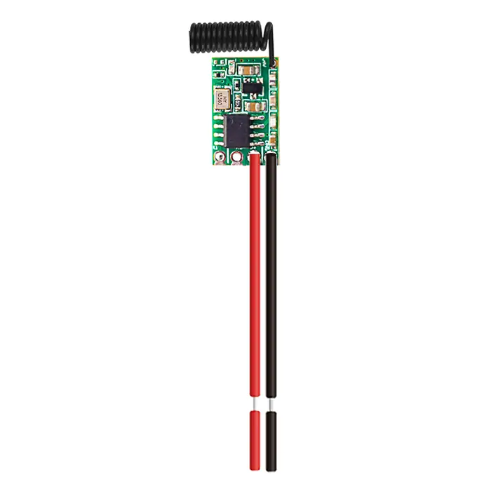
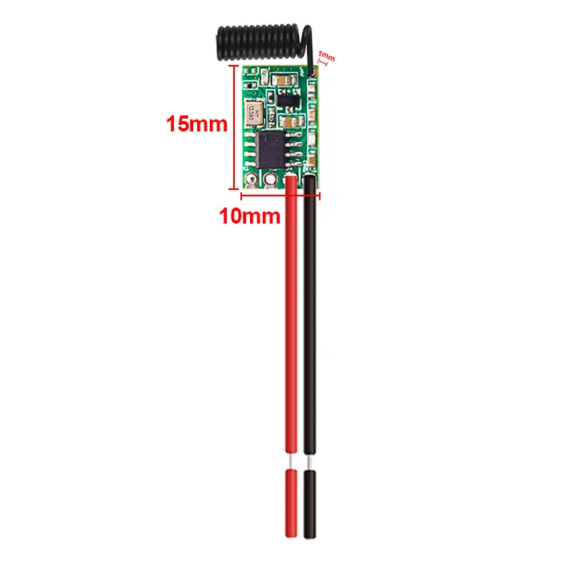
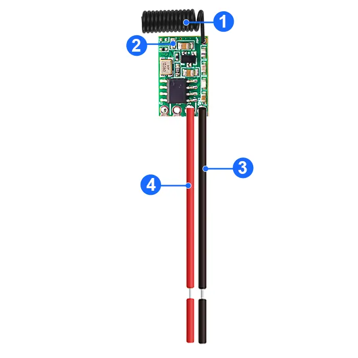
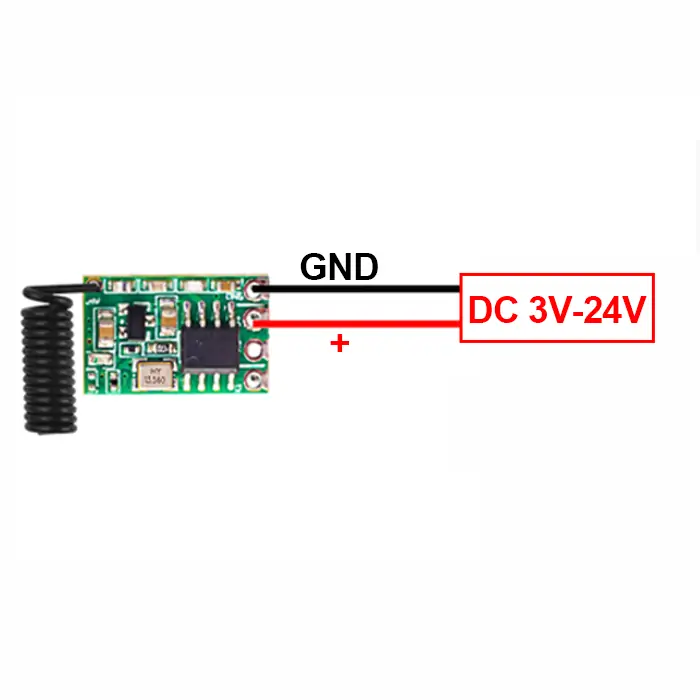
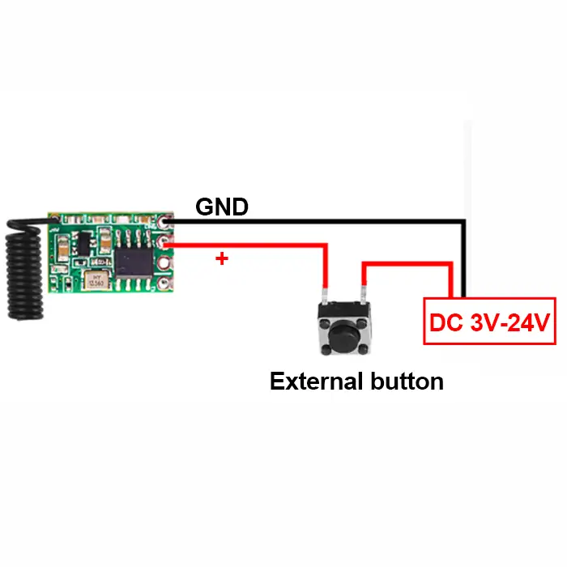

# QIACHIP TX181-4 Instruction Manual DC 3V-24V 433MHz RF Power-on Transmitter Module

{ width="50%" .center loading="lazy" }

> Version: V1.0

> Last Updated: 2026-2-28

> Model: TX181-4

## Product Size

{ width="68%" .center loading="lazy" }

- Receiver Length (L) x Width (W) x Height (H): 15mm x 10mm x 1mm

## Component Description

{ width="50%" .center loading="lazy" }

  <ul style="flex: 1 1 45%; margin-right: 1%;">
    <li>1: Antenna</li>
    <li>2: Indicator light</li>
  </ul>
  <ul style="flex: 1 1 45%; margin-left: 1%;">
    <li>3: GND (Power Ground Pin)</li>
    <li>4: V+ (Positive Power Input Pin)</li>
  </ul>

## Wiring Diagram

Disconnect power before wiring.

### Figure 1

{ width="68%" .center loading="lazy" }

- Input Power: DC 3V-24V
- When the module is powered on, the indicator lights up and the module starts transmitting signals.
- When the module is powered off, the indicator turns off and the module stops transmitting signals.

---

### Figure 2

{ width="68%" .center loading="lazy" }

- Input Power: DC 3V-24V
- After the module is powered on, pressing the external button will turn on the module's indicator light and make it transmit signals.
- When the external button is released, the module indicator turns off and signal transmission stops.

---

## Electrical characteristics

| Parameter | Value |
| --- | --- |
| Input voltage | DC 3.0V-24V |
| RF frequency | 433.92MHz |
| Transmit Power | ≥10dBm |
| Transmission Distance | 100m - 300m (open and unobstructed environment) |
| Transmission Power Consumption | 5 - 6 mA |
| Working temperature | -40~85℃ |
| Size | 15x10x1mm |

## NOTE

1. This product is a CMOS device. Anti-static precautions must be taken during storage, transportation and operation.
2. Ensure reliable grounding when the device is in use.
