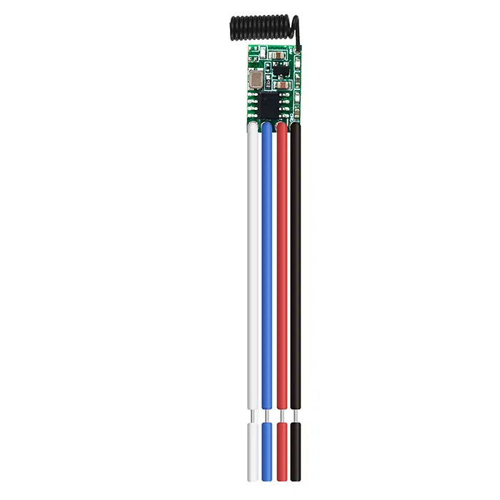
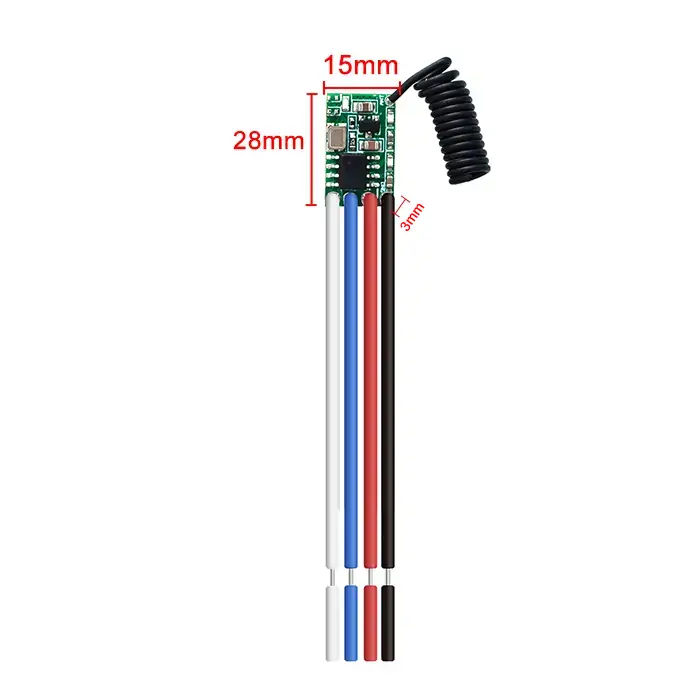
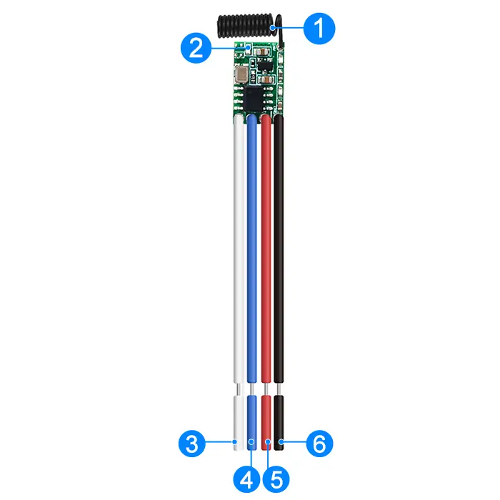
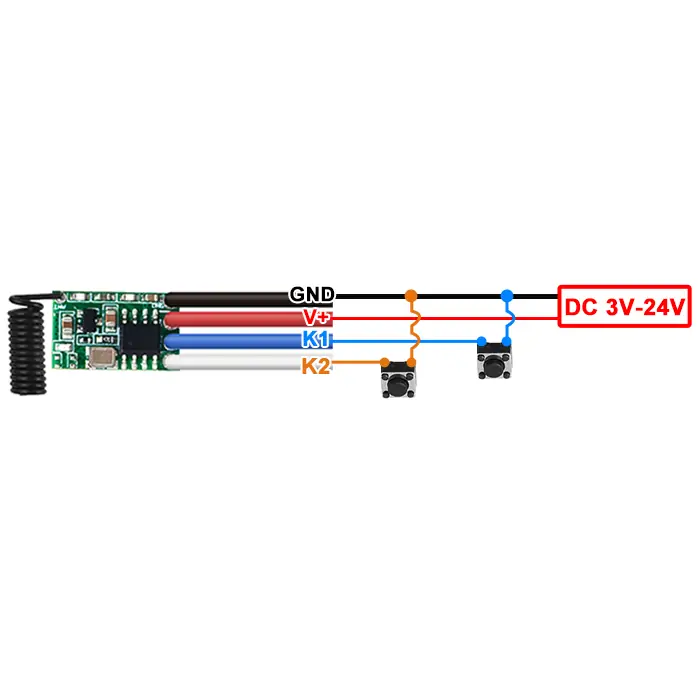

# QIACHIP TX183-4 Instruction Manual DC 3V-24V 433MHz RF Transmitter Module

{ width="68%" .center loading="lazy" }

> Version: V1.0
> 

> Last Updated: 2026-08-17
> 

> Model: TX183-4
> 

## Product Size

{ width="68%" .center loading="lazy" }

- Length (L) x Width (W) x Height (H): 28mm x 15mm x 3mm

## Component Description

{ width="68%" .center loading="lazy" }

  <ul style="flex: 1 1 45%; margin-right: 1%;">
    <li>1: Antenna</li>
    <li>2: Indicator LED</li>
    <li>3: K2 (K2 trigger input; connect to GND to transmit the K2 code)</li>
  </ul>
  <ul style="flex: 1 1 45%; margin-left: 1%;">
    <li>4: K1 (K1 trigger input; connect to GND to transmit the K1 code)</li>
    <li>5: V+ (Positive power-supply input)</li>
    <li>6: GND (Negative power-supply input)</li>
  </ul>

## Wiring Diagram

Disconnect power before wiring.

### Figure 1

{ width="68%" .center loading="lazy" }

Figure 1: Wiring diagram for external button connections

- Input Power: DC 3V-24V
- After the module is powered on, pressing the external button will turn on the Indicator LED and make it transmit signals.
- When the external button is released, the Indicator LED turns off and signal transmission stops.

## Electrical characteristics

| Parameter | Value |
| --- | --- |
| Input voltage | DC 3V-24V |
| RF frequency | 433.92 MHz |
| Encoding protocol | EV1527 learning code |
| Transmit power | ≥ 10 dBm |
| Transmission range | 20-80 m (open, unobstructed environment; actual range varies with operating conditions) |
| Quiescent current | 0.1 mA |
| Working temperature | -40 °C to +85 °C |
| Size | 28x15x3mm |

## Warning

1. This module contains ESD-sensitive CMOS components. Observe appropriate ESD precautions during storage, transportation, installation, and operation.
2. Connect GND securely to the negative terminal of the power supply before applying power.
