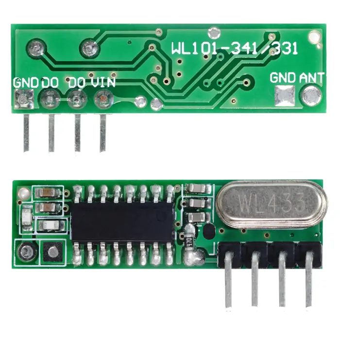
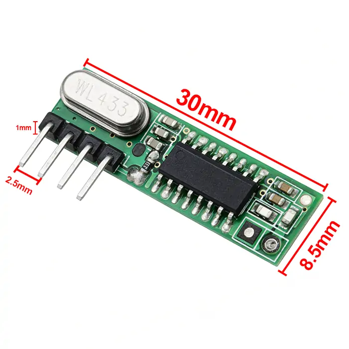
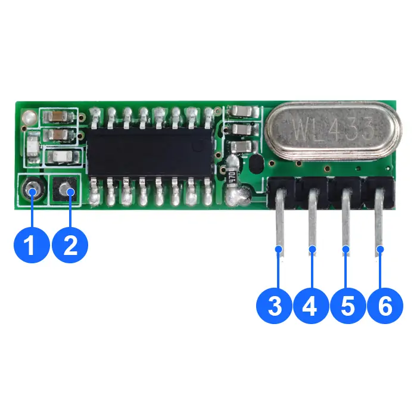
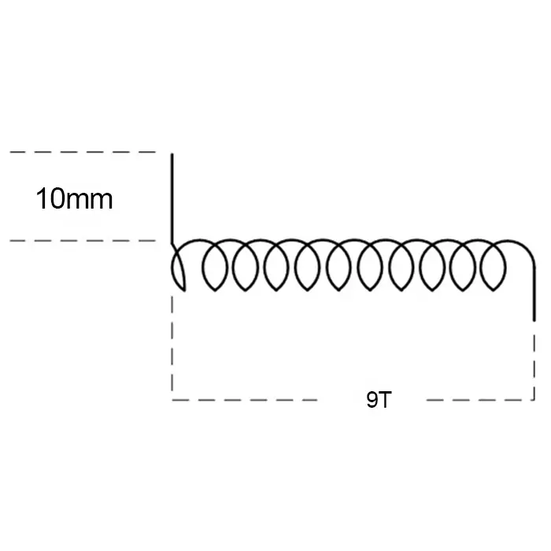

# QIACHIP WL101-341 Instruction Manual DC 3V-5V 433MHz RF Superheterodyne Wireless Receiver Module

{ width="50%" .center loading="lazy" }

> Version: V1.0

> Last Updated: 2026-2-27

> Model: WL101-341

## Product Size

{ width="68%" .center loading="lazy" }

- Receiver Length (L) x Width (W) x Height (H): 30mm x 8.5mm x 1mm
- Receiver Pin header pitch: 2.5 mm

## Component Description

{ width="50%" .center loading="lazy" }

  <ul style="flex: 1 1 45%; margin-right: 1%;">
    <li>1: ANT (Antenna Pin)</li>
    <li>2: GND (Power Ground Pin)</li>
    <li>3: VIN (Power Input Pin)</li>
  </ul>
  <ul style="flex: 1 1 45%; margin-left: 1%;">
    <li>4: DO (Data Output Pin)</li>
    <li>5: DO (Data Output Pin)</li>
    <li>6: GND (Power Ground Pin)</li>
  </ul>

## Antenna Size

### General Application Type

For general applications, you can directly use the market-standard specifications for the antenna. Details of the 433MHz antenna are as follows:

{ width="68%" .center loading="lazy" }

- Wire length at the soldering end: 10mm
- Total straight length of the antenna wire: 170mm
- Number of winding turns: 9 turns

---

### Special Enhanced Type

If a longer communication distance is required and the general application type antenna cannot meet the demand, an enhanced type antenna can be used to improve the receiving distance.
Details of the 433MHz antenna are as follows:

{ width="68%" .center loading="lazy" }

- Antenna core diameter (including outer sheath): 1.0 mm
- Antenna core diameter (excluding outer sheath): 0.35 mm
- Wire length at the soldering end: 12 mm
- Antenna winding diameter (excluding outer sheath): 3.0 mm
- Number of winding turns: 26 turns
- Winding length: 36 mm

---

## Electrical characteristics

| Parameter | Value |
| --- | --- |
| Input voltage | DC 3.0V-5.0V |
| RF frequency | 433.92MHz |
| Power Consumption | 5mA |
| Receiving Bandwidth | ±150KHz |
| Receiver sensitivity | -107dBm |
| Working temperature | -40~85℃ |
| Size | 30x8.5x1mm |

## NOTE

1. This product is a CMOS device. Please take anti-static precautions during storage, transportation and operation.
2. Ensure proper grounding when using the device.
3. RF devices are voltage-sensitive. If the power supply is unstable or has significant ripple, add filtering at the power input terminal to ensure the supply voltage does not exceed the product's maximum operating voltage.
