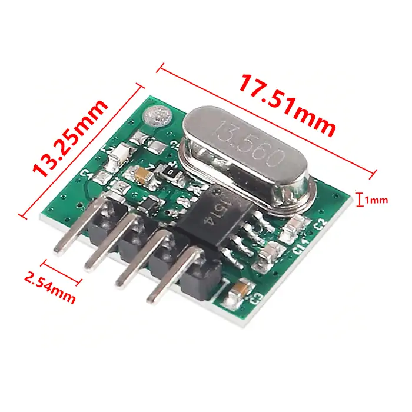
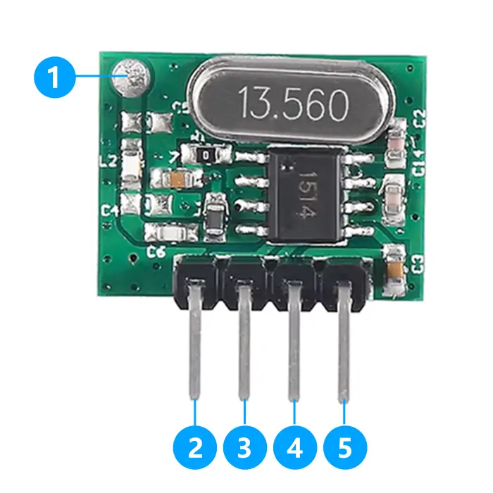
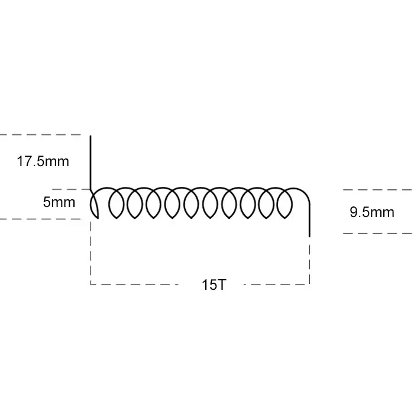

# QIACHIP WL102-341 Instruction Manual DC 2V-3.6V 433MHz RF Superheterodyne Wireless Transmitter Module

{ width="50%" .center loading="lazy" }

> Version: V1.0
> 

> Last Updated: 2026-1-6
> 

> Model: WL102-341
> 

## Product Size

{ width="68%" .center loading="lazy" }

- Receiver Length (L) x Width (W) x Height (H): 17.51mm x 13.25mm x 1mm
- Receiver Pin header pitch: 2.54 mm

## Component Description

{ width="50%" .center loading="lazy" }

- 1: ANT (Antenna Pin)
- 2: EN (Enable Pin)
- 3: DAT (Wave Signal Input)

- 4: + (Power Input Pin)
- 5: - (Power Ground Pin)

## Antenna Size

For general applications, the antenna can directly adopt market-available standard specifications. Details are as follows:

{ width="50%" .center loading="lazy" }

- Antenna core diameter (including outer sheath): 1.0 mm
- Antenna core diameter (excluding outer sheath): 0.5 mm
- Wire length at the soldering end: 17.5 mm
- Wire length at the antenna end: 9.5 mm
- Antenna winding diameter (including outer sheath): 5 mm
- Number of winding turns: 15 turns

---

## Electrical characteristics

| Parameter | Value |
| --- | --- |
| Input voltage | DC 2.0V-3.6V |
| RF frequency | 433.92MHz |
| Power Consumption | Current in shutdown mode is less than 0.1μA |
| Maximum Data Rate | 20Kbps |
| Maximum Transmit Power | 11dBm |
| Working temperature | -40~85℃ |
| Size | 17.51x13.25x1mm |

## NOTE

1. This product is a CMOS device. Anti-static precautions must be taken during storage, transportation and operation.
2. Ensure reliable grounding when the device is in use.