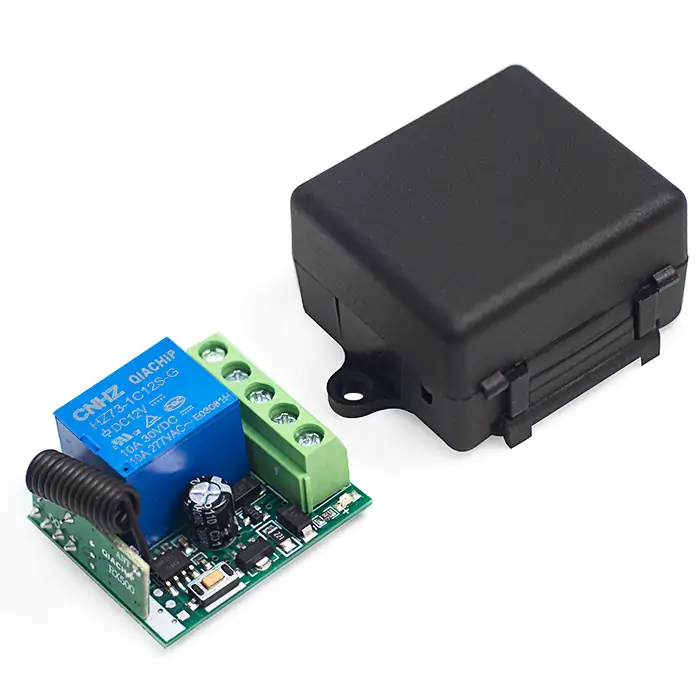
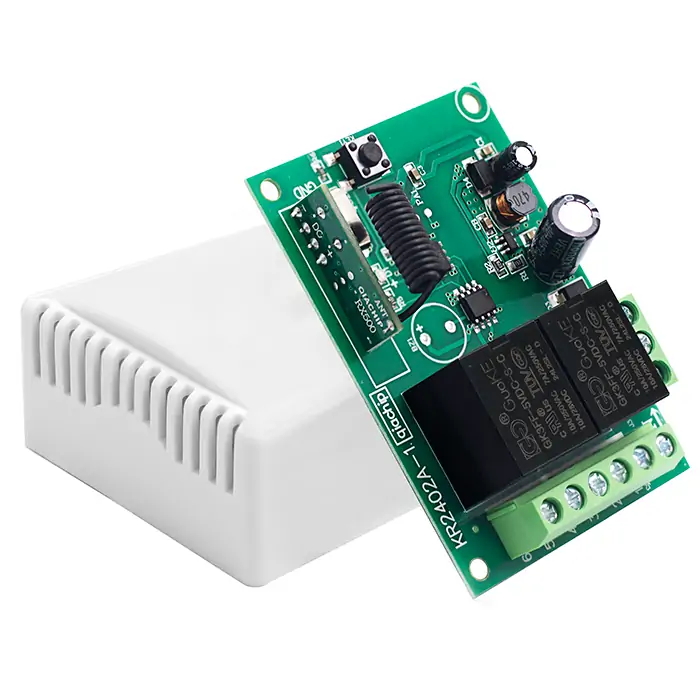

---  
glightbox: false  # 禁用当前页面的灯箱效果  
---  

# User Guide

## DC Controller

  <a href="KR1201A/QIACHIP_KR1201A/">
    
    <h2>KR1201A</h2>
    
  </a>

  <a href="KR2402A/QIACHIP_KR2402A/">
    
    <h2>KR2402A</h2>
    
  </a>

## AC Controller

  <a href="KR2202/QIACHIP_KR2202/">
    
    <h2>KR2202</h2>
    
  </a>

