---  
glightbox: false  # 禁用当前页面的灯箱效果  
---  

# User Guide

## DC Controller

  <a href="KR1201A/QIACHIP_KR1201A/">
    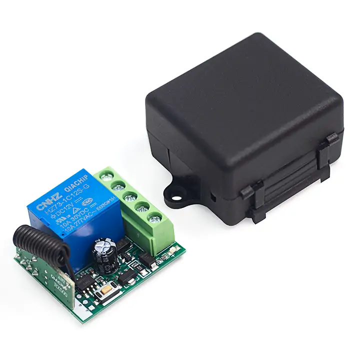
    <h2>KR1201A</h2>
    
  </a>

  <a href="KR1204/QIACHIP_KR1204/">
    
    <h2>KR1204</h2>
    
  </a>

  <a href="KR1204B/QIACHIP_KR1204B/">
    
    <h2>KR1204B</h2>
    
  </a>

  <a href="KR2401FB/QIACHIP_KR2401FB/">
    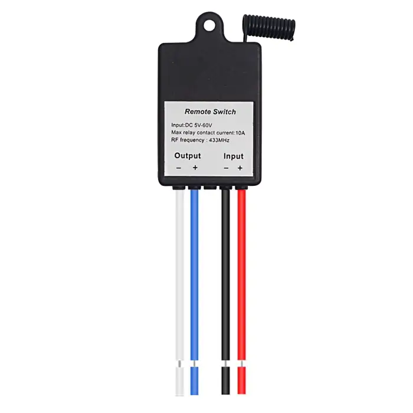
    <h2>KR2401FB</h2>
    
  </a>

  <a href="KR2402A/QIACHIP_KR2402A/">
    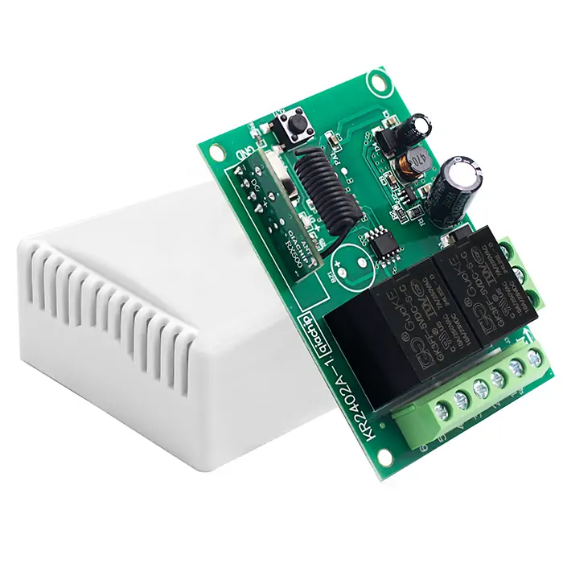
    <h2>KR2402A</h2>
    
  </a>

  <a href="KR3001A/QIACHIP_KR3001A/">
    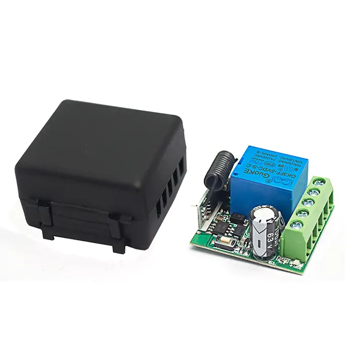
    <h2>KR3001A</h2>
    
  </a>

## AC Controller

  <a href="KR2201-4/QIACHIP_KR2201-4/">
    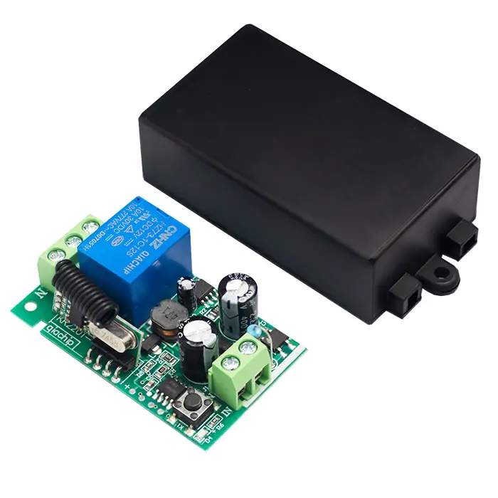
    <h2>KR2201-4</h2>
    
  </a>

  <a href="KR2201-COM/QIACHIP_KR2201-COM/">
    
    <h2>KR2201-COM</h2>
    
  </a>

  <a href="KR2202/QIACHIP_KR2202/">
    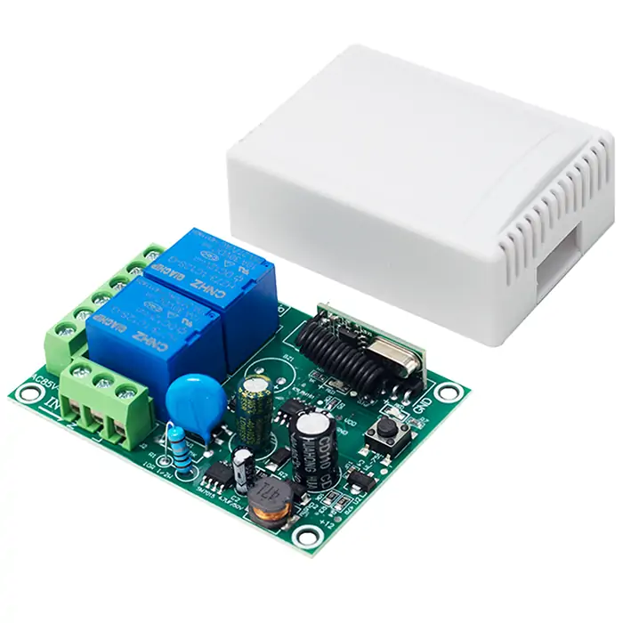
    <h2>KR2202</h2>
    
  </a>

  <a href="KR2204/QIACHIP_KR2204/">
    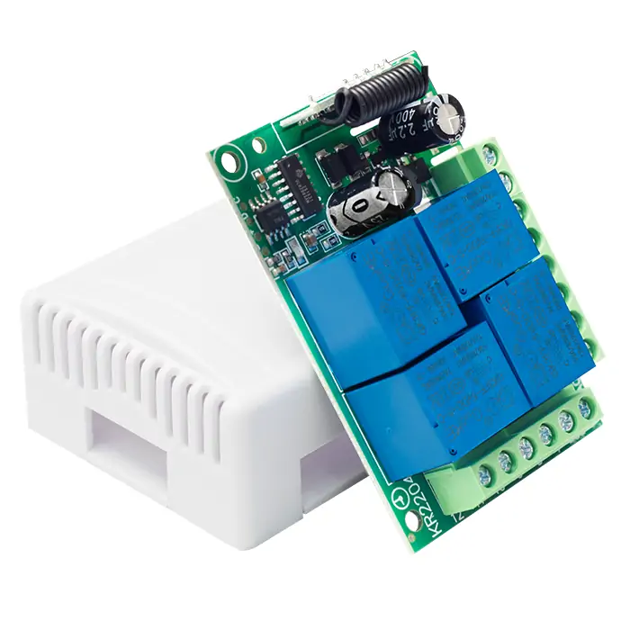
    <h2>KR2204</h2>
    
  </a>

  <a href="KR2201G/QIACHIP_KR2201G/">
    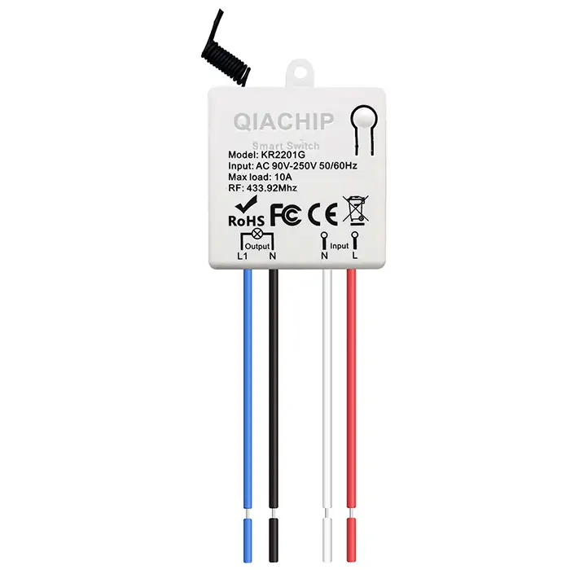
    <h2>KR2201G</h2>
    
  </a>

## Ceiling Fan Light Controller

  <a href="FLC05-E110V/QIACHIP_FLC05-E110V/">
    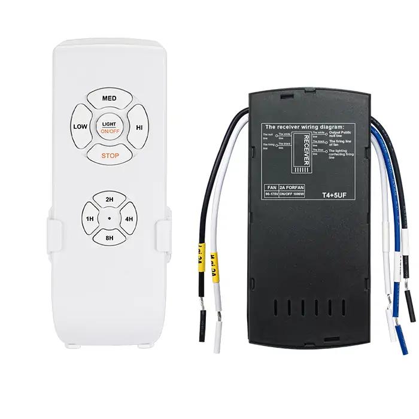
    <h2>FLC05-E110V</h2>
    
  </a>

  <a href="FLC05-E220V/QIACHIP_FLC05-E220V/">
    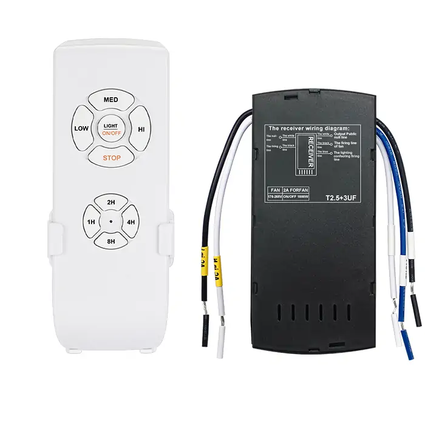
    <h2>FLC05-E220V</h2>
    
  </a>

## Wireless Receiver Module

  <a href="RX470-4/QIACHIP_RX470-4/">
    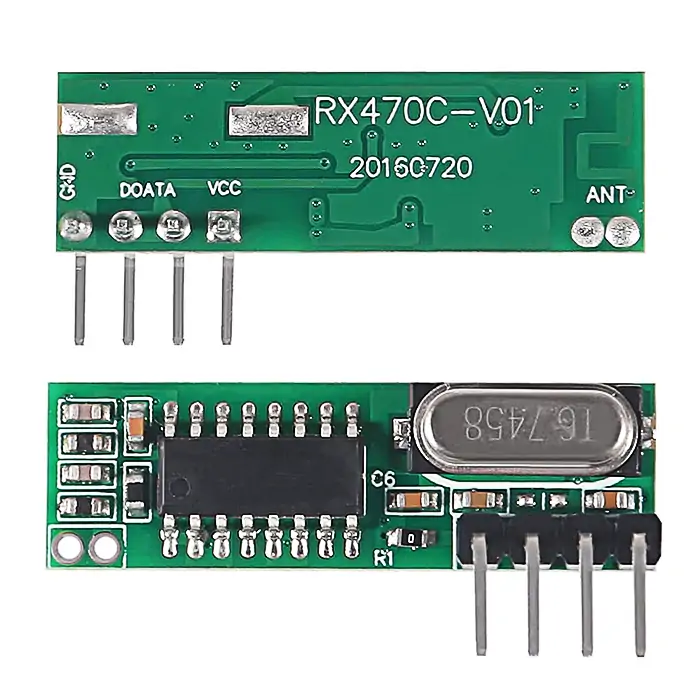
    <h2>RX470-4</h2>
    
  </a>

  <a href="QA-R-011/QIACHIP_QA-R-011/">
    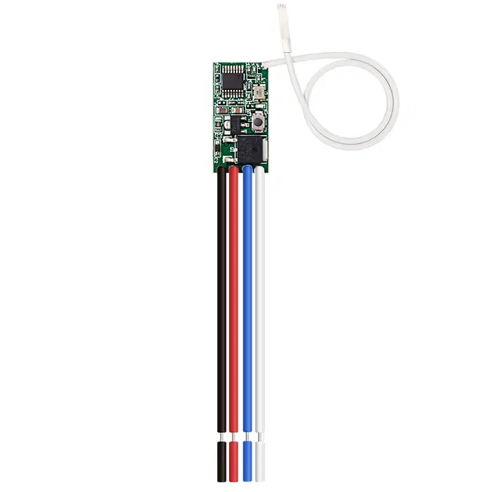
    <h2>QA-R-011</h2>
    
  </a>

  <a href="QA-R-012/QIACHIP_QA-R-012/">
    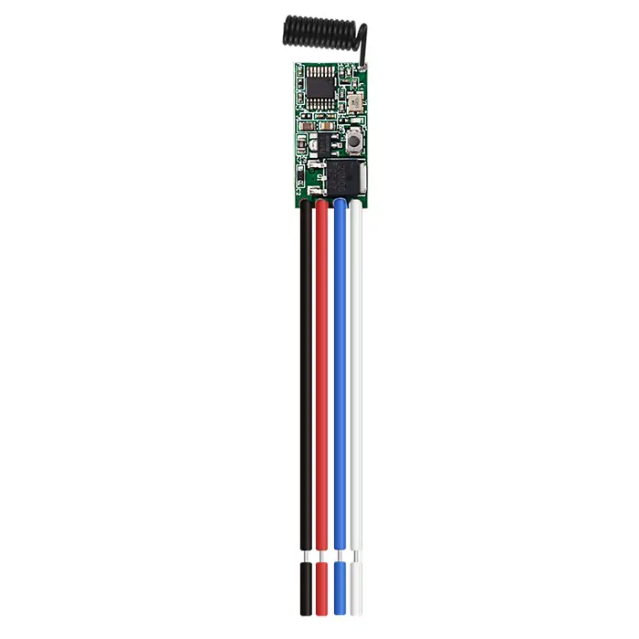
    <h2>QA-R-012</h2>
    
  </a>

  <a href="QA-R-012V3/QIACHIP_QA-R-012V3/">
    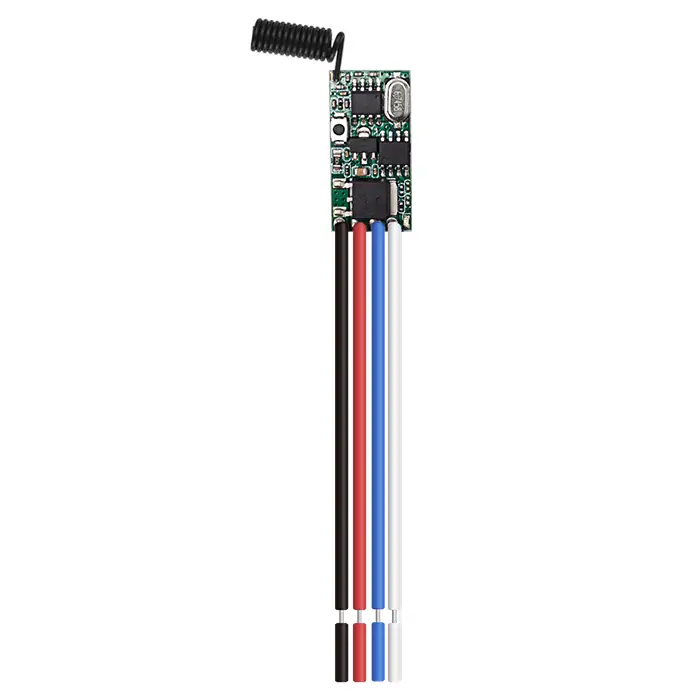
    <h2>QA-R-012V3</h2>
    
  </a>

## Wireless Transmitter Module

  <a href="WL102-341/QIACHIP_WL102-341/">
    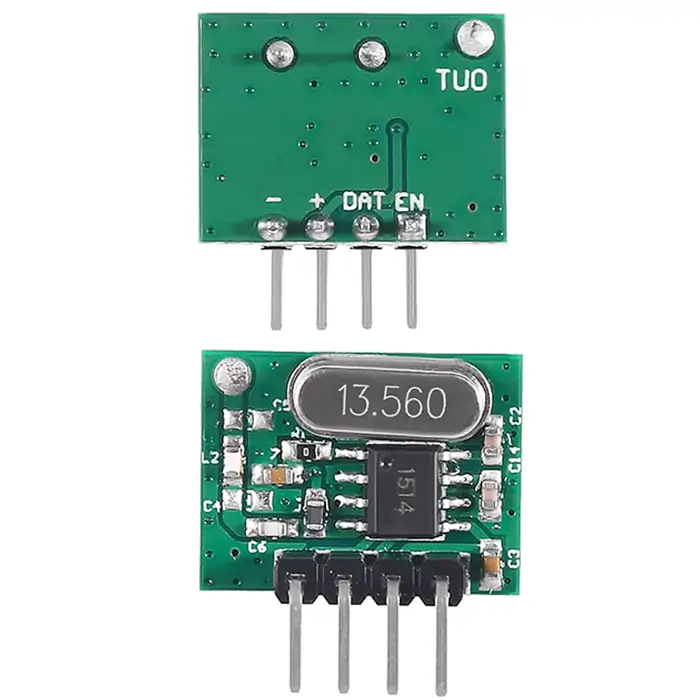
    <h2>WL102-341</h2>
    
  </a>

