---  
glightbox: false  # 禁用当前页面的灯箱效果  
---  

# User Guide

## DC Controller

  <a href="KR1201/KR1201A/QIACHIP_KR1201A/">
    
    <h2>KR1201A</h2>
    
  </a>

  <a href="KR1201/KR1201C/QIACHIP_KR1201C/">
    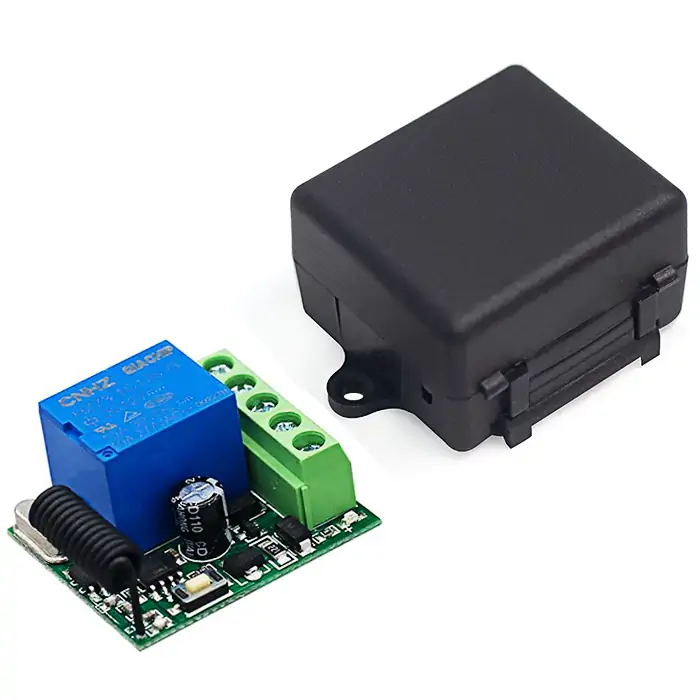
    <h2>KR1201C</h2>
    
  </a>

  <a href="KR1201/KR1201MINI-V03/QIACHIP_KR1201MINI-V03/">
    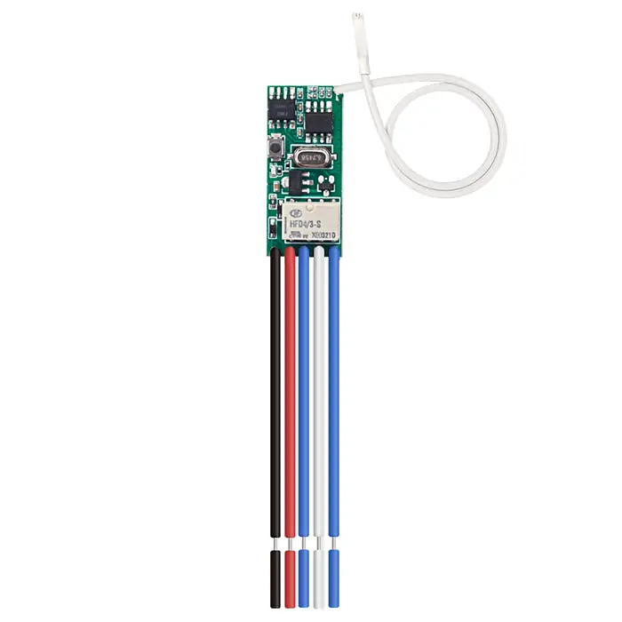
    <h2>KR1201MINI-V03</h2>
    
  </a>

  <a href="KR3001A/QIACHIP_KR3001A/">
    
    <h2>KR3001A</h2>
    
  </a>

  <a href="KR1202/KR1202-30R/QIACHIP_KR1202-30R/">
    
    <h2>KR1202-30R</h2>
    
  </a>

  <a href="KR1202/KR1202-V05/QIACHIP_KR1202-V05/">
    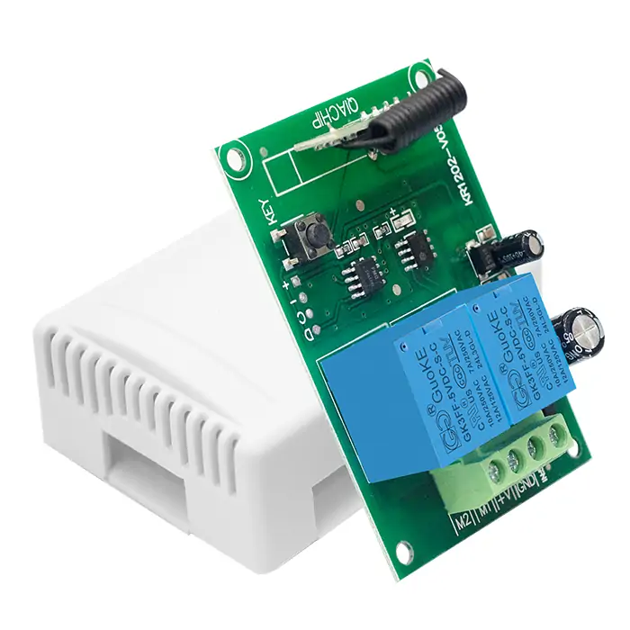
    <h2>KR1202-V05</h2>
    
  </a>

  <a href="KR1204/KR1204/QIACHIP_KR1204/">
    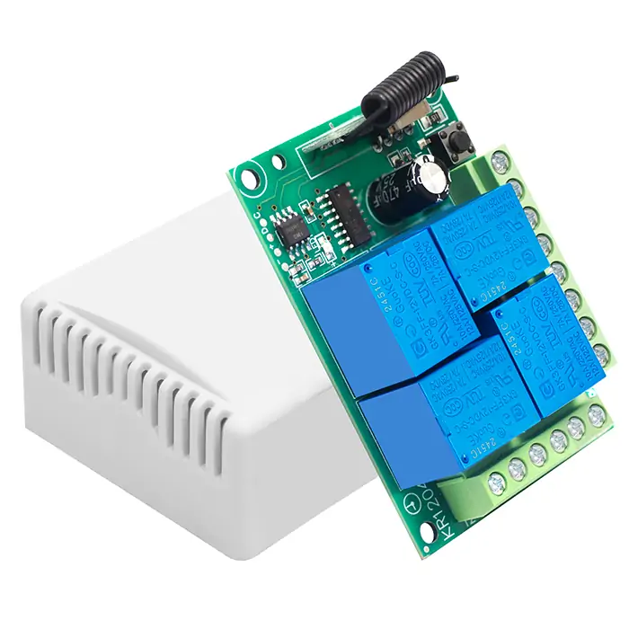
    <h2>KR1204</h2>
    
  </a>

  <a href="KR1204/KR1204B/QIACHIP_KR1204B/">
    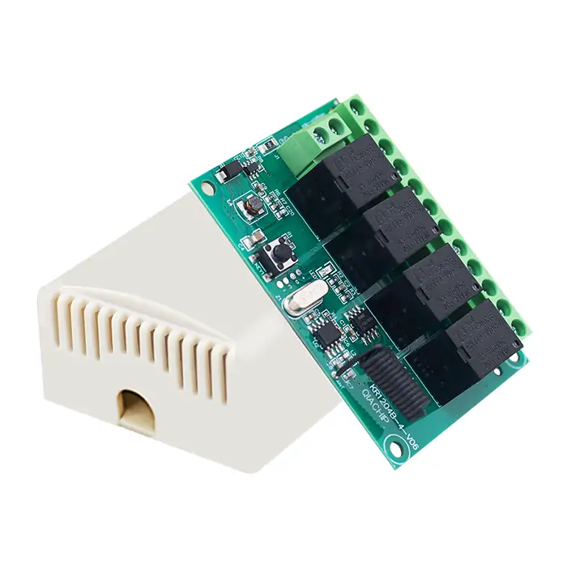
    <h2>KR1204B</h2>
    
  </a>

  <a href="KR2401/KR2401FB/QIACHIP_KR2401FB/">
    
    <h2>KR2401FB</h2>
    
  </a>

  <a href="KR2401/KR2401F-4/QIACHIP_KR2401F-4/">
    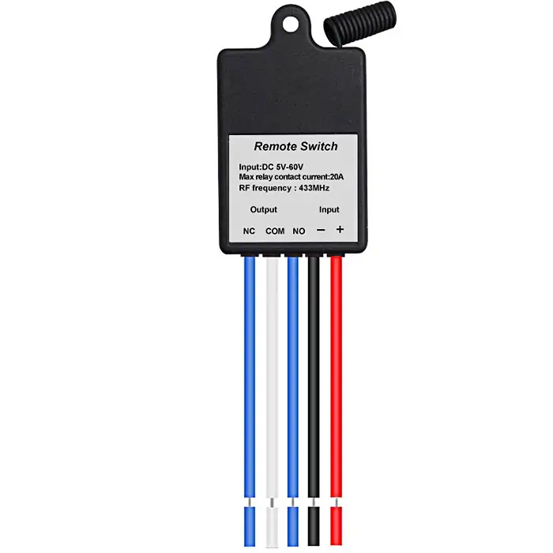
    <h2>KR2401F-4</h2>
    
  </a>

  <a href="KR2402A/QIACHIP_KR2402A/">
    
    <h2>KR2402A</h2>
    
  </a>

  <a href="KR0548/KR0548-1CH/QIACHIP_KR0548-1CH/">
    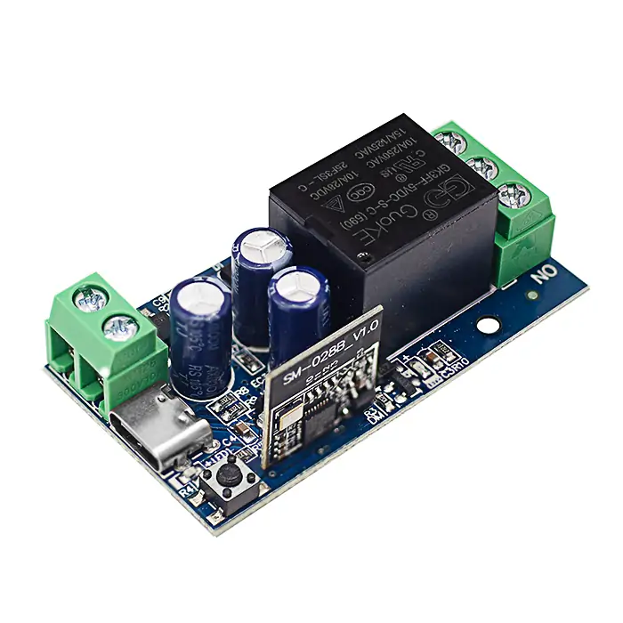
    <h2>KR0548-1CH</h2>
    
  </a>

  <a href="KR0548/KR0548-2CH/QIACHIP_KR0548-2CH/">
    
    <h2>KR0548-2CH</h2>
    
  </a>

  <a href="KR0548/KR0548-4CH/QIACHIP_KR0548-4CH/">
    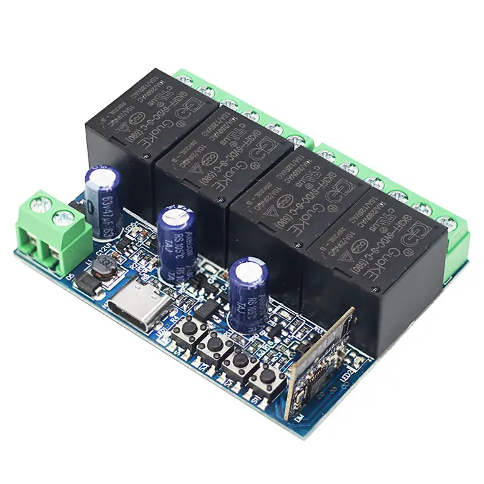
    <h2>KR0548-4CH</h2>
    
  </a>

  <a href="KR7001/QIACHIP_KR7001/">
    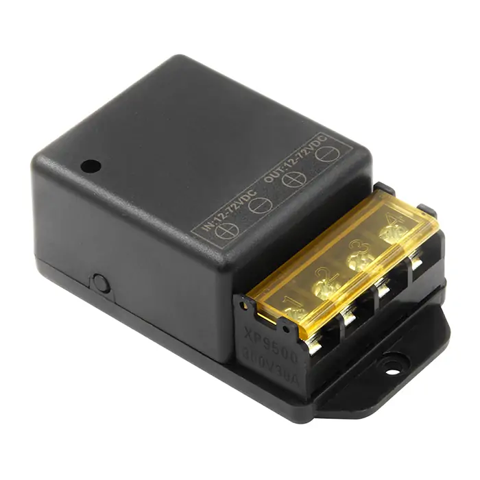
    <h2>KR7001</h2>
    
  </a>

## AC Controller

  <a href="KR2201/KR2201-4/QIACHIP_KR2201-4/">
    
    <h2>KR2201-4</h2>
    
  </a>

  <a href="KR2201/KR2201-COM/QIACHIP_KR2201-COM/">
    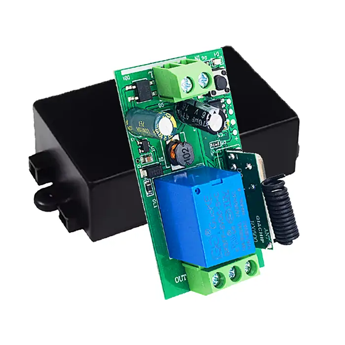
    <h2>KR2201-COM</h2>
    
  </a>

  <a href="KR2201/KR2201B-4/QIACHIP_KR2201B-4/">
    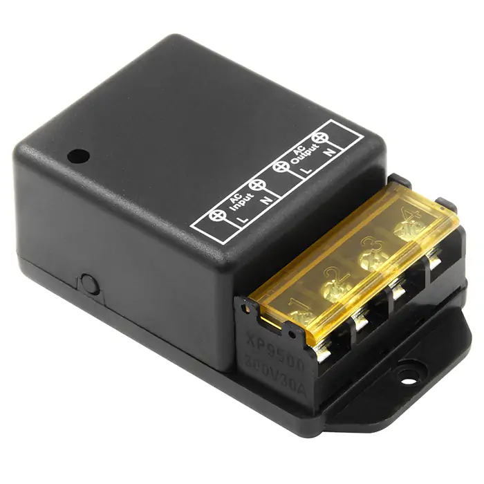
    <h2>KR2201B-4</h2>
    
  </a>

  <a href="KR2201/KR2201BL-4/QIACHIP_KR2201BL-4/">
    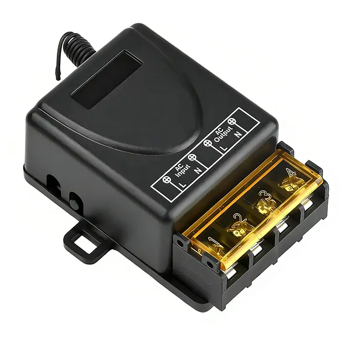
    <h2>KR2201BL-4</h2>
    
  </a>

  <a href="KR2201/KR2201BY/QIACHIP_KR2201BY/">
    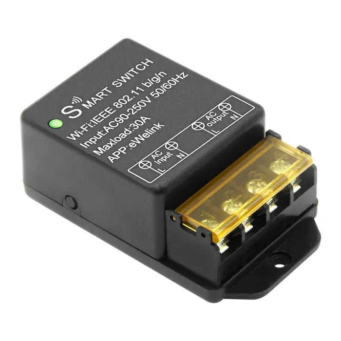
    <h2>KR2201BY</h2>
    
  </a>

  <a href="KR2201/KR2201DA-4/QIACHIP_KR2201DA-4/">
    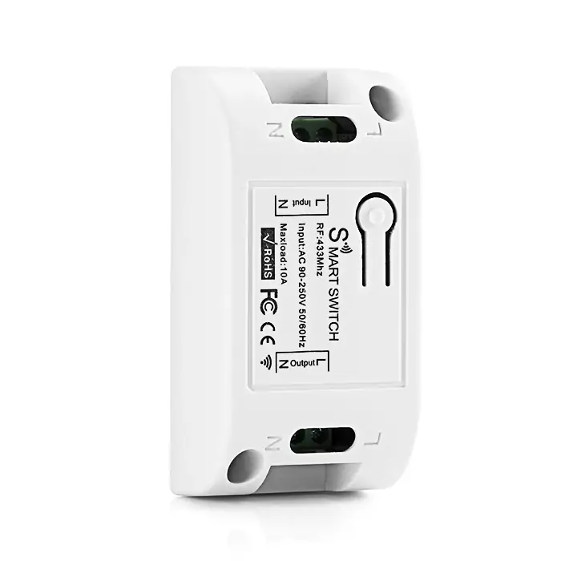
    <h2>KR2201DA-4</h2>
    
  </a>

  <a href="KR2201/KR2201F-4/QIACHIP_KR2201F-4/">
    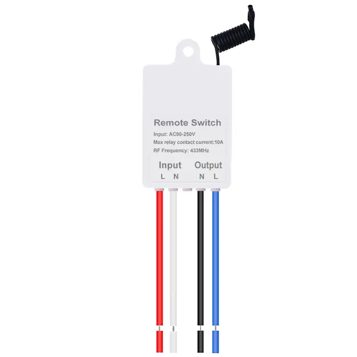
    <h2>KR2201F-4</h2>
    
  </a>

  <a href="KR2201/KR2201G-4/QIACHIP_KR2201G-4/">
    
    <h2>KR2201G-4</h2>
    
  </a>

  <a href="KR2201/KR2201GS-4/QIACHIP_KR2201GS-4/">
    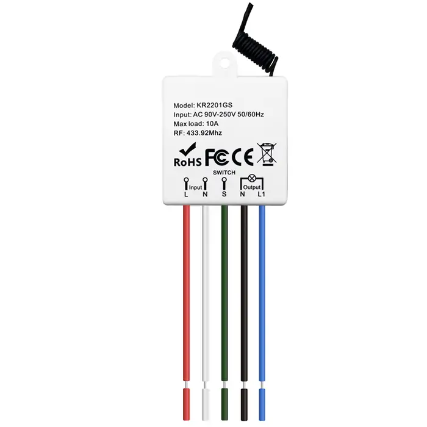
    <h2>KR2201GS-4</h2>
    
  </a>

  <a href="KR2201/KR2201W-4/QIACHIP_KR2201W-4/">
    
    <h2>KR2201W-4</h2>
    
  </a>

  <a href="KR2201/KR2201WB/QIACHIP_KR2201WB/">
    
    <h2>KR2201WB</h2>
    
  </a>

  <a href="KR2202/QIACHIP_KR2202/">
    
    <h2>KR2202</h2>
    
  </a>

  <a href="KR2204/QIACHIP_KR2204/">
    
    <h2>KR2204</h2>
    
  </a>

  <a href="KR2301/KR2301/QIACHIP_KR2301/">
    
    <h2>KR2301</h2>
    
  </a>

  <a href="KR2301/KR2301MT/QIACHIP_KR2301MT/">
    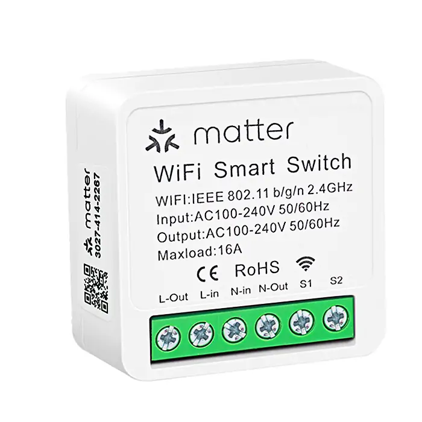
    <h2>KR2301MT</h2>
    
  </a>

  <a href="KR2303/QIACHIP_KR2303/">
    
    <h2>KR2303</h2>
    
  </a>

  <a href="KR2305/QIACHIP_KR2305/">
    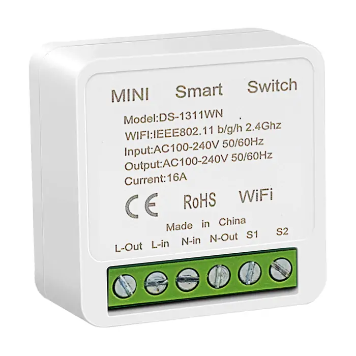
    <h2>KR2305</h2>
    
  </a>

  <a href="KR2306EW/QIACHIP_KR2306EW/">
    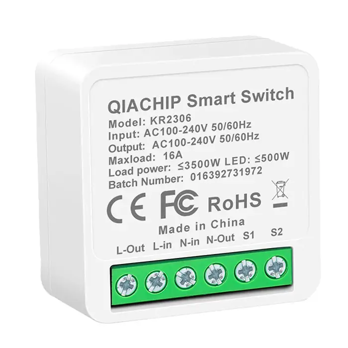
    <h2>KR2306EW</h2>
    
  </a>

## Ceiling Fan Light Controller

  <a href="FLC05-E110V/QIACHIP_FLC05-E110V/">
    
    <h2>FLC05-E110V</h2>
    
  </a>

  <a href="FLC05-E220V/QIACHIP_FLC05-E220V/">
    
    <h2>FLC05-E220V</h2>
    
  </a>

## Wireless Receiver Module

  <a href="RX480E/RX480E-4A/QIACHIP_RX480E-4A/">
    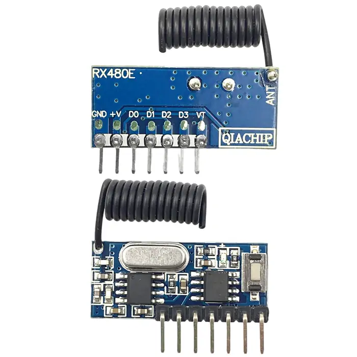
    <h2>RX480E-4A</h2>
    
  </a>

  <a href="RX480E/RX480E-4C/QIACHIP_RX480E-4C/">
    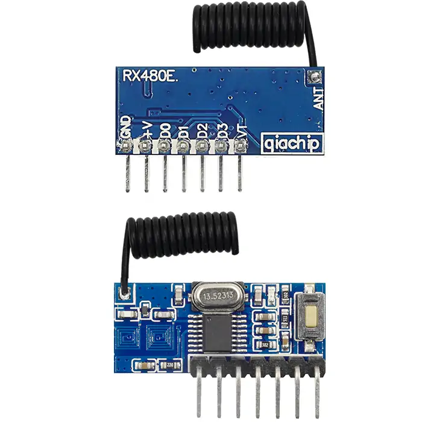
    <h2>RX480E-4C</h2>
    
  </a>

  <a href="RX480E/RX480E-1A/QIACHIP_RX480E-1A/">
    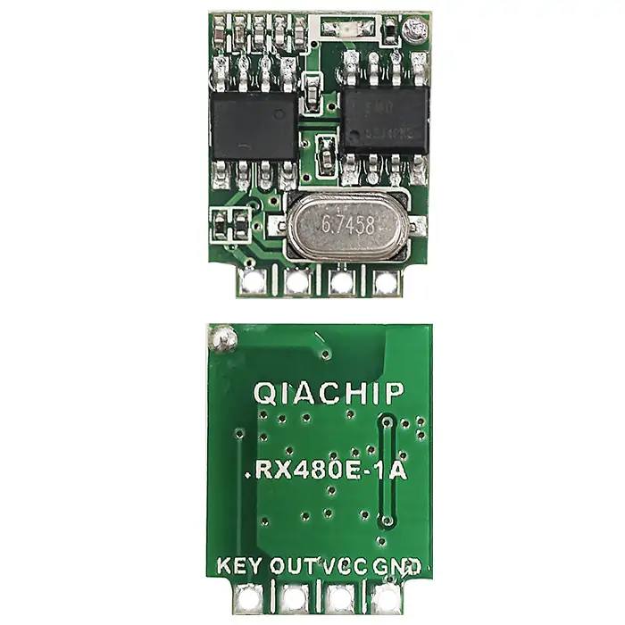
    <h2>RX480E-1A</h2>
    
  </a>

  <a href="RX480E/RX480E-868/QIACHIP_RX480E-868/">
    
    <h2>RX480E-868</h2>
    
  </a>

  <a href="QA-R-011/QIACHIP_QA-R-011/">
    
    <h2>QA-R-011</h2>
    
  </a>

  <a href="QA-R-012/QIACHIP_QA-R-012/">
    
    <h2>QA-R-012</h2>
    
  </a>

  <a href="QA-R-012V3/QIACHIP_QA-R-012V3/">
    
    <h2>QA-R-012V3</h2>
    
  </a>

  <a href="MTD12A-4/QIACHIP_MTD12A-4/">
    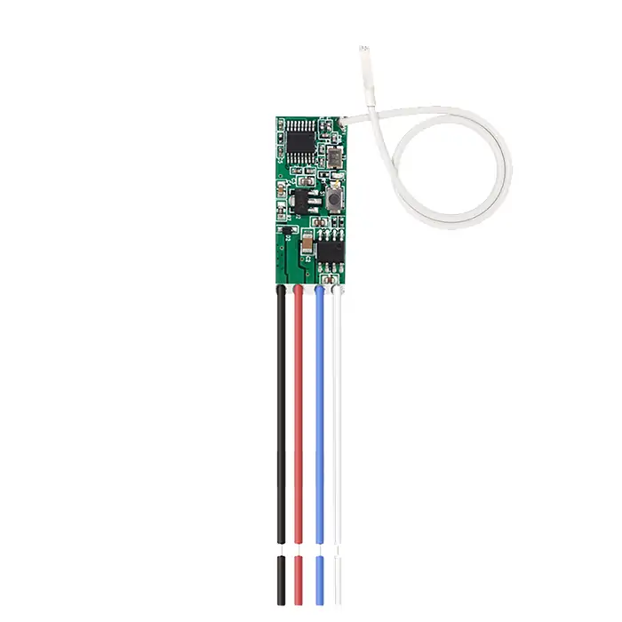
    <h2>MTD12A-4</h2>
    
  </a>

  <a href="RX500-4/QIACHIP_RX500-4/">
    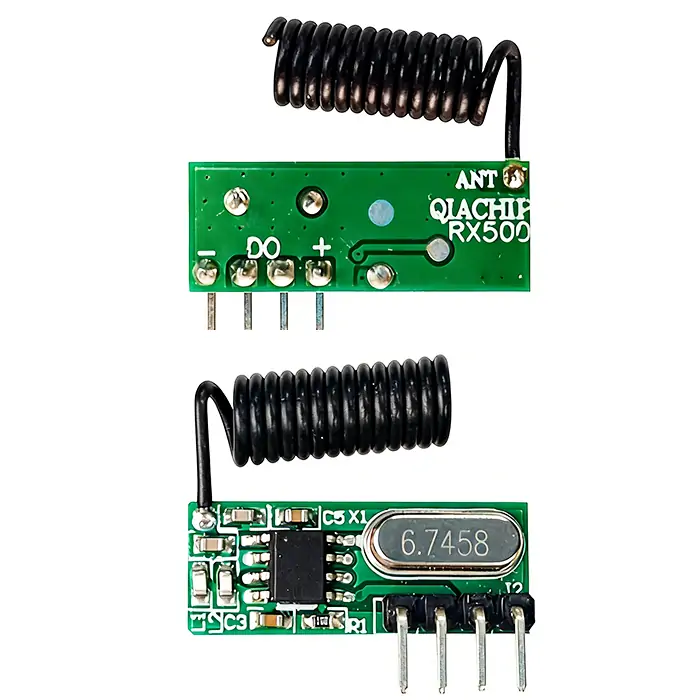
    <h2>RX500-4</h2>
    
  </a>

  <a href="RX470-4/QIACHIP_RX470-4/">
    
    <h2>RX470-4</h2>
    
  </a>

  <a href="RX217E-V01/QIACHIP_RX217E-V01/">
    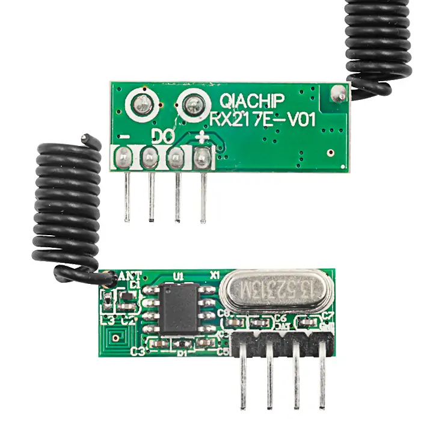
    <h2>RX217E-V01</h2>
    
  </a>

  <a href="WL101-341/QIACHIP_WL101-341/">
    
    <h2>WL101-341</h2>
    
  </a>

  <a href="RX18210A-4/QIACHIP_RX18210A-4/">
    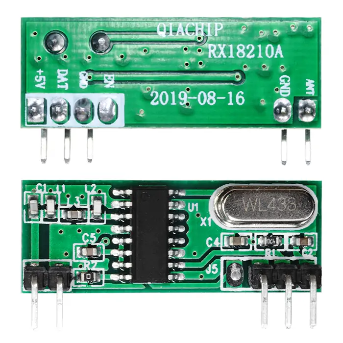
    <h2>RX18210A-4</h2>
    
  </a>

  <a href="RX18211A-4/QIACHIP_RX18211A-4/">
    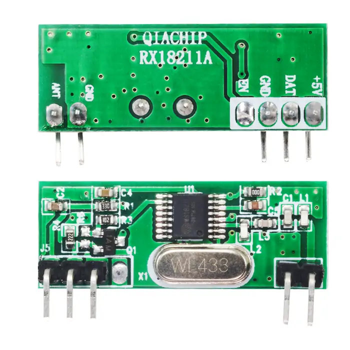
    <h2>RX18211A-4</h2>
    
  </a>

## Wireless Transmitter Module

  <a href="WL102-341/QIACHIP_WL102-341/">
    
    <h2>WL102-341</h2>
    
  </a>

  <a href="TX118SA-4/QIACHIP_TX118SA-4/">
    
    <h2>TX118SA-4</h2>
    
  </a>

  <a href="TX181-4/QIACHIP_TX181-4/">
    
    <h2>TX181-4</h2>
    
  </a>

