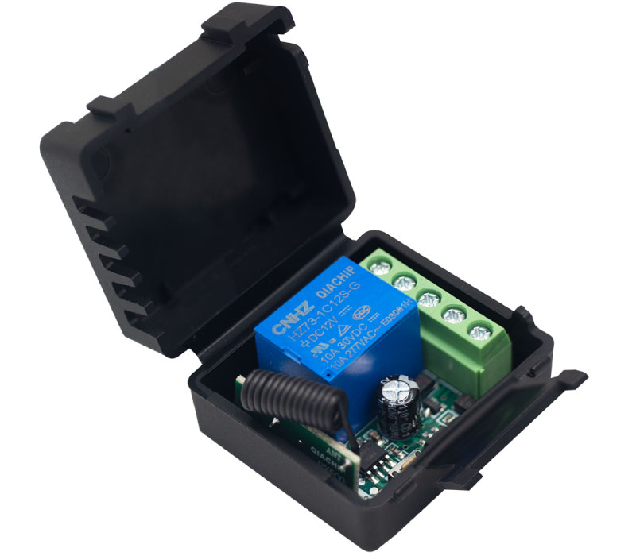
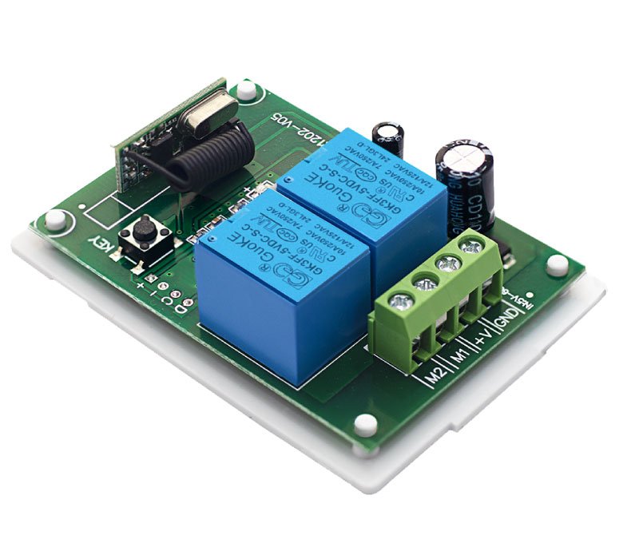

## 12V DC Controller
<!-- 页面主标题，用于展示产品列表 -->

<!-- 结束样式定义 -->

  <a href="../KR1201/KR1201/">
    
    <h2>KR1201</h2>
  </a>
  
  <a href="../KR1202-V05/KR1202-V05/">
    
    <h2>KR1202-V05</h2>
  </a>

<!-- 结束网格布局 -->

## 220V DC Controller

  <a href="../KR2202/KR2202/">
    
    <h2>KR2202</h2>
  </a>

